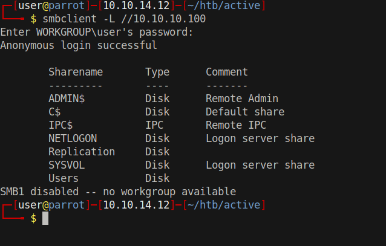
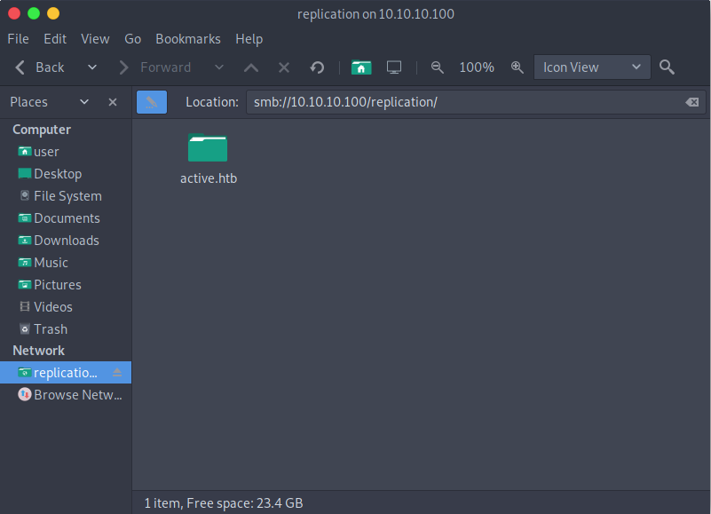
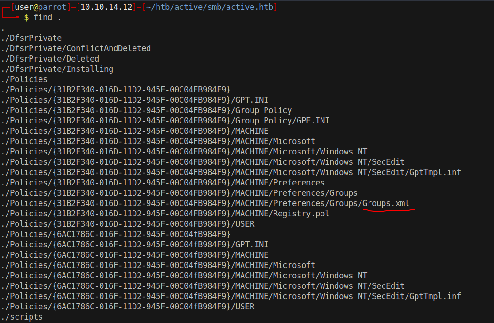
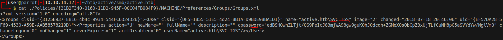
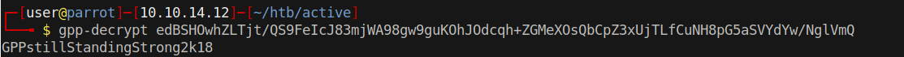
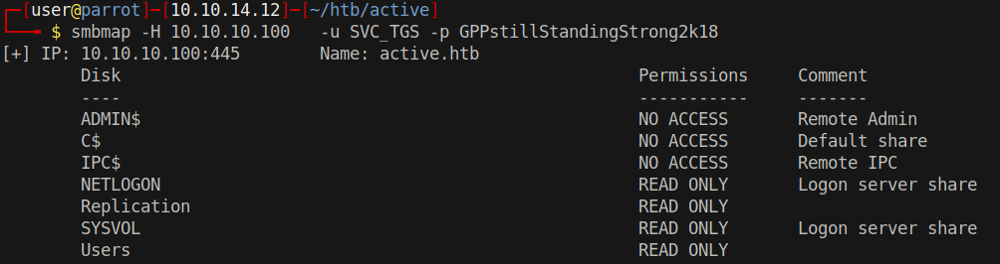
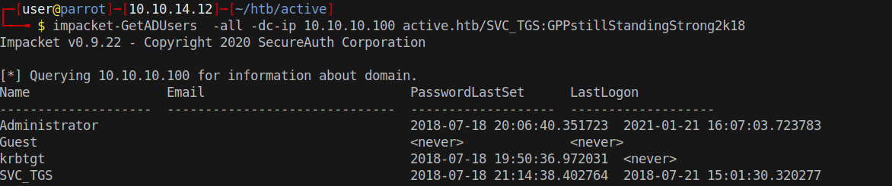

# 10 - SMB


# Replication share is readable



# Mount the share



# Groups.xml



# Cached GPP Password

[Group Policy Preferences was mainly used to deploy a custom local administrator account on a group of machines. There were two problems with this approach though. First, since the Group Policy Objects are stored as XML files in SYSVOL, any domain user can read them. The second problem is that the password set in these GPPs is AES256-encrypted with a default key, which is publicly documented.](https://book.hacktricks.xyz/windows/windows-local-privilege-escalation#cached-gpp-pasword)


# Contents of Groups.xml



# gpp-decrypt



# Share permissions with the new credentials



# Mount Users Share & user.txt
```bash
┌─[user@parrot]─[10.10.14.12]─[~/htb/active]
└──╼ $ sudo mount.cifs //10.10.10.100/Users /mnt/smb -o user=SVC_TGS,pass=GPPstillStandingStrong2k18 
┌─[user@parrot]─[10.10.14.12]─[/mnt/smb]
└──╼ $ find .
..
..
./SVC_TGS/Desktop/user.txt
..
```

# Users
