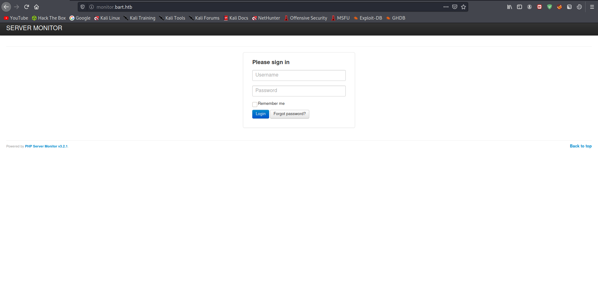
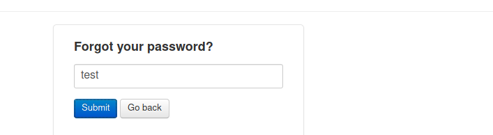
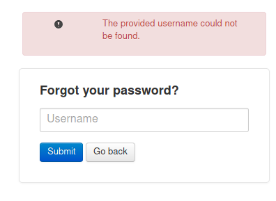
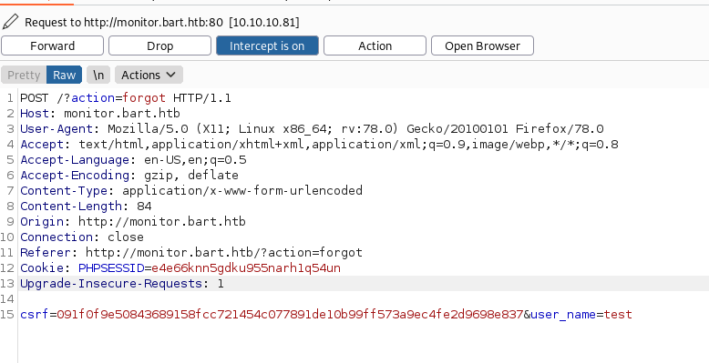
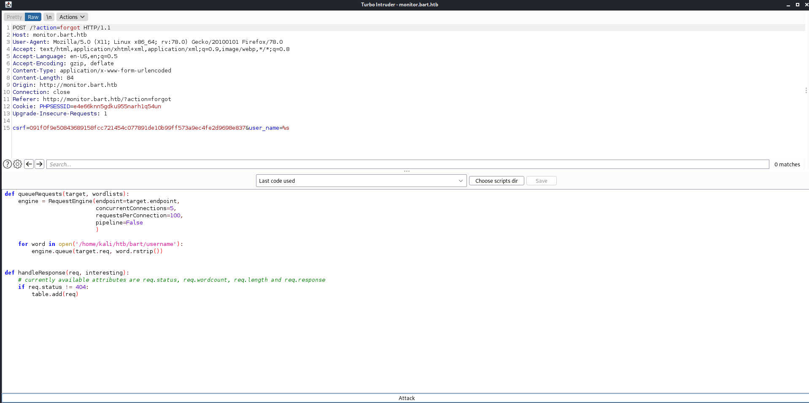
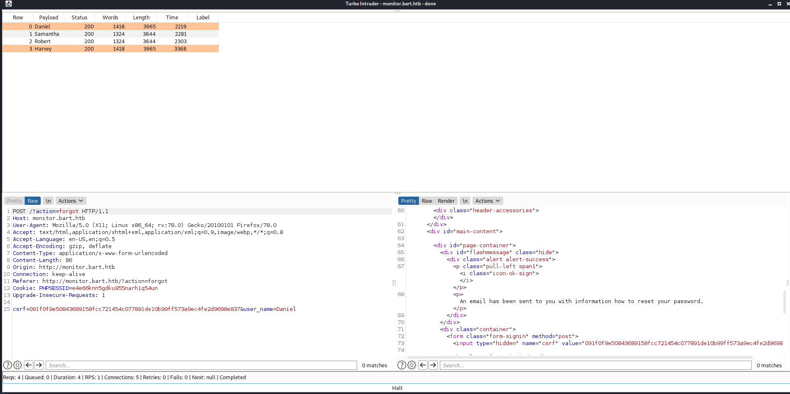
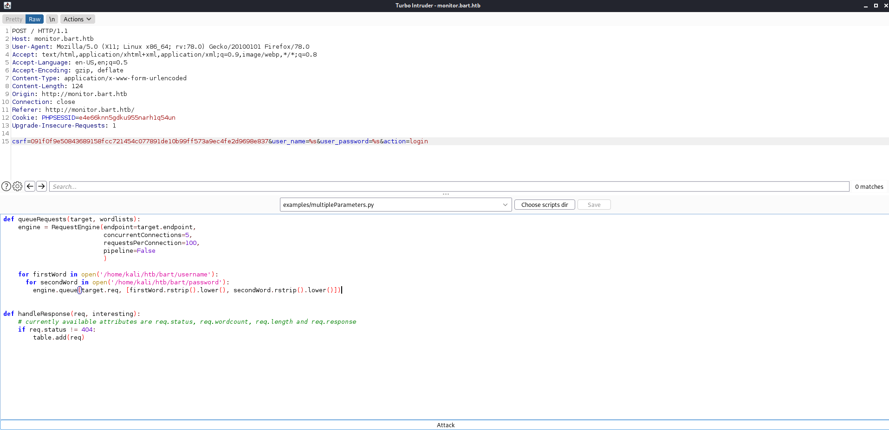
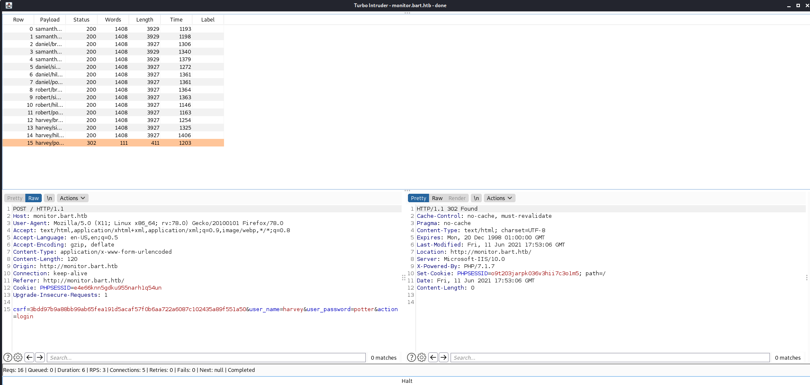

# 15 - Monitor

# Index page

# Forgot password?

# Username could not be found that means we can try to find valid usernames

  
# Bruteforce with Turbo Intruder Extension on Burp Suite

# Emails are sent for user daniel and harvey

# Password bruteforce with Turbo Intruder

Letter case matters in passwords because they will generate different hashes. I decided to lowercase everything

# Harvey's password appears to be his last name

