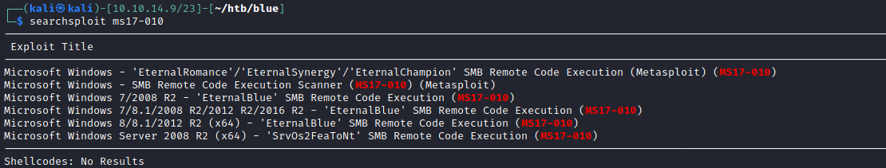
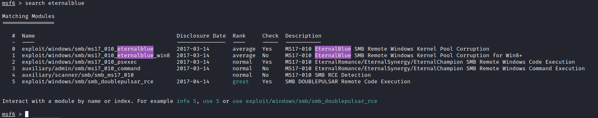
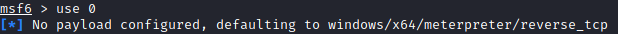
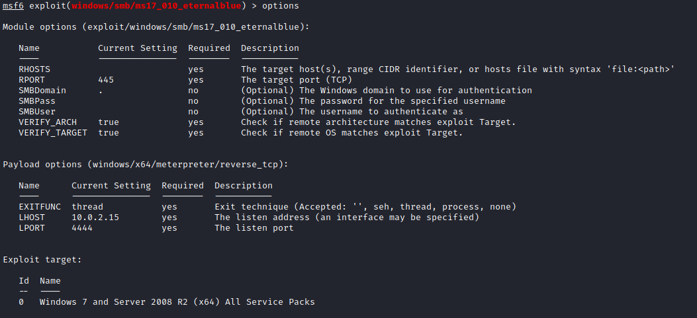
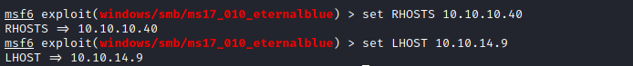
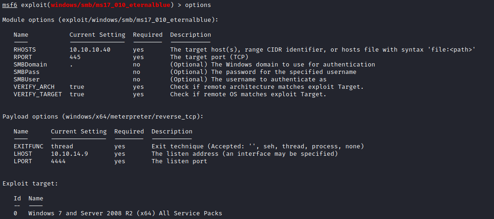
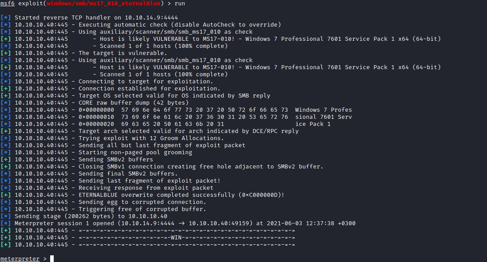
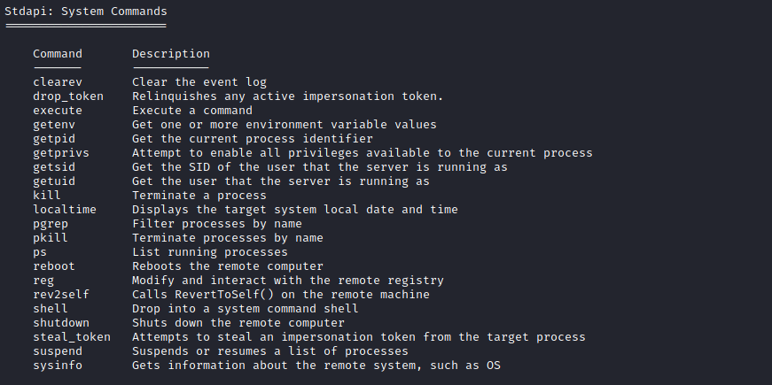
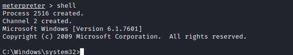
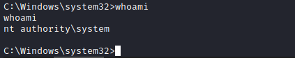

# 10 - Eternal Blue

# Run msfconsole to open metasploit console

# Search EnternalBlue

# Use 0 to select the exploit

# Options to check the variables

# Set the variables

# Payload should be set by metasploit itself here is the final view of my exploit

# Run 

# We get a meterpreter shell let's see what we can do with it

There are a lot of things you can do on a meterpreter shell but  **shell system command** stands out the most

# Whoami

That's it, we pwned the box
