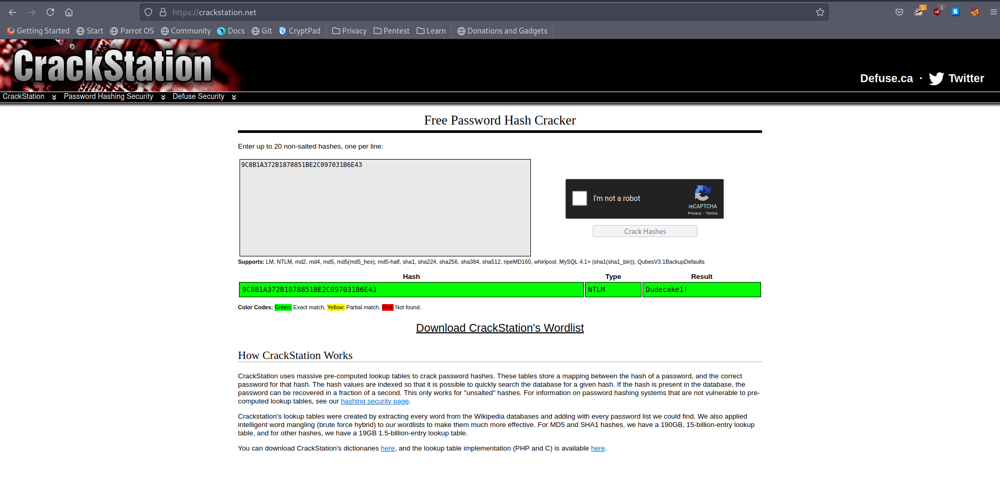

# 10 - Simple Network Management Protocol


# IKE VPN password PSK
```sql
┌─[user@parrot]─[10.10.14.9]─[~/htb/conceal/snmp]
└──╼ $ snmp-check -c public -v2c 10.10.10.116
[*] System information:

  Host IP address               : 10.10.10.116
  Hostname                      : Conceal
  Description                   : Hardware: AMD64 Family 23 Model 1 Stepping 2 AT/AT COMPATIBLE - Software: Windows Version 6.3 (Build 15063 Multiprocessor Free)
  Contact                       : IKE VPN password PSK - 9C8B1A372B1878851BE2C097031B6E43
  Location                      : -
  Uptime snmp                   : 00:41:47.71
  Uptime system                 : 00:41:33.00
  System date                   : 2021-7-1 11:17:34.8
  Domain                        : WORKGROUP
```
# Users

```
[*] User accounts:

  Guest
  Destitute
  Administrator
  DefaultAccount
```


# TCP & UDP Ports
```
[*] TCP connections and listening ports:

  Local address         Local port            Remote address        Remote port           State
  0.0.0.0               21                    0.0.0.0               0                     listen
  0.0.0.0               80                    0.0.0.0               0                     listen
  0.0.0.0               135                   0.0.0.0               0                     listen
  0.0.0.0               445                   0.0.0.0               0                     listen
  0.0.0.0               49664                 0.0.0.0               0                     listen
  0.0.0.0               49665                 0.0.0.0               0                     listen
  0.0.0.0               49666                 0.0.0.0               0                     listen
  0.0.0.0               49667                 0.0.0.0               0                     listen
  0.0.0.0               49668                 0.0.0.0               0                     listen
  0.0.0.0               49669                 0.0.0.0               0                     listen
  0.0.0.0               49670                 0.0.0.0               0                     listen
  10.10.10.116          139                   0.0.0.0               0                     listen

[*] Listening UDP ports:

  Local address         Local port
  0.0.0.0               123
  0.0.0.0               161
  0.0.0.0               500
  0.0.0.0               4500
  0.0.0.0               5050
  0.0.0.0               5353
  0.0.0.0               5355
  0.0.0.0               52741
  10.10.10.116          137
  10.10.10.116          138
  10.10.10.116          1900
  10.10.10.116          50436
  127.0.0.1             1900
  127.0.0.1             50437
```


# CrackStation 

