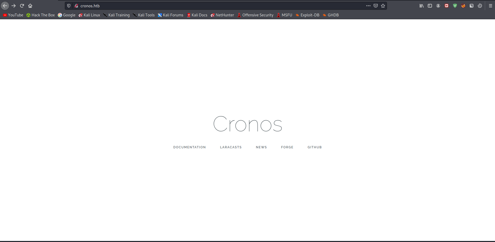

# 10 - Cronos

# /etc/hosts

```sql
┌──(kali㉿kali)-[10.10.14.9/23]-[~/htb/cronos]
└─$ cat /etc/hosts
127.0.0.1       localhost passmanager.htb
127.0.1.1       kali
10.10.10.13    cronos.htb
```

# cronos.htb

Documentation redirects to laravel.com, Laravel is a web application framework



# Gobuster
```bash
┌──(kali㉿kali)-[10.10.14.9/23]-[~/htb/cronos]
└─$ gobuster dir -u cronos.htb -w /usr/share/wordlists/dirbuster/directory-list-2.3-medium.txt -o gobuster/cronosext.log  -t 100 -x ".php,.html,.txt" 
===============================================================
Gobuster v3.1.0                                                                                                       
by OJ Reeves (@TheColonial) & Christian Mehlmauer (@firefart)  
===============================================================
[+] Url:                     http://cronos.htb   
[+] Method:                  GET
[+] Threads:                 100
[+] Wordlist:                /usr/share/wordlists/dirbuster/directory-list-2.3-medium.txt
[+] Negative Status codes:   404
[+] User Agent:              gobuster/3.1.0
[+] Extensions:              php,html,txt
[+] Timeout:                 10s
===============================================================
2021/05/28 17:13:49 Starting gobuster in directory enumeration mode
===============================================================
/index.php            (Status: 200) [Size: 2319]
/css                  (Status: 301) [Size: 306] [--> http://cronos.htb/css/]
/js                   (Status: 301) [Size: 305] [--> http://cronos.htb/js/] 
/robots.txt           (Status: 200) [Size: 24]                               
/server-status        (Status: 403) [Size: 298]                              
                                                                             
===============================================================
2021/05/28 17:23:14 Finished
```

Nothing stands out from this output we should also try subdomain enumeration.


# Gobuster vhost scan

```sql
┌──(kali㉿kali)-[10.10.14.9/23]-[~/htb/cronos]
└─$ gobuster vhost -u cronos.htb -w /opt/SecLists/Discovery/DNS/subdomains-top1million-110000.txt -o gobuster/dns.log  -t 100 
===============================================================
Gobuster v3.1.0
by OJ Reeves (@TheColonial) & Christian Mehlmauer (@firefart)
===============================================================
[+] Url:          http://cronos.htb
[+] Method:       GET
[+] Threads:      100
[+] Wordlist:     /opt/SecLists/Discovery/DNS/subdomains-top1million-110000.txt
[+] User Agent:   gobuster/3.1.0
[+] Timeout:      10s
===============================================================
2021/05/28 17:34:43 Starting gobuster in VHOST enumeration mode
===============================================================
Found: admin.cronos.htb (Status: 200) [Size: 1547]
```


