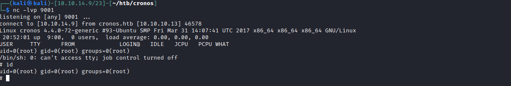

# 20 - PrivEsc

Initial shell isn't that great let's get a proper shell


* python3 -c 'import pty;pty.spawn("/bin/bash");'
* Ctrl+Z to background the nc shell
* Type **stty raw -echo** on your host 
* Type **fg** to go to the foreground process  # it won't get printed to the screen but don't worry
* Then hit **enter** one more time to get your nc shell prompt


```bash
$ python3 -c 'import pty;pty.spawn("/bin/bash");'
www-data@cronos:/var/www/admin$ ^Z
[1]+  Stopped                 nc -lvp 4444
┌──(kali㉿kali)-[10.10.14.9/23]-[~/htb/cronos/www]
└─$ stty raw -echo
┌──(kali㉿kali)-[10.10.14.9/23]-[~/htb/cronos/www]
nc -lvp 4444

www-data@cronos:/var/www/admin$ 
```

# Linpeas.sh cron job


artisan php code is run by root, let's see if we have write permissions on this file

```sql
www-data@cronos:/tmp/tmp.9uU3b8yxPq$ ls -l /var/www/laravel/artisan
-rwxr-xr-x 1 www-data www-data 1646 Apr  9  2017 /var/www/laravel/artisan
```

yes we have, that means artisan will run with root privileges and the user www-data has write permission on that file. Let's inject a reverse shell into artisan


# injecting a reverse shell into artisan

Please ignore autoload.php text at the bottom of the screen I didn't notice I had write permissions on artisan as well.

# Root Shell

