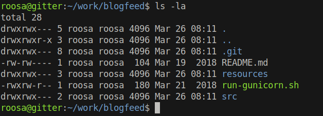
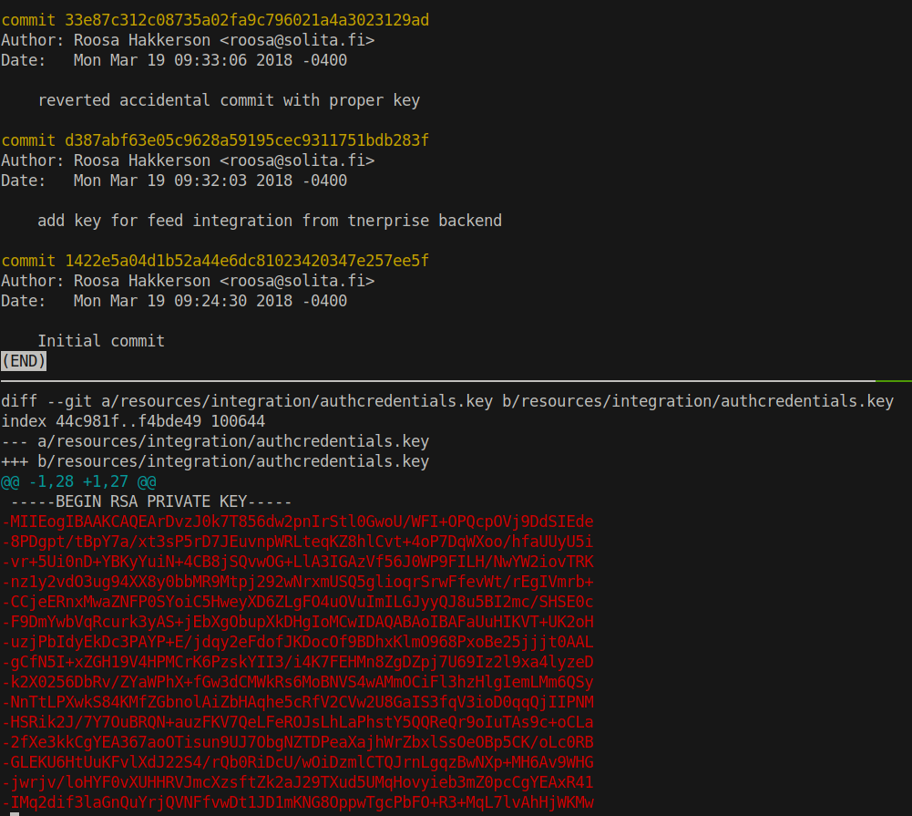
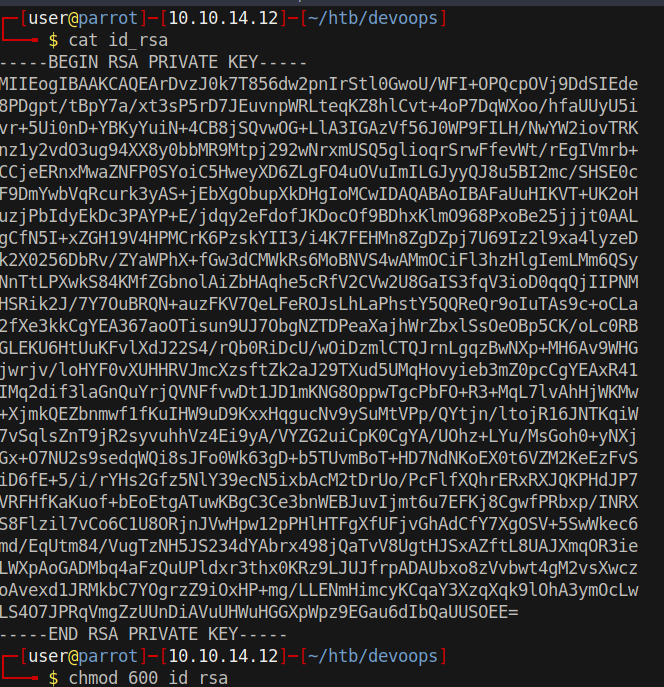
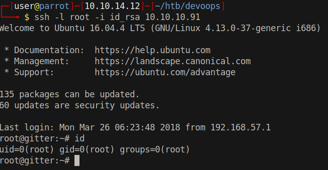

# 15 - PrivEsc


# Git


Git repositories are always interesting.


# Accidental commit with proper key

```
roosa@gitter:~/work/blogfeed $ git log
```





The private key highlighted as red might be the private key of root. 


# RSA Private Key



# Root Shell

