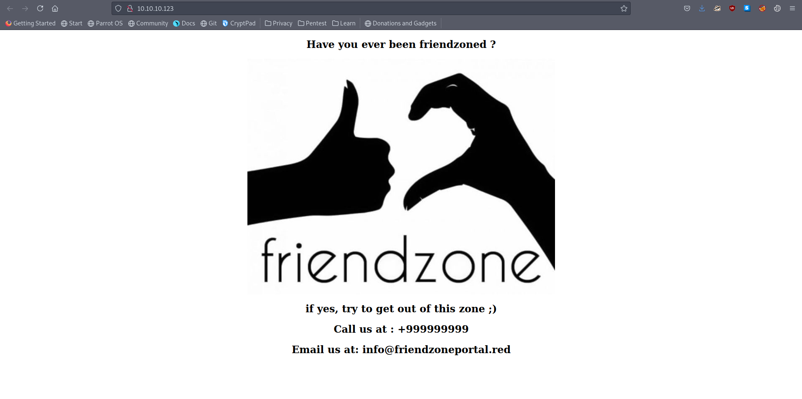

# 10 - FriendZone


# index.html



We discover that there are friendzoneportal.red and friendzone.red(nmap) domain names. Are there any subdomains? Luckily there is also a dns server on the box we can try zone transfer to  steal dns records. This is usually disabled in real word scenarios to avoid certain attacks.


# DNS Zone Transfer

# friendzone.red
```bash
┌─[user@parrot]─[10.10.14.9]─[~/htb/friendzone]
└──╼ $ dig axfr friendzone.red @10.10.10.123

; <<>> DiG 9.16.15-Debian <<>> axfr friendzone.red @10.10.10.123
;; global options: +cmd
friendzone.red.         604800  IN      SOA     localhost. root.localhost. 2 604800 86400 2419200 604800
friendzone.red.         604800  IN      AAAA    ::1
friendzone.red.         604800  IN      NS      localhost.
friendzone.red.         604800  IN      A       127.0.0.1
administrator1.friendzone.red. 604800 IN A      127.0.0.1
hr.friendzone.red.      604800  IN      A       127.0.0.1
uploads.friendzone.red. 604800  IN      A       127.0.0.1
friendzone.red.         604800  IN      SOA     localhost. root.localhost. 2 604800 86400 2419200 604800
;; Query time: 68 msec
;; SERVER: 10.10.10.123#53(10.10.10.123)
;; WHEN: Sat Jul 03 13:32:26 BST 2021
;; XFR size: 8 records (messages 1, bytes 289)
```
# friendzoneportal.red
```
┌─[user@parrot]─[10.10.14.9]─[~/htb/friendzone]
└──╼ $ dig axfr friendzoneportal.red @10.10.10.123

; <<>> DiG 9.16.15-Debian <<>> axfr friendzoneportal.red @10.10.10.123
;; global options: +cmd
friendzoneportal.red.   604800  IN      SOA     localhost. root.localhost. 2 604800 86400 2419200 604800
friendzoneportal.red.   604800  IN      AAAA    ::1
friendzoneportal.red.   604800  IN      NS      localhost.
friendzoneportal.red.   604800  IN      A       127.0.0.1
admin.friendzoneportal.red. 604800 IN   A       127.0.0.1
files.friendzoneportal.red. 604800 IN   A       127.0.0.1
imports.friendzoneportal.red. 604800 IN A       127.0.0.1
vpn.friendzoneportal.red. 604800 IN     A       127.0.0.1
friendzoneportal.red.   604800  IN      SOA     localhost. root.localhost. 2 604800 86400 2419200 604800
;; Query time: 72 msec
;; SERVER: 10.10.10.123#53(10.10.10.123)
;; WHEN: Sat Jul 03 13:33:14 BST 2021
;; XFR size: 9 records (messages 1, bytes 309)
```