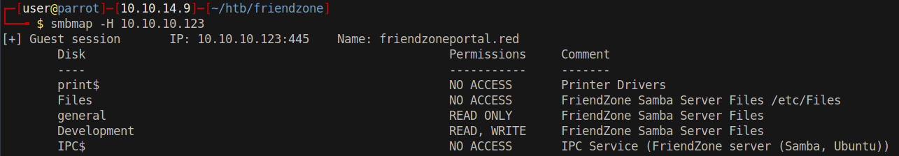

# 15 - SMB



We have write permissions on Development and we can guess from the comment of `Files` that Development share is most likely at /etc/Development

# Mount the shares

```bash
┌─[user@parrot]─[10.10.14.9]─[/mnt/friendzone]
└──╼ $ sudo mount -t cifs -o guest //10.10.10.123/general /mnt/friendzone/general/
┌─[user@parrot]─[10.10.14.9]─[/mnt/friendzone]
└──╼ $ sudo mount -t cifs -o guest //10.10.10.123/Development /mnt/friendzone/Development/
```

# creds.txt

```bash
┌─[user@parrot]─[10.10.14.9]─[/mnt/friendzone]
└──╼ $ ls
Development  general
┌─[user@parrot]─[10.10.14.9]─[/mnt/friendzone]
└──╼ $ find .
.
./Development
./general
./general/creds.txt
┌─[user@parrot]─[10.10.14.9]─[/mnt/friendzone]
└──╼ $ cat general/creds.txt 
creds for the admin THING:

admin:WORKWORKHhallelujah@#

```

