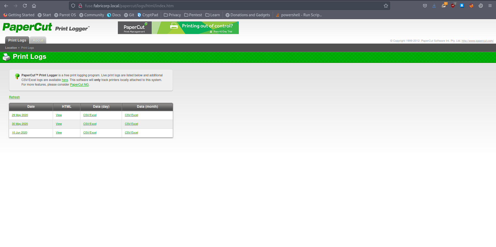
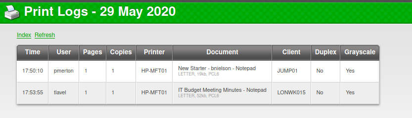
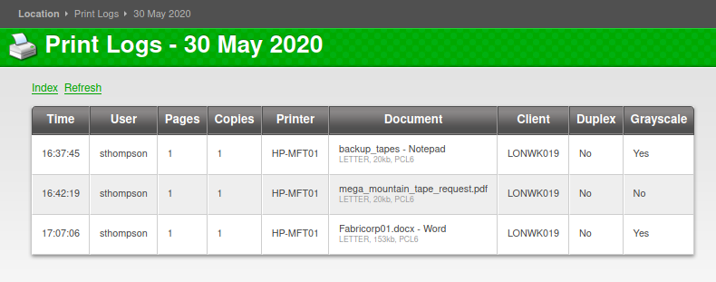
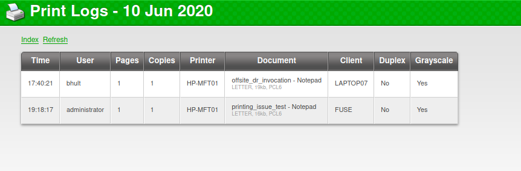

# 10 - Print Logger


# Index page


Visiting the IP address of the box on port 80 redirected us to a domain, putting the domain name into `/etc/resolv.conf` rather than `/etc/hosts` is recommended. The rationale behind it is that instead of adding each subdomain that pops up on our screen to /etc/hosts, we can simply query the DC for it.
Print Logger is a print logging program. However, the service itself does not look exploitable as it serves only static pages.

# Potential Users







At this point we should keep note of the usernames because there is not much to do here.


```bash
┌─[user@parrot]─[10.10.14.18]─[~/htb/fuse]
└──╼ $ cat user.lst 
bhult
administrator
sthompson
pmerton
tlavel
```