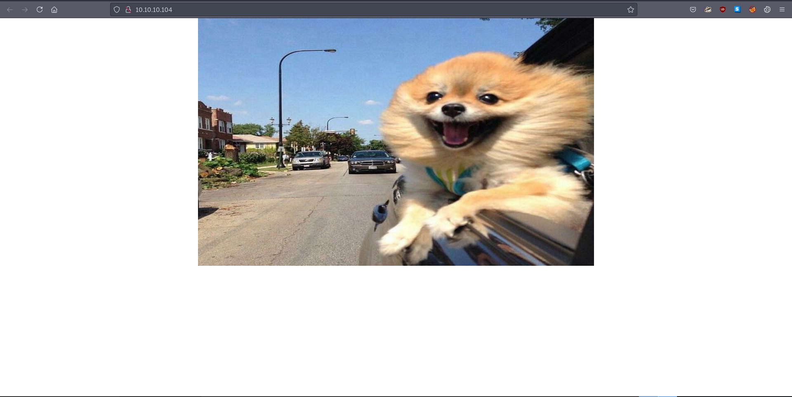
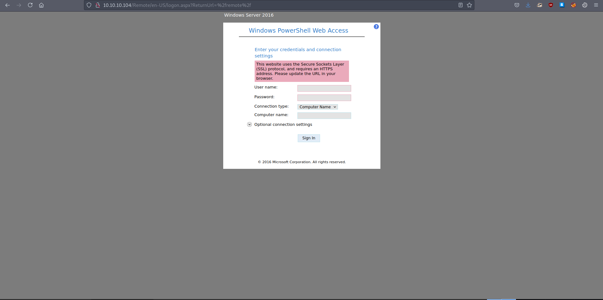

# 05 - HTTP

#  Index page


# Gobuster
```bash
┌─[user@parrot]─[10.10.14.9]─[~/htb/giddy]
└──╼ $ gobuster dir -u 10.10.10.104 -w /usr/share/wordlists/dirbuster/directory-list-lowercase-2.3-medium.txt  -o gobuster/initial.log
===============================================================
Gobuster v3.1.0
by OJ Reeves (@TheColonial) & Christian Mehlmauer (@firefart)
===============================================================
[+] Url:                     http://10.10.10.104
[+] Method:                  GET
[+] Threads:                 10
[+] Wordlist:                /usr/share/wordlists/dirbuster/directory-list-lowercase-2.3-medium.txt
[+] Negative Status codes:   404
[+] User Agent:              gobuster/3.1.0
[+] Timeout:                 10s
===============================================================
2021/08/17 19:53:24 Starting gobuster in directory enumeration mode
===============================================================
/remote               (Status: 302) [Size: 157] [--> /Remote/default.aspx?ReturnUrl=%2fremote]
/*checkout*           (Status: 400) [Size: 3420]                                              
/*docroot*            (Status: 400) [Size: 3420]                                              
/mvc                  (Status: 301) [Size: 147] [--> http://10.10.10.104/mvc/]         
```

/remote and /mvc are unique.


# PowerShell Web Access


We don't have any credentials yet. Let's check out the other directory `mvc`. 