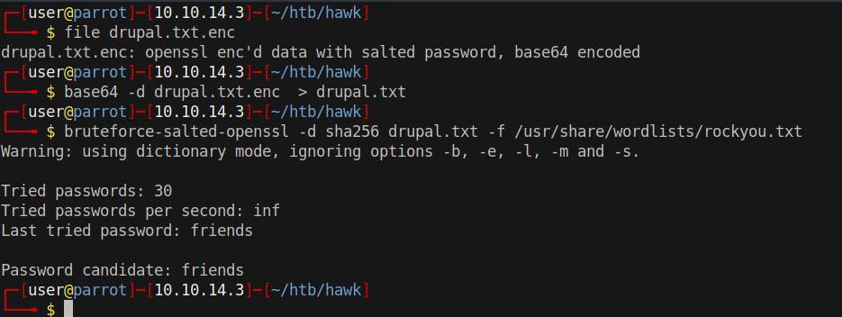

# 15 - FTP

```bash
┌─[user@parrot]─[10.10.14.12]─[~/htb/hawk]
└──╼ $ ftp 10.10.10.102
Name (10.10.10.102:user): anonymous
230 Login successful.
ftp> ls -la
drwxr-xr-x    3 ftp      ftp          4096 Jun 16  2018 .
drwxr-xr-x    3 ftp      ftp          4096 Jun 16  2018 ..
drwxr-xr-x    2 ftp      ftp          4096 Jun 16  2018 messages
ftp> cd messages
ftp> ls -la
200 PORT command successful. Consider using PASV.
150 Here comes the directory listing.
drwxr-xr-x    2 ftp      ftp          4096 Jun 16  2018 .
drwxr-xr-x    3 ftp      ftp          4096 Jun 16  2018 ..
-rw-r--r--    1 ftp      ftp           240 Jun 16  2018 .drupal.txt.enc
ftp> get .drupal.txt.enc
226 Transfer complete.
ftp> exit
┌─[user@parrot]─[10.10.14.12]─[~/htb/hawk]
└──╼ $ cat .drupal.txt.enc 
U2FsdGVkX19rWSAG1JNpLTawAmzz/ckaN1oZFZewtIM+e84km3Csja3GADUg2jJb
CmSdwTtr/IIShvTbUd0yQxfe9OuoMxxfNIUN/YPHx+vVw/6eOD+Cc1ftaiNUEiQz
QUf9FyxmCb2fuFoOXGphAMo+Pkc2ChXgLsj4RfgX+P7DkFa8w1ZA9Yj7kR+tyZfy
t4M0qvmWvMhAj3fuuKCCeFoXpYBOacGvUHRGywb4YCk=
```


# Decrypting drupal password




* -d   Digest
* -f    Password file

aes-256-cbc is the most common encryption and default on bruteforce-salted-openssl. Digest is sha256 because it's default on openssl.


```bash
┌─[user@parrot]─[10.10.14.3]─[~/htb/hawk]
└──╼ $ openssl enc -aes-256-cbc -d -in drupal.txt -out drupal.decypt
enter aes-256-cbc decryption password: friends
┌─[user@parrot]─[10.10.14.3]─[~/htb/hawk]
└──╼ $ cat drupal.decypt 
Daniel,

Following the password for the portal:

PencilKeyboardScanner123

Please let us know when the portal is ready.

Kind Regards,

IT department

```