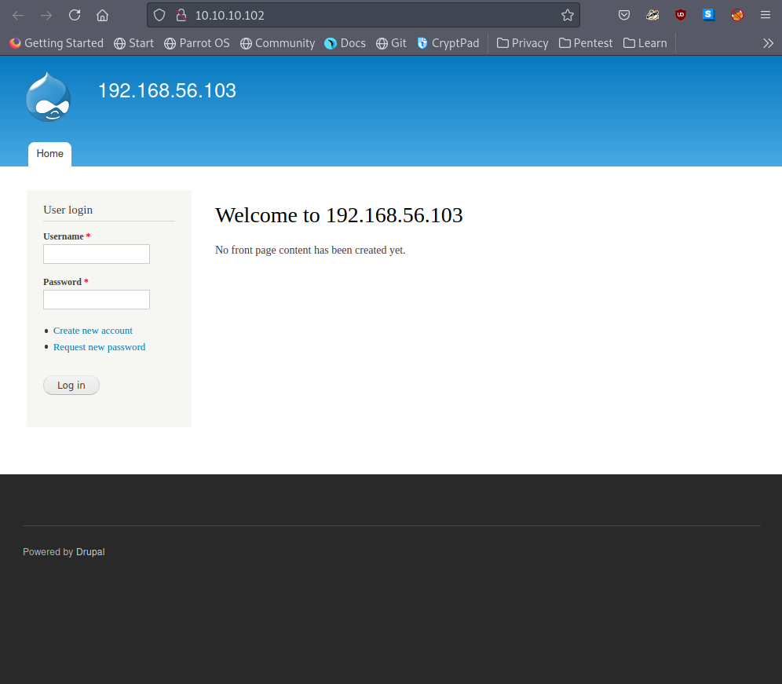
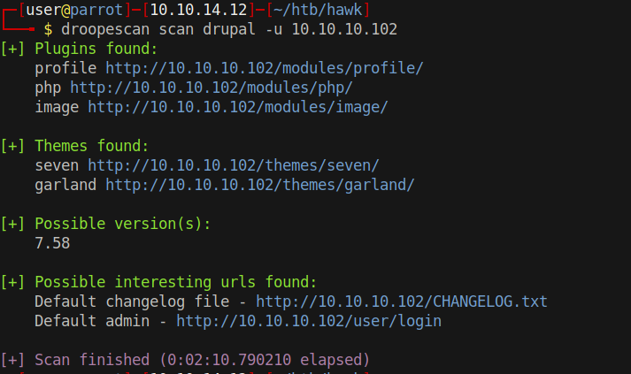
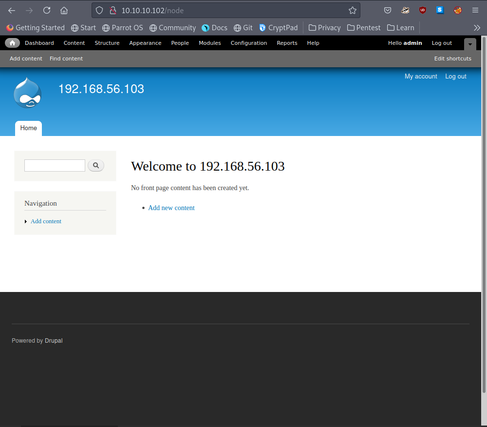
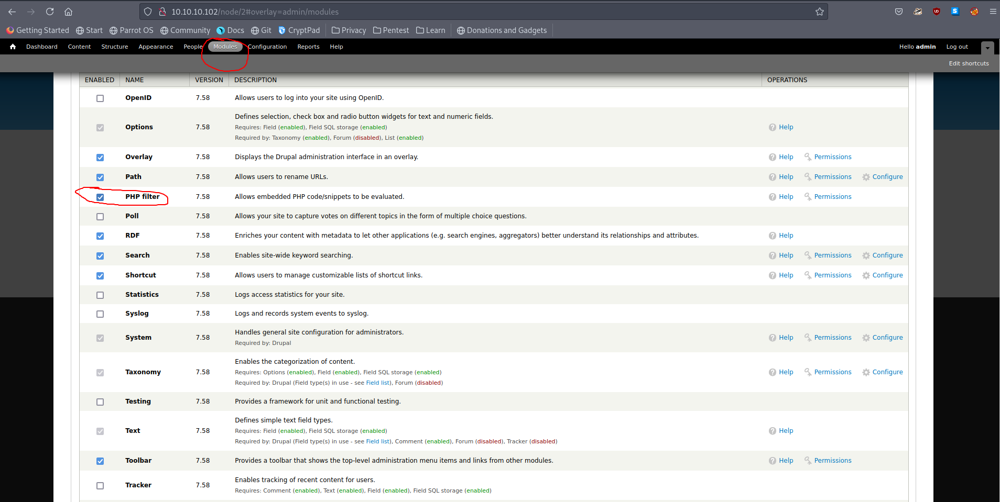
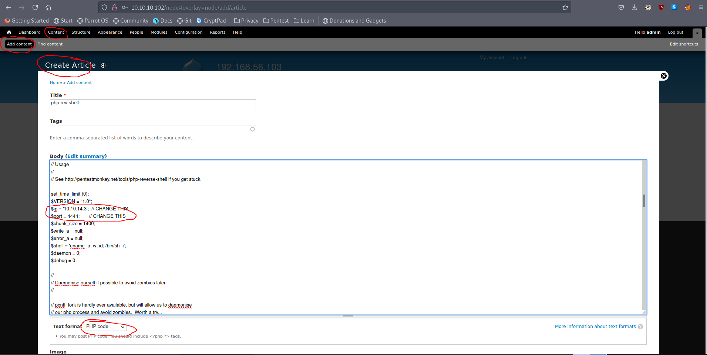
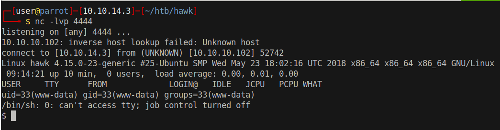

# 10 - Drupal

# Droopescan

* admin:PencilKeyboardScanner123

# Code execution

Enable **PHP filter** and click **Save configuration*** on the bottom of the screen

# [Php reverse shell](https://raw.githubusercontent.com/pentestmonkey/php-reverse-shell/master/php-reverse-shell.php)

Don't forget to set **Text format** to PHP code, if it doesn't show up you may want to check php filter plugin in the content menu. Click **preview** to execute php code immediately because we don't want to save our reverse shell. Besides, save is a 2 step process, one is for saving and the other is for executing.

