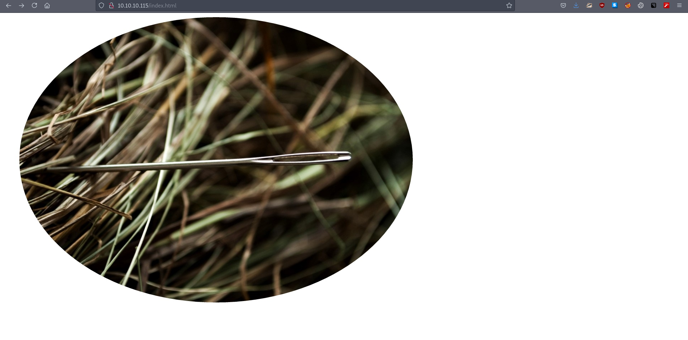
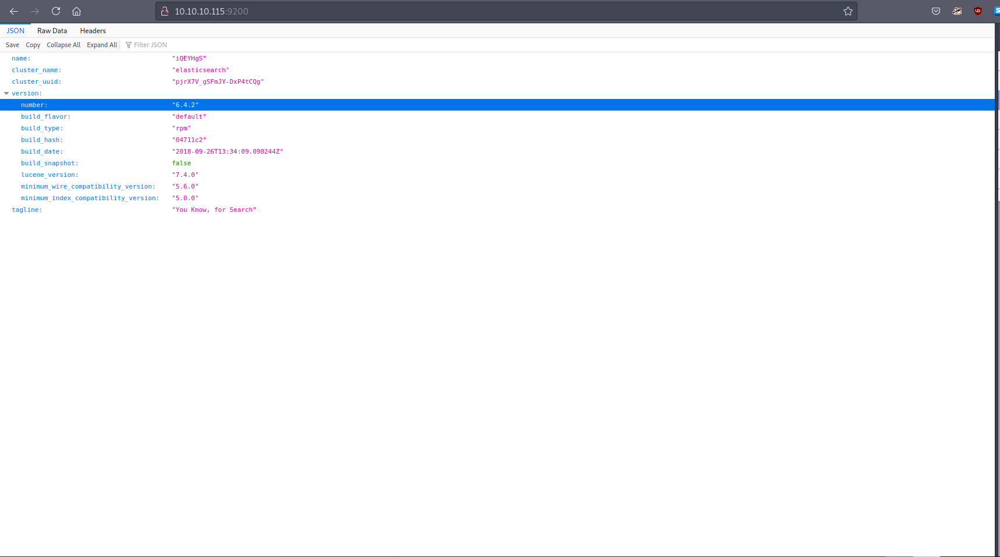

# 10 - HTTP

# index.html

A basic html response. There isn't much here to worry about.

# Elasticsearch

Apparently, authentication is disabled( by default ). We can access anything in the database.